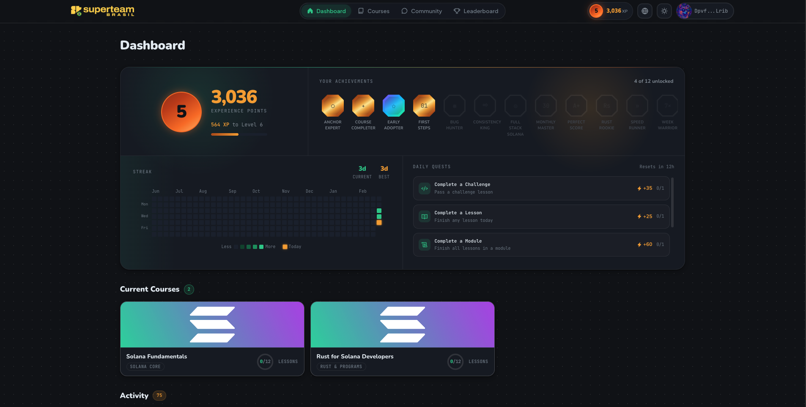
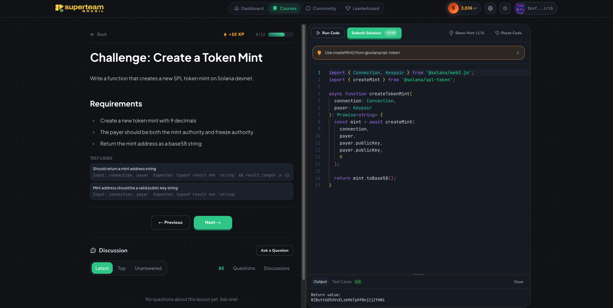
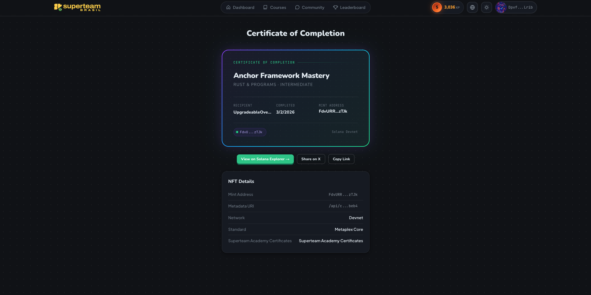

<div align="center">
  <h1>Superteam Academy</h1>
  <p><strong>A Solana-native learning platform with on-chain credentials.</strong></p>
  <p>Soulbound XP tokens, NFT certificates, interactive coding challenges, and gamified progression — all on Solana.</p>
  <p>Built by <a href="https://superteam.fun">Superteam Brazil</a></p>

  <p>
    <a href="#overview">Overview</a> &bull;
    <a href="#tech-stack">Tech Stack</a> &bull;
    <a href="#local-development">Local Development</a> &bull;
    <a href="#environment-variables">Environment Variables</a> &bull;
    <a href="#deployment">Deployment</a> &bull;
    <a href="#documentation">Documentation</a>
  </p>

  <p>
    
    
    
    
    
    
    
  </p>
</div>

---

## Overview

Superteam Academy is an open-source learning management system built on Solana. Learners enroll in courses, complete lessons to earn soulbound XP tokens, receive NFT certificates on course completion, and collect achievements — all with on-chain verification.

### Feature Highlights

**On-Chain Credentials**

- **Soulbound XP tokens** via Token-2022 (NonTransferable + PermanentDelegate) — cannot be transferred or self-burned
- **NFT certificates** via Metaplex Core, auto-minted on course completion and frozen to the learner's wallet (PermanentFreezeDelegate)
- **On-chain lesson tracking** using a bitmap stored in the Enrollment PDA — each bit represents a lesson

**Interactive Learning**

- Code challenges with an in-browser Monaco Editor (JS/TS syntax highlighting, automated test cases)
- Rust/Anchor program compilation via a sandboxed build server
- Content lessons with rich markdown rendering
- Program deployment and interaction directly from lesson pages

**Gamification**

- XP rewards for lesson completions (10-100 XP based on difficulty)
- Level progression: `Level = floor(sqrt(totalXP / 100))`
- Daily streaks tracking consecutive learning days
- Achievements across 5 categories (Progress, Streaks, Skills, Community, Special), with unlock rules declared in content
- Celebration popups for level-ups, achievements, and certificate minting

**Community Forum**

- Discussion threads with category browsing and full-text search
- Answers with upvoting/downvoting and accepted answer marking
- Content flagging for moderation
- Community XP rewards for participation

**Daily Quests**

- Rotating daily objectives (complete a lesson, earn XP, etc.)
- Bonus XP for first daily completion and streak bonuses

**Platform**

- i18n: English, Portuguese (pt-BR), Spanish
- Dark/light mode with Solana-branded gradient theme
- Wallet auth (SIWS) supporting Phantom, Solflare, and Backpack
- Google OAuth + GitHub OAuth for low-friction onboarding
- Admin panel for deploying courses and achievements on-chain
- Live leaderboard with weekly, monthly, and all-time XP rankings
- In-browser program deployment with wallet-signed transactions

## Tech Stack

| Layer            | Technology                                                            |
| ---------------- | --------------------------------------------------------------------- |
| Frontend         | Next.js 14 (App Router), React 18, Tailwind CSS, shadcn/ui + Radix UI |
| Content          | Committed bundle compiled from the `courses-academy` git repo         |
| Database / Auth  | Supabase (Postgres, RLS, Auth)                                        |
| On-Chain Program | Solana, Anchor 0.31+ (Rust)                                           |
| XP Tokens        | Token-2022 (NonTransferable + PermanentDelegate)                      |
| Credential NFTs  | Metaplex Core (soulbound via PermanentFreezeDelegate)                 |
| i18n             | next-intl (EN, PT-BR, ES)                                             |
| Auth             | SIWS (Sign In With Solana) + Google OAuth + GitHub OAuth              |
| Code Editor      | Monaco Editor                                                         |
| Build Server     | Rust/Axum on GCP Cloud Run                                            |
| Analytics        | GA4, PostHog, Sentry (all optional)                                   |
| RPC              | Helius (DAS API for credential queries + leaderboard)                 |
| Monorepo         | Turborepo + pnpm 9                                                    |
| Deployment       | Vercel (web) + GCP Cloud Run (build server)                           |

## Screenshots

|                  Dashboard                  |                  Code Challenge                  |                   Certificate                   |
| :-----------------------------------------: | :----------------------------------------------: | :---------------------------------------------: |
|  |  |  |

## Local Development

### Prerequisites

- [Node.js](https://nodejs.org) >= 18
- [pnpm](https://pnpm.io) >= 9
- A [Supabase](https://supabase.com) account (free tier works)
- A Solana wallet ([Phantom](https://phantom.app) recommended)

For on-chain program development, you also need:

- [Rust](https://rustup.rs) >= 1.82
- [Solana CLI](https://docs.solanalabs.com/cli/install) >= 1.18
- [Anchor CLI](https://www.anchor-lang.com/docs/installation) >= 0.31

### Quick Setup

```bash
# 1. Clone and install
git clone https://github.com/superteam-brazil/superteam-academy.git
cd superteam-academy
pnpm install

# 2. Configure environment
cp .env.example apps/web/.env.local
# Replace every placeholder with a real value — .env.example holds illustrative
# defaults, not working credentials. Minimum to boot (see Environment Variables):
# NEXT_PUBLIC_SUPABASE_URL, NEXT_PUBLIC_SUPABASE_ANON_KEY, SUPABASE_SERVICE_ROLE_KEY,
# NEXT_PUBLIC_SOLANA_RPC_URL, SOLANA_RPC_URL.

# 3. Set up the database (migrations are the source of truth)
# Create a Supabase project, install the Supabase CLI, then link and push:
#   supabase link --project-ref <your-project-ref>
#   supabase db push        # applies supabase/migrations/ in order
# supabase/schema.sql is a generated snapshot for reference — do not run it directly.

# 4. Content — nothing to import.
# Course content is a COMMITTED bundle (apps/web/src/content/generated/), compiled
# from solanabr/courses-academy at the SHA pinned in apps/web/content.lock.
# It is already in the repo. To recompile it after a pin bump:
#   pnpm --filter web compile-content

# 5. Start the dev server
pnpm dev
```

Open [http://localhost:3000](http://localhost:3000).

**Minimum variables for basic dev** (no on-chain features): `NEXT_PUBLIC_SUPABASE_URL`, `NEXT_PUBLIC_SUPABASE_ANON_KEY`, `SUPABASE_SERVICE_ROLE_KEY`, `NEXT_PUBLIC_SOLANA_RPC_URL`, `SOLANA_RPC_URL`.

> **Courses won't appear until they're deployed on-chain.** Visibility is gated on
> the Supabase `onchain_deployments` table (`status = "synced"` and active), which
> starts empty on a fresh project. Deploy courses from `/en/admin/deploy` — see
> [docs/ADMIN.md](docs/ADMIN.md).

**Full on-chain features** require: `NEXT_PUBLIC_PROGRAM_ID`, `NEXT_PUBLIC_XP_MINT_ADDRESS`, `PROGRAM_AUTHORITY_SECRET`, `BACKEND_SIGNER_SECRET`. See [Program Deployment](docs/DEPLOY-PROGRAM.md) for the deploy and initialize workflow.

### Development Commands

```bash
pnpm dev          # Start Next.js dev server
pnpm build        # Production build
pnpm lint         # ESLint
pnpm typecheck    # TypeScript type checking
pnpm format       # Prettier formatting
```

## Project Structure

```
superteam-academy/
├── apps/
│   ├── web/                    # Next.js 14 application
│   │   ├── src/app/            #   App Router pages ([locale] route groups)
│   │   │   ├── [locale]/
│   │   │   │   ├── (marketing)/  # Landing page
│   │   │   │   ├── (platform)/   # Authenticated routes (dashboard, courses, etc.)
│   │   │   │   └── admin/        # Admin panel
│   │   │   └── api/              # API routes (auth, lessons, achievements, etc.)
│   │   ├── src/components/     #   UI components (auth, editor, gamification, layout)
│   │   ├── src/lib/            #   Utilities (supabase, content, github, solana, analytics)
│   │   ├── src/content/generated/  # COMMITTED content bundle (do not hand-edit)
│   │   ├── content.lock        #   The courses-academy commit the bundle is pinned to
│   │   ├── scripts/            #   compile-content.ts (repo → committed bundle)
│   │   └── src/messages/       #   i18n translation files (en, pt-BR, es)
│   └── build-server/           # Rust/Axum build server (GCP Cloud Run)
├── onchain-academy/            # Anchor workspace (Solana program)
│   ├── programs/               #   On-chain program source (Rust)
│   └── tests/                  #   Integration + unit tests
├── packages/
│   ├── types/                  # Shared TypeScript interfaces
│   ├── content-schema/         # Zod schemas for the content standard
│   ├── content-lint/           # Content linter (runs in courses-academy CI)
│   ├── challenge-executor/     # Sandboxed challenge runner (QuickJS)
│   ├── deploy/                 # Browser-based Solana program deployment library
│   └── config/                 # Shared ESLint, TS, Tailwind configs
├── supabase/                   # Database schema + migrations
├── scripts/                    # Helper scripts (init-program, update-program-id)
├── wallets/                    # Keypairs (gitignored)
└── docs/                       # Documentation
```

Course **content** lives in a separate repo:
[`solanabr/courses-academy`](https://github.com/solanabr/courses-academy).

## Environment Variables

Copy `.env.example` to `apps/web/.env.local` and fill in values.

### Supabase (Required)

| Variable                        | Scope  | Description                                                         |
| ------------------------------- | ------ | ------------------------------------------------------------------- |
| `NEXT_PUBLIC_SUPABASE_URL`      | Client | Supabase project URL                                                |
| `NEXT_PUBLIC_SUPABASE_ANON_KEY` | Client | Public anon key (safe for browser)                                  |
| `SUPABASE_SERVICE_ROLE_KEY`     | Server | Service role key for admin operations. **Never expose to browser.** |

### Content

**No variables required.** Course content is a committed bundle — there is no CMS
and no content-write credential. `GITHUB_TOKEN` (below) is optional, read-only, and
only used to poll the content repo's HEAD/CI state for the admin Publish screen.

### Solana (Required for on-chain features)

| Variable                      | Scope  | Description                                                                                       |
| ----------------------------- | ------ | ------------------------------------------------------------------------------------------------- |
| `NEXT_PUBLIC_SOLANA_RPC_URL`  | Client | Browser RPC endpoint. Must carry **no** privileged key (default: `https://api.devnet.solana.com`) |
| `SOLANA_RPC_URL`              | Server | Server RPC endpoint — **this** is the one that may carry the Helius key. Required at boot.        |
| `NEXT_PUBLIC_SOLANA_NETWORK`  | Client | Network name (`devnet`)                                                                           |
| `NEXT_PUBLIC_PROGRAM_ID`      | Client | Program ID from `anchor deploy`                                                                   |
| `NEXT_PUBLIC_XP_MINT_ADDRESS` | Client | XP mint pubkey from `initialize` output                                                           |

### Admin / Signing (Required for the admin console and on-chain operations)

| Variable                   | Scope  | Description                                                                                                                                |
| -------------------------- | ------ | ------------------------------------------------------------------------------------------------------------------------------------------ |
| `PROGRAM_AUTHORITY_SECRET` | Server | JSON array of authority keypair bytes (64 elements). The keypair that signed `initialize`.                                                 |
| `BACKEND_SIGNER_SECRET`    | Server | JSON array of backend signer keypair bytes. On devnet, same as `PROGRAM_AUTHORITY_SECRET`.                                                 |
| `XP_MINT_AUTHORITY_SECRET` | Server | JSON array of XP mint authority keypair bytes. Signs XP token mints; omit to disable XP minting.                                           |
| `ADMIN_SECRET`             | Server | Admin console secret (min 32 chars, random) — also the HMAC key signing the `admin_session` cookie                                         |
| `GITHUB_TOKEN`             | Server | Fine-grained **read** token for `solanabr/courses-academy`. Powers the admin Publish screen. Unset → those routes 503. **No write scope.** |

### Build Server (Optional -- for code compilation features)

| Variable               | Scope  | Description                                                                      |
| ---------------------- | ------ | -------------------------------------------------------------------------------- |
| `BUILD_SERVER_URL`     | Server | Cloud Run service URL                                                            |
| `BUILD_SERVER_API_KEY` | Server | API key for `X-API-Key` header (same as `ACADEMY_API_KEY` on Cloud Run)          |
| `RUST_PLAYGROUND_URL`  | Server | Upstream for `/api/rust/execute` (default: `https://play.rust-lang.org/execute`) |

### AI Lesson Assistant (Optional)

| Variable                 | Scope  | Description                                                                             |
| ------------------------ | ------ | --------------------------------------------------------------------------------------- |
| `GEMINI_API_KEY`         | Server | Google Gemini API key for the in-lesson AI assistant (`/api/ai/*`). Omit to disable it. |
| `AI_PARTNER_SEAL_SECRET` | Server | Key sealing the comprehension-check token. Falls back to `SUPABASE_SERVICE_ROLE_KEY`.   |

### Credentials & Moderation (Optional)

| Variable                  | Scope  | Description                                                                                                          |
| ------------------------- | ------ | -------------------------------------------------------------------------------------------------------------------- |
| `ARWEAVE_UPLOADER_SECRET` | Server | Solana keypair funding Irys uploads that pin credential metadata to Arweave. Unset → falls back to the metadata API. |
| `MODERATION_WEBHOOK_URL`  | Server | Slack/Discord-compatible webhook pinged on the first flag of a post.                                                 |
| `HELIUS_API_KEY`          | Server | Helius DAS API + webhook management                                                                                  |
| `HELIUS_WEBHOOK_SECRET`   | Server | Verifies Helius webhook signatures                                                                                   |

### Analytics (Optional -- platform works without these)

| Variable                         | Scope  | Description                                                |
| -------------------------------- | ------ | ---------------------------------------------------------- |
| `NEXT_PUBLIC_GA4_MEASUREMENT_ID` | Client | Google Analytics 4 measurement ID                          |
| `NEXT_PUBLIC_POSTHOG_KEY`        | Client | PostHog project key                                        |
| `NEXT_PUBLIC_POSTHOG_HOST`       | Client | PostHog instance URL (default: `https://us.i.posthog.com`) |
| `NEXT_PUBLIC_SENTRY_DSN`         | Client | Sentry error tracking DSN (public/safe to expose)          |

### App URL

| Variable              | Scope  | Description                                                                        |
| --------------------- | ------ | ---------------------------------------------------------------------------------- |
| `NEXT_PUBLIC_APP_URL` | Client | Base URL for sitemap, OG tags, NFT metadata URI (default: `http://localhost:3000`) |

## Deployment

Superteam Academy deploys as a Vercel-hosted Next.js app backed by Supabase (Postgres + Auth) and a Solana on-chain program. Content ships inside the build — there is no CMS to deploy.

- **[Production Deployment Guide](docs/DEPLOYMENT.md)** -- Full instructions for Vercel, Supabase, the content bundle, Google OAuth, GCP Cloud Run (build server), analytics, custom domains, and post-deployment checklist.
- **[Program Deployment Guide](docs/DEPLOY-PROGRAM.md)** -- On-chain program build, deploy, and initialize workflow (keypair generation, Anchor build, devnet deploy, XP mint creation).

## On-Chain Program

**Program**: Superteam Academy (`onchain_academy`)
**Network**: Solana Devnet
**Program ID**: `7NeJaSRyb4Wxay3Tcd9bdpD7T3GWYUQSFyrhG8SgwE8V`

The program manages the full learning lifecycle on-chain:

- **18 instructions**: initialize, update config, create/update/close course, enroll, complete lesson, finalize course, close enrollment, issue/upgrade credential, register/update/revoke minter, reward XP, create/deactivate achievement type, award achievement
- **6 PDA account types**: Config, Course, Enrollment, MinterRole, AchievementType, AchievementReceipt
- **XP minting**: Token-2022 soulbound tokens minted on lesson completion
- **Credential issuance**: Metaplex Core NFTs minted on course completion

For deployment instructions, see [docs/DEPLOY-PROGRAM.md](docs/DEPLOY-PROGRAM.md).
For system architecture, see [docs/ARCHITECTURE.md](docs/ARCHITECTURE.md).

## Admin Console

**URL**: `/{locale}/admin` (e.g., `/en/admin`)
**Auth**: Enter the `ADMIN_SECRET` value — this mints an HMAC-signed `admin_session` cookie

Four screens:

- **Publish** (`/admin/publish`): shows the pinned content SHA vs `courses-academy` HEAD and hands you a prefilled PR link. Publishing is a **pull request** that bumps `content.lock` + commits the regenerated bundle — the console holds no write token and cannot mutate content.
- **Deploy** (`/admin/deploy`): deploy courses and achievements on-chain (Course PDA + Metaplex Core collection), and deactivate/reactivate courses. Recorded in the Supabase `onchain_deployments` table, which **is** the learner-visibility gate.
- **Moderation** (`/admin/moderation`): the pending community-flag queue.
- **Status** (`/admin/status`): program liveness, authority match, deploy counts, and on-chain → Supabase resync.

For details, see [docs/ADMIN.md](docs/ADMIN.md).

## Documentation

| Document                                     | Description                                               |
| -------------------------------------------- | --------------------------------------------------------- |
| [Architecture](docs/ARCHITECTURE.md)         | System design, account maps, data flows, content pipeline |
| [Customization](docs/CUSTOMIZATION.md)       | Theming, i18n, gamification, and extending                |
| [Admin Guide](docs/ADMIN.md)                 | The 4-screen console: publish, deploy, moderate, status   |
| [Deployment](docs/DEPLOYMENT.md)             | Vercel, Supabase, content bundle, build server            |
| [Program Deployment](docs/DEPLOY-PROGRAM.md) | On-chain program build, deploy, and initialize            |
| [Developer Reference](CLAUDE.md)             | Full codebase conventions, security model, API routes     |

## Known Limitations / Roadmap

The on-chain program is feature-complete with 18 instructions covering the full learning lifecycle. The following items are scoped for future iterations:

- **Track collection enforcement**: `track_collection` is validated server-side during credential issuance but is not yet enforced on-chain as an account constraint (future program upgrade).
- **`perfect-score` achievement**: dropped, not deferred. Block results are transient by design, so there is no durable "passed on first try" signal to key it on.
- **Build server**: Compilation features (`buildable` Rust challenges + program deployment) require a separately deployed Rust/Axum build server on GCP Cloud Run. See the [Deployment](#deployment) section for setup details.

## Code Quality

- TypeScript strict mode with zero `any` types
- ESLint + Prettier enforced via Husky pre-commit hooks
- Conventional commits: `feat:`, `fix:`, `docs:`, `chore:`, `refactor:`
- All UI strings externalized via next-intl (never hardcoded)
- Server components by default, client components only when needed
- RLS enabled on all Supabase tables; sensitive functions restricted to `service_role`

## Contributing

1. Fork the repository
2. Create a feature branch: `git checkout -b feat/your-feature`
3. Commit using conventional commits: `git commit -m "feat: add quiz lesson type"`
4. Push and open a pull request

## License

MIT

## Acknowledgments

- [Superteam Brazil](https://superteam.fun) -- community and bounty program
- [Solana Foundation](https://solana.org) -- blockchain infrastructure
- Built with [Claude Code](https://claude.ai/claude-code) (Anthropic)
