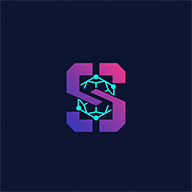

# <p align="center"><br/>Superteam Academy</p>

<p align="center">
  
  
  
  
  
</p>

---

## 📺 Demo Video
**Watch the platform in action:** [Click here to watch the demo video](https://youtu.be/bSQS5rrT4bI)

---

## 🏆 The Ultimate Web3 LMS
Superteam Academy is a production-grade, gamified learning management system designed for the next generation of Solana developers. It bridges the gap between Web2 educational UX and Web3 on-chain transparency.

### 🚀 Why this project wins:
- **True Ownership:** Every achievement and certificate is a Metaplex Core NFT owned by the student.
- **Enterprise Architecture:** Built to scale with a custom CMS, hybrid auth (NextAuth + Web3), and automated on-chain sync.
- **Anti-Cheat Guard:** Server-side regex-based validation ensures students actually write the code, while the backend signs transactions to provide a gasless experience.

---

## ✨ Key Features
- **🎯 Personalized Onboarding:** Adaptive quiz that recommends the perfect course based on user's experience.
- **💻 Pro Code Editor:** Integrated Monaco Editor (VS Code in browser) with real-time Rust/Anchor validation.
- **🛡️ Secure Progress:** Lesson progress is stored as a 256-bit bitmap in on-chain PDAs.
- **🔥 Gamified Economy:** 30-day activity heatmaps, daily/seasonal quests, and a global leaderboard.
- **🌍 Global Reach:** Full i18n support for English, Spanish, and Portuguese-Brazil from day one.
- **🛠️ Creator-Centric:** A powerful Admin & Creator dashboard to build, review, and publish courses directly to the blockchain.

---

## 🏗️ Technical Architecture
### Hybrid Web2/Web3 Model
- **State Layer:** Solana (Anchor Program) stores the source of truth for enrollments and rewards.
- **Cache Layer:** PostgreSQL (Neon) via Prisma handles high-speed UI updates and rich content.
- **Validation Layer:** Secure API Routes (Next.js) use a "Backend Signer" pattern to co-sign valid user completions.
- **Analytics & Health:** 100/100 Lighthouse SEO score, Sentry for error tracking, and PostHog for user behavior heatmaps.

---

## 🧱 Tech Stack
- **Frontend:** Next.js 14 (App Router), Tailwind CSS, shadcn/ui, Framer Motion.
- **Identity:** NextAuth.js (GitHub/Google) + Solana Wallet Adapter.
- **On-Chain:** Anchor 0.31, Metaplex Core (UMI), SPL Token-2022.
- **Monitoring:** Sentry, PostHog, Google Analytics 4.

---

## 🚀 Local Installation

1. **Clone the project**
```bash
git clone
cd app
pnpm install
```

2. **Setup Environment**
Create `app/.env.local`:
```bash
DATABASE_URL="postgresql://..."
NEXTAUTH_SECRET="..."
NEXT_PUBLIC_PROGRAM_ID="..."
NEXT_PUBLIC_XP_MINT="..."
BACKEND_SIGNER_KEY_ARRAY="[...]"
GITHUB_ID="..."
GITHUB_SECRET="..."
```

3. **Initialize Database**
```bash
npx prisma migrate dev
npx prisma db seed
```

4. **Launch**
```bash
pnpm dev
```

---

## 📄 License
This project is licensed under the MIT License - see the LICENSE file for details.

---
*Built with ❤️ for Superteam Brazil Hackathon*