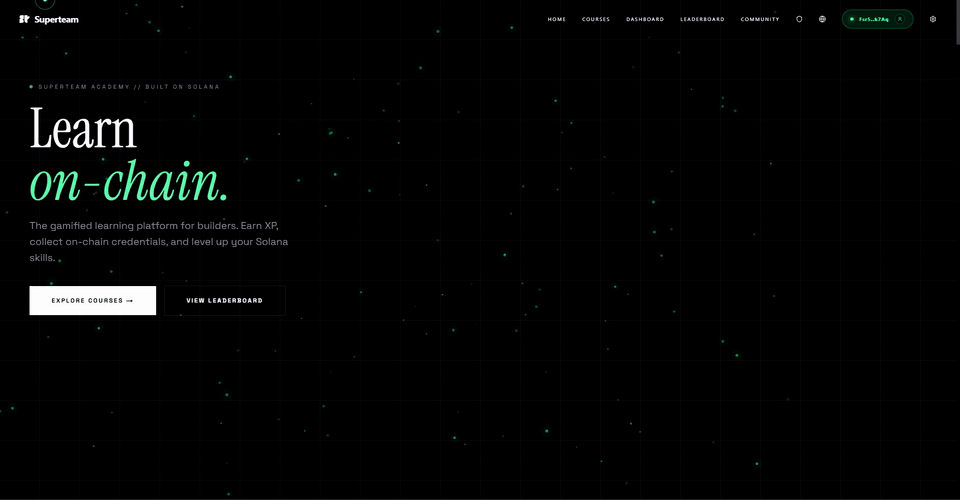

# Superteam Academy

**A Solana-native learning management system with gamified progression, on-chain credentials, and verifiable skill tracking.**

Built for [Superteam Brazil](https://x.com/superteambr). Access [here](https://superteam-academy-gules.vercel.app/en).



---

## Platform Capabilities

| | |
|---|---|
| **On-Chain XP** | Soulbound Token-2022 tokens minted via raw CPI (NonTransferable + PermanentDelegate) |
| **Verifiable Credentials** | Metaplex Core NFTs with PermanentFreezeDelegate -- soulbound, upgradeable per track |
| **16-Instruction Program** | Deployed Anchor program: courses, enrollments, streaks, achievements, credentials, seasons |
| **Admin Dashboard** | bcrypt-gated admin panel -- 14 components, 8 API routes, course CRUD, user management, analytics, moderation, on-chain registration |
| **Sanity CMS** | 5 content schemas, embedded Studio at `/studio`, full admin integration for course publishing |
| **PWA** | Service worker with cache versioning, offline fallback page, installable standalone manifest |
| **Analytics** | PostHog + GA4 + Sentry -- consent-gated tracking, 11+ event types, session recording |
| **E2E + Unit Tests** | 12 Playwright test suites + Vitest unit tests, CI-integrated via GitHub Actions |
| **i18n** | next-intl with full locale routing -- EN, PT-BR, ES (~36KB translations per locale) |
| **Bot Protection** | Cloudflare Turnstile on site load and API endpoints (lesson completion, course finalization) |

## Features

- **Course Catalog** -- Filterable grid with search, difficulty badges, and learning track filters
- **Interactive Lessons** -- Reading content, embedded video, code challenges with Monaco Editor, and quizzes
- **Dashboard** -- XP and level progress, streak calendar with heatmap, achievements, personalized recommendations
- **Leaderboard** -- Global XP rankings with time-based and course-based filters, podium display
- **On-Chain Credentials** -- Metaplex Core soulbound NFT certificates issued on course completion
- **Profile with Skill Constellation** -- Radar chart visualization, achievement showcase, credential gallery
- **Certificates** -- Visual certificate cards with on-chain verification, social sharing, and image download
- **Settings** -- Profile management, linked accounts (Google/GitHub/Wallet), theme toggle, language switcher
- **Wallet Authentication** -- Multi-wallet support (Phantom, Backpack, Solflare) via Wallet Standard auto-detect
- **XP System** -- Soulbound Token-2022 tokens with level formula: `Level = floor(sqrt(totalXP / 100))`
- **Gamification** -- XP rewards per lesson, challenge, and course; streak tracking with freeze system; 20 achievements
- **Dark and Light Themes** -- Dark mode by default with Warm Stone palette, theme toggle via `next-themes`

## Deployed Addresses

| Item | Address |
|------|---------|
| Program ID | [`EHgTQKSeAAoh7JVMij46CFVzThh4xUi7RDjZjHnA7qR6`](https://explorer.solana.com/address/EHgTQKSeAAoh7JVMij46CFVzThh4xUi7RDjZjHnA7qR6?cluster=devnet) |
| XP Mint (Token-2022) | [`H2LjXpSDff3iQsut49nGniBoAQWjERYA5BdTcmfjf9Yz`](https://explorer.solana.com/address/H2LjXpSDff3iQsut49nGniBoAQWjERYA5BdTcmfjf9Yz?cluster=devnet) |
| Upgrade Authority | [`Fsr5QpudWMXhnZQErVFTdysSfRh1SpHjrYXYZeM5k7Aq`](https://explorer.solana.com/address/Fsr5QpudWMXhnZQErVFTdysSfRh1SpHjrYXYZeM5k7Aq?cluster=devnet) |
| Network | Solana Devnet |

## Repository Structure

```
superteam-academy/
├── onchain-academy/           # Anchor program + frontend + backend
│   ├── programs/
│   │   └── onchain-academy/   # Solana program (Anchor 0.31.1)
│   ├── tests/                 # Integration tests
│   ├── app/                   # Next.js frontend
│   ├── backend/               # Backend services
│   ├── scripts/               # Devnet setup and E2E tests
│   ├── patches/               # Dependency patches
│   ├── Anchor.toml
│   ├── Cargo.toml
│   └── package.json
├── docs/                      # Architecture, spec, guides
├── scripts/                   # Repo-level utility scripts
├── LICENSE
└── README.md
```

## Quick Start

### Frontend

```bash
cd onchain-academy/app
pnpm install
cp .env.example .env.local
pnpm dev
```

Open [http://localhost:3000](http://localhost:3000).

### On-Chain Program

```bash
cd onchain-academy
anchor build
anchor test
```

See [docs/DEPLOY-PROGRAM.md](docs/DEPLOY-PROGRAM.md) for deployment instructions.

## Tech Stack

| Layer | Technology |
|-------|------------|
| On-Chain Program | Anchor 0.31.1, Rust, Token-2022, Metaplex Core |
| Frontend | Next.js 16.1, React 19, Tailwind CSS v4 |
| Auth | NextAuth.js v5 + Solana Wallet Adapter |
| CMS | Sanity v5 |
| Database | Supabase |
| i18n | next-intl (EN, PT-BR, ES) |

## Documentation

| Document | Description |
|----------|-------------|
| [ARCHITECTURE.md](docs/ARCHITECTURE.md) | System architecture, account maps, data flow diagrams |
| [SPEC.md](docs/SPEC.md) | Full on-chain program specification |
| [CMS_GUIDE.md](docs/CMS_GUIDE.md) | Course creation and publishing workflow |
| [CUSTOMIZATION.md](docs/CUSTOMIZATION.md) | Theme, language, and gamification customization |
| [DEPLOY-PROGRAM.md](docs/DEPLOY-PROGRAM.md) | Program deployment guide |

## License

[MIT License](LICENSE) -- Copyright (c) 2026 Superteam Brazil.
