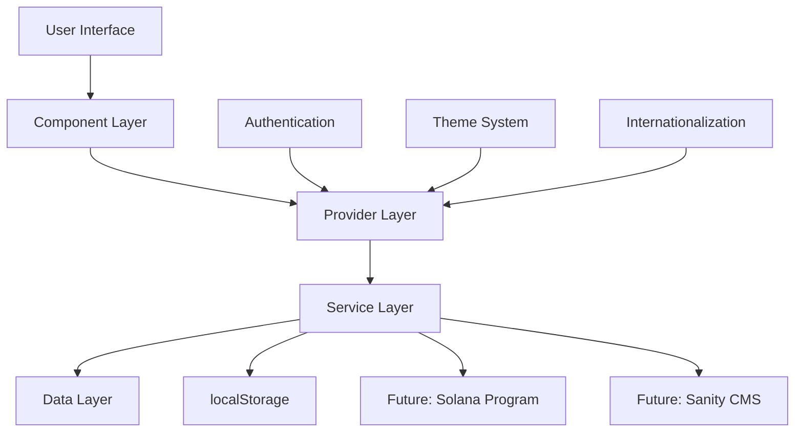
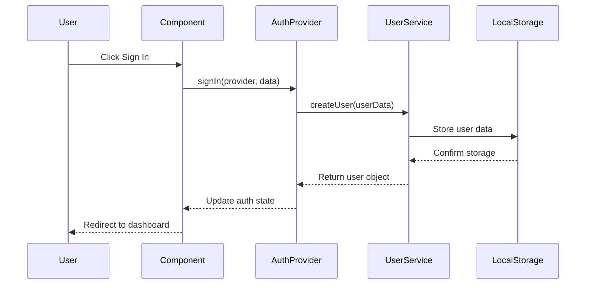
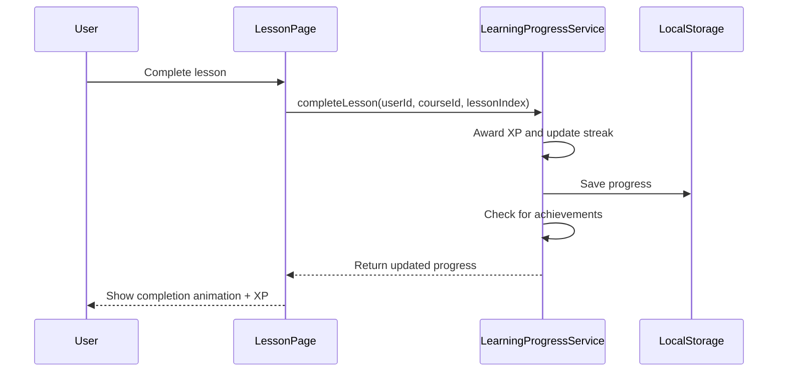
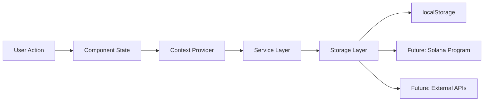
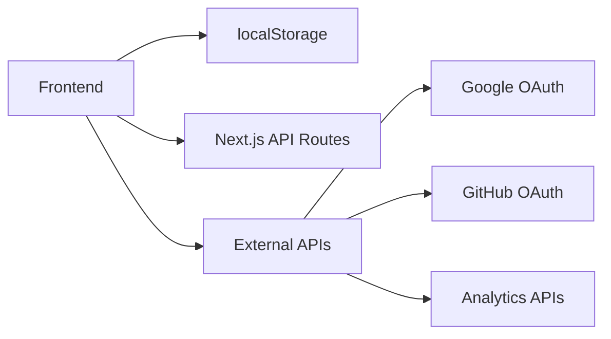
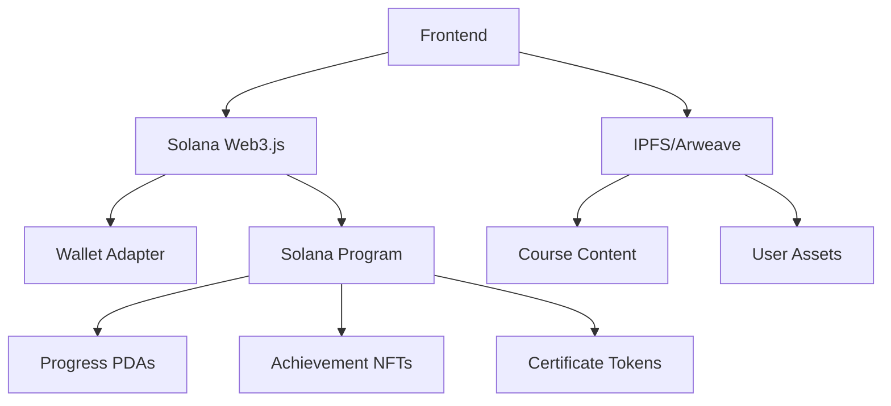
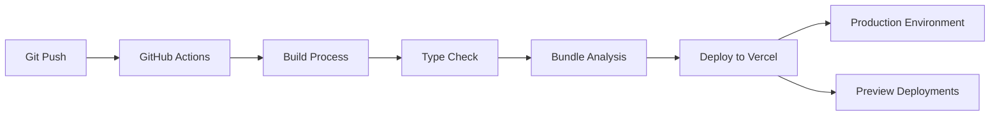
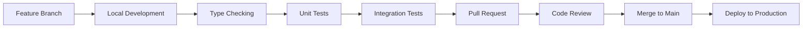

# Architecture Documentation

This document outlines the technical architecture, component structure, data flow, and integration points for the Superteam Academy LMS frontend.

## 🏗 System Architecture Overview



## 📂 Directory Structure

```
src/
├── app/                          # Next.js 13+ App Router
│   ├── (auth)/                  # Route groups for auth pages
│   │   ├── signin/              # Sign-in page
│   │   └── signup/              # Sign-up page
│   ├── courses/                 # Course-related pages
│   │   ├── page.tsx            # Course catalog
│   │   └── [slug]/             # Dynamic course pages
│   │       ├── page.tsx        # Course detail
│   │       └── lessons/        # Lesson pages
│   │           └── [id]/       # Individual lesson
│   │               └── page.tsx
│   ├── dashboard/              # User dashboard
│   ├── leaderboard/           # Global leaderboard
│   ├── profile/               # User profiles
│   ├── settings/              # User settings
│   ├── globals.css            # Global styles and CSS variables
│   ├── layout.tsx             # Root layout with providers
│   └── page.tsx               # Landing page
│
├── components/                 # Reusable UI components
│   ├── ui/                    # shadcn/ui components
│   │   ├── button.tsx
│   │   ├── card.tsx
│   │   ├── input.tsx
│   │   └── ...
│   └── navigation.tsx         # Main navigation component
│
├── providers/                 # React context providers
│   ├── auth-provider.tsx      # Authentication state management
│   └── theme-provider.tsx     # Dark/light theme provider
│
├── services/                  # Business logic and data access
│   ├── learning-progress.service.ts  # Progress tracking
│   ├── course.service.ts            # Course data management
│   └── user.service.ts              # User profile management
│
├── types/                     # TypeScript type definitions
│   └── index.ts              # All application types
│
├── lib/                       # Utility functions
│   └── utils.ts              # Common utilities (cn, XP calculations)
│
├── hooks/                     # Custom React hooks
│   └── (future expansion)
│
├── i18n/                      # Internationalization
│   ├── config.ts             # i18n configuration
│   └── locales/              # Translation files
│       ├── en.json
│       ├── pt-BR.json
│       └── es.json
│
└── data/                      # Static data and sample content
    ├── courses.ts             # Course data structure
    └── achievements.ts        # Achievement definitions
```

## 🔄 Data Flow Architecture

### 1. Authentication Flow



### 2. Learning Progress Flow



### 3. Data State Management



## 🧩 Component Architecture

### Component Hierarchy

```
App Layout
├── ThemeProvider
├── AuthProvider
├── Navigation
│   ├── Logo
│   ├── NavMenu
│   ├── UserMenu
│   └── ThemeToggle
└── Page Components
    ├── Landing
    ├── Courses
    │   ├── CourseGrid
    │   ├── CourseCard
    │   └── FilterPanel
    ├── CourseDetail
    │   ├── CourseHeader
    │   ├── ModuleList
    │   └── EnrollmentCard
    ├── LessonView
    │   ├── LessonContent (ReactMarkdown)
    │   ├── CodeEditor (Monaco)
    │   └── LessonNavigation
    ├── Dashboard
    │   ├── StatsCards
    │   ├── ProgressChart
    │   ├── ActivityFeed
    │   └── StreakCalendar
    └── Profile
        ├── ProfileHeader
        ├── AchievementBadges
        ├── SkillRadar
        └── CourseHistory
```

### Component Design Patterns

1. **Compound Components**: Complex UI elements broken into sub-components
2. **Container/Presenter**: Logic separation for maintainability
3. **Higher-Order Components**: Cross-cutting concerns (authentication, theming)
4. **Render Props**: Flexible component composition

## 🔌 Service Layer Architecture

### Service Interface Design

The service layer provides a clean abstraction between the UI and data storage, enabling seamless migration from localStorage to blockchain:

```typescript
// Current Implementation: localStorage
// Future Implementation: Solana Program + Sanity CMS

interface LearningProgressService {
  // Core progress tracking
  getProgress(userId: string, courseId: string): Promise<Progress>
  updateProgress(progress: Partial<Progress>): Promise<void>
  completeLesson(userId: string, courseId: string, lessonIndex: number): Promise<void>
  
  // Gamification
  getXP(userId: string): Promise<number>
  getStreak(userId: string): Promise<StreakData>
  getLeaderboard(timeframe: 'weekly' | 'monthly' | 'alltime'): Promise<LeaderboardEntry[]>
  
  // Credentials (blockchain-ready)
  getCredentials(wallet: PublicKey): Promise<Credential[]>
  issueCredential(userId: string, courseId: string): Promise<Credential>
}
```

### Service Implementation Strategy

1. **Current Phase**: localStorage implementation for rapid development
2. **Migration Phase**: Gradual migration to blockchain with fallback
3. **Production Phase**: Full blockchain integration with local caching

## 🎨 Styling Architecture

### CSS-in-JS Strategy

We use a **CSS Variables + Tailwind CSS** approach:

```css
/* CSS Variables for theming */
:root {
  --primary: 269 87% 61%;      /* Solana Purple */
  --accent: 143 90% 61%;       /* Solana Green */
  --background: 0 0% 100%;     /* Dynamic based on theme */
  --foreground: 240 10% 3.9%;  /* Text color */
}

/* Utility classes for common patterns */
.text-gradient {
  background: linear-gradient(135deg, hsl(var(--primary)) 0%, hsl(var(--accent)) 100%);
  -webkit-background-clip: text;
  background-clip: text;
  -webkit-text-fill-color: transparent;
}
```

### Component Styling Patterns

1. **shadcn/ui Base**: Pre-built accessible components
2. **Tailwind Utilities**: Rapid styling with consistent spacing
3. **CSS Variables**: Dynamic theming and color management
4. **Custom Components**: Brand-specific elements (XP badges, level indicators)

## 🌐 State Management

### Context-Based Architecture

We use React Context for global state management:

```typescript
// Authentication Context
interface AuthContextType {
  user: User | null
  loading: boolean
  signIn: (provider: AuthProvider, data?: any) => Promise<void>
  signOut: () => Promise<void>
  updateUser: (updates: Partial<User>) => Promise<void>
  linkWallet: (walletAddress: string) => Promise<void>
}

// Theme Context (next-themes)
interface ThemeContextType {
  theme: 'light' | 'dark' | 'system'
  setTheme: (theme: string) => void
  resolvedTheme: 'light' | 'dark'
}
```

### State Flow Patterns

1. **Server State**: Fetched data cached in React Query (future)
2. **Client State**: Form state managed with React Hook Form
3. **Global State**: Authentication and theme via Context
4. **Local State**: Component-specific useState/useReducer

## 🔐 Security Architecture

### Client-Side Security

```typescript
// Data Sanitization
const sanitizeUserInput = (input: string): string => {
  return DOMPurify.sanitize(input)
}

// Storage Encryption (future)
const encryptLocalStorage = (data: any): string => {
  return CryptoJS.AES.encrypt(JSON.stringify(data), secretKey).toString()
}

// Wallet Security
const validateWalletSignature = (message: string, signature: Uint8Array, publicKey: PublicKey): boolean => {
  return nacl.sign.detached.verify(
    new TextEncoder().encode(message),
    signature,
    publicKey.toBytes()
  )
}
```

### Security Layers

1. **Input Validation**: All user inputs validated and sanitized
2. **Authentication**: OAuth 2.0 + wallet signatures
3. **Authorization**: Role-based access control (future)
4. **Data Protection**: Encrypted sensitive data storage

## 🔗 Integration Architecture

### Current Integrations



### Future Blockchain Integration



### Integration Points

1. **Authentication**
   - NextAuth.js for OAuth providers
   - Solana Wallet Adapter for blockchain auth
   - Account linking system

2. **Content Management**
   - Sanity CMS for course content
   - IPFS for decentralized storage
   - CDN for static assets

3. **Analytics & Monitoring**
   - Google Analytics for user behavior
   - PostHog for product analytics
   - Sentry for error tracking

## 🚀 Performance Architecture

### Optimization Strategies

```typescript
// Code Splitting
const LessonView = dynamic(() => import('@/components/LessonView'), {
  loading: () => <LessonViewSkeleton />
})

// Image Optimization
import Image from 'next/image'

// Bundle Analysis
const withBundleAnalyzer = require('@next/bundle-analyzer')({
  enabled: process.env.ANALYZE === 'true',
})
```

### Performance Patterns

1. **Route-based Code Splitting**: Automatic with Next.js App Router
2. **Component Lazy Loading**: Dynamic imports for heavy components
3. **Image Optimization**: Next.js Image component with WebP conversion
4. **Static Generation**: Pre-render pages where possible
5. **Edge Caching**: CDN integration for global performance

## 🔄 Deployment Architecture

### Build & Deployment Flow



### Environment Configuration

```typescript
// Environment-specific configurations
interface EnvironmentConfig {
  development: {
    solanaNetwork: 'devnet'
    enableDebugMode: true
    skipAuthentication: true
  }
  
  production: {
    solanaNetwork: 'mainnet-beta'
    enableDebugMode: false
    skipAuthentication: false
  }
}
```

## 🔮 Future Architecture Considerations

### Blockchain Migration Strategy

1. **Phase 1**: Dual-write to localStorage + blockchain
2. **Phase 2**: Read from blockchain, fallback to localStorage
3. **Phase 3**: Full blockchain migration with local caching

### Scalability Considerations

1. **Microservices**: Split services as usage grows
2. **CDN Integration**: Global content distribution
3. **Database Sharding**: User data partitioning
4. **Caching Layers**: Redis for session management

### Technology Evolution

1. **React Server Components**: Gradual adoption for better performance
2. **Web3 Standards**: Integration with emerging wallet standards
3. **AI Integration**: Personalized learning paths with ML
4. **Mobile Apps**: React Native for native mobile experience

## 📊 Monitoring & Observability

### Error Tracking

```typescript
// Sentry Integration
import * as Sentry from "@sentry/nextjs"

Sentry.captureException(error, {
  tags: {
    component: 'LessonView',
    action: 'completeLesson'
  },
  user: {
    id: user.id,
    username: user.username
  }
})
```

### Performance Monitoring

1. **Core Web Vitals**: LCP, FID, CLS tracking
2. **Custom Metrics**: Learning engagement metrics
3. **Error Boundaries**: Graceful error handling
4. **Performance Budgets**: Bundle size monitoring

## 🔧 Development Architecture

### Development Workflow



### Code Quality Gates

1. **TypeScript**: Strict mode, no implicit any
2. **ESLint**: Enforced code standards
3. **Prettier**: Consistent formatting
4. **Husky**: Pre-commit hooks
5. **Conventional Commits**: Standardized commit messages

This architecture provides a solid foundation for the current application while maintaining flexibility for future blockchain integration and scaling requirements.