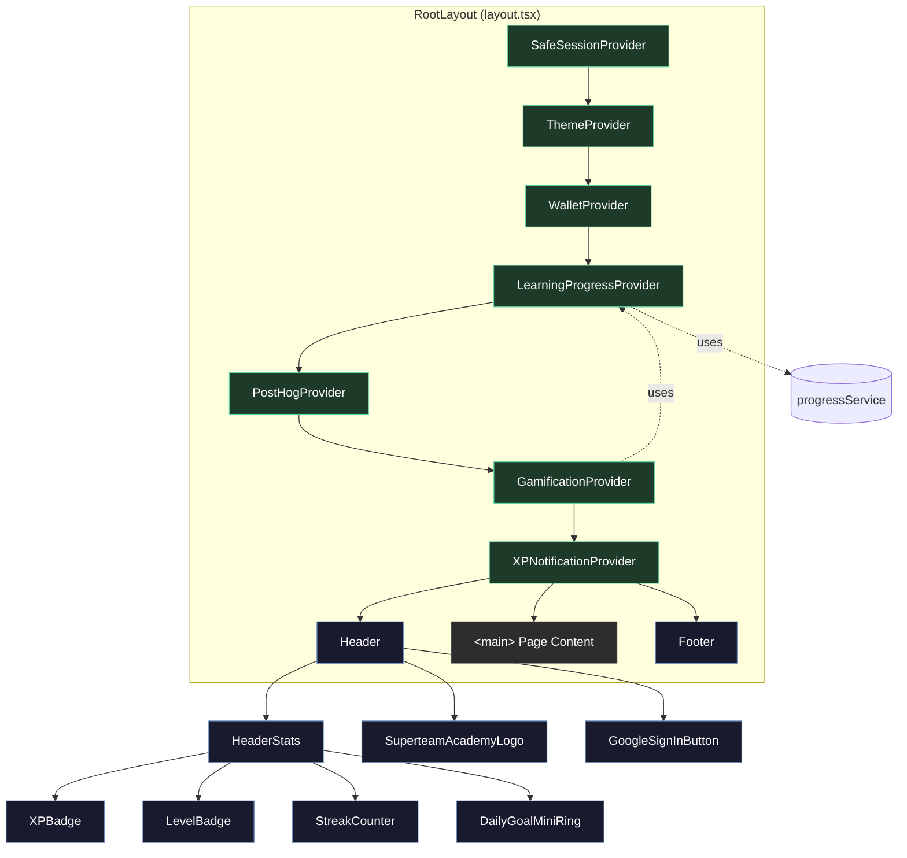
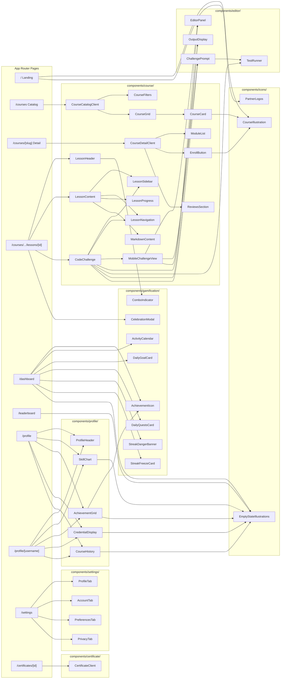
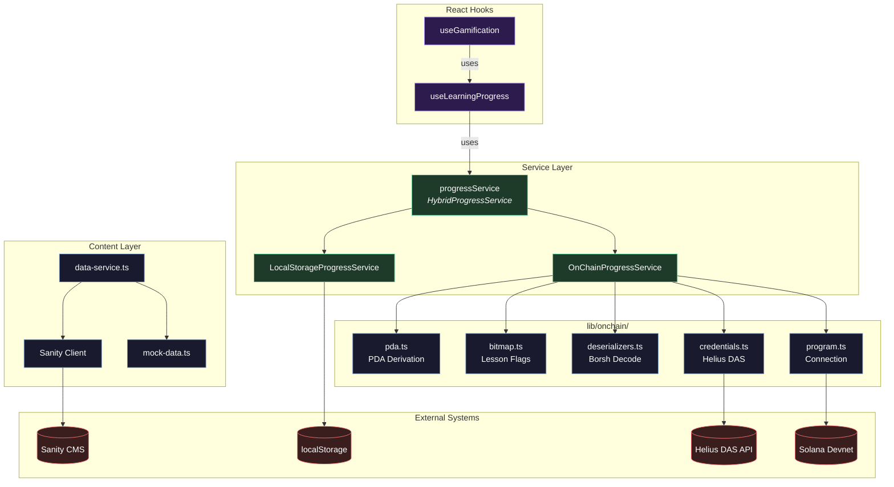

# Superteam Academy -- Frontend Architecture

System architecture for the Next.js frontend of Superteam Academy. For the on-chain Anchor program specification, see [../docs/SPEC.md](../docs/SPEC.md) and [../docs/ARCHITECTURE.md](../docs/ARCHITECTURE.md).

---

## System Overview

```
+-----------------------------+      +---------------------------+
|    Next.js 16 Frontend      |      |   Solana Devnet           |
|    (App Router + React 19)  |      |                           |
|                             |      |   Anchor Program          |
|   Wallet Adapter            |----->|   (ACADBRCB3z...)         |
|   OnChainProgressService    |      |                           |
|   HybridProgressService     |      |   Config PDA              |
|   Sanity CMS Client         |      |   Course PDAs             |
|                             |      |   Enrollment PDAs         |
+-----------------------------+      |   LearnerProfile PDAs     |
         |         |                 |   XP Token (Token-2022)   |
         |         |                 +---------------------------+
         |         v                          |
   +----------+  +--------+          +----------------+
   | Sanity   |  | local- |          | Helius DAS API |
   | CMS      |  | Storage|          | (credentials,  |
   | (content)|  | (state)|          |  leaderboard)  |
   +----------+  +--------+          +----------------+
```

The frontend communicates with four external systems:

1. **Solana devnet** -- reads on-chain state (XP token balances, enrollment PDAs, course PDAs) via `@solana/web3.js`
2. **Helius DAS API** -- fetches credentials (Metaplex Core assets with `track_id` attributes) and XP token holders for leaderboard ranking
3. **Sanity CMS** -- pulls course content (titles, modules, lessons, challenges) via GROQ queries; falls back to mock data when not configured
4. **localStorage** -- persists progress, streaks, achievements, daily quests, and combos client-side for instant UI feedback

---

## Directory Structure

```
app/src/
├── app/                          Next.js App Router pages
│   ├── layout.tsx                Root layout (providers, header, footer)
│   ├── page.tsx                  Landing page
│   ├── globals.css               Tailwind v4 theme + Superteam color palette
│   ├── global-error.tsx          Error boundary
│   ├── not-found.tsx             404 page
│   ├── courses/
│   │   ├── layout.tsx            Courses section layout
│   │   ├── page.tsx              Course catalog (search, filter by track/difficulty)
│   │   └── [slug]/
│   │       ├── page.tsx          Course detail (modules, enrollment CTA, progress)
│   │       └── lessons/[id]/
│   │           └── page.tsx      Lesson view + split-pane Monaco editor
│   ├── dashboard/                XP stats, progress charts, streak, achievements
│   │   ├── layout.tsx
│   │   └── page.tsx
│   ├── leaderboard/              Ranked table with timeframe toggle
│   │   ├── layout.tsx
│   │   └── page.tsx
│   ├── profile/                  User profile + public profile routes
│   │   ├── layout.tsx
│   │   ├── page.tsx
│   │   └── [username]/page.tsx
│   ├── settings/                 User preferences (theme, language, notifications)
│   │   ├── layout.tsx
│   │   └── page.tsx
│   ├── certificates/[id]/        On-chain credential detail with verification
│   │   └── page.tsx
│   └── api/auth/[...nextauth]/   NextAuth.js route handler
│       └── route.ts
│
├── components/
│   ├── auth/                     sign-in-button.tsx
│   ├── gamification/             XP badge, streak counter, level badge,
│   │   ├── achievement-card.tsx    achievement card/icon, activity calendar,
│   │   ├── achievement-icon.tsx    celebration modal, combo indicator,
│   │   ├── activity-calendar.tsx   daily goal, daily quests, header stats,
│   │   ├── celebration-modal.tsx   streak counter, streak danger banner,
│   │   ├── combo-indicator.tsx     streak freeze card, xp badge,
│   │   ├── daily-goal.tsx          xp notification
│   │   ├── daily-quests.tsx
│   │   ├── header-stats.tsx
│   │   ├── index.ts
│   │   ├── level-badge.tsx
│   │   ├── streak-counter.tsx
│   │   ├── streak-danger-banner.tsx
│   │   ├── streak-freeze-card.tsx
│   │   ├── xp-badge.tsx
│   │   └── xp-notification.tsx
│   ├── layout/                   Header, Footer, ThemeProvider,
│   │   ├── header.tsx              WalletProvider, PostHogProvider
│   │   ├── footer.tsx
│   │   ├── theme-provider.tsx
│   │   ├── wallet-provider.tsx
│   │   └── posthog-provider.tsx
│   └── ui/                       Radix-based design system (17 components)
│       ├── accordion.tsx           button, card, dialog, tabs, tooltip,
│       ├── avatar.tsx              input, label, select, badge, progress,
│       ├── badge.tsx               scroll-area, separator, skeleton,
│       ├── button.tsx              switch, dropdown-menu, accordion, avatar
│       └── ...
│
├── i18n/
│   ├── config.ts                 Locale list: en, pt-BR, es
│   ├── request.ts                Server-side locale resolution (cookie-based)
│   └── actions.ts                Server action for locale switching
│
├── lib/
│   ├── constants.ts              XP limits, track registry (7 tracks),
│   │                             learning paths, difficulty colors
│   ├── utils.ts                  cn(), XP math, address truncation
│   ├── mock-data.ts              Fallback course/achievement data
│   ├── data-service.ts           Sanity-or-mock data fetcher
│   ├── analytics.ts              GA4 + PostHog event tracking
│   ├── hooks/
│   │   ├── use-learning-progress.tsx   React context for progress/XP/streaks
│   │   └── use-gamification.tsx        Daily goals, quests, combos, celebrations
│   ├── onchain/
│   │   ├── constants.ts          Program ID, Token-2022 ID, RPC URLs
│   │   ├── pda.ts                PDA derivation (config, course, enrollment,
│   │   │                         minter role, achievement type, achievement receipt)
│   │   ├── bitmap.ts             Lesson flag bitmap utilities
│   │   ├── program.ts            Connection factory
│   │   ├── idl.ts                Anchor IDL type definition
│   │   ├── credentials.ts        Helius DAS: getOnChainCredentials, getXpTokenHolders
│   │   ├── index.ts              Re-exports
│   │   └── instructions/
│   │       ├── enroll.ts         Enroll transaction builder
│   │       ├── close-enrollment.ts  Close enrollment transaction builder
│   │       └── index.ts
│   ├── sanity/
│   │   ├── client.ts             Sanity client (null when PROJECT_ID not set)
│   │   ├── queries.ts            GROQ queries (allCourses, courseBySlug, allLearningPaths)
│   │   └── schemas/              5 CMS schemas: course, module, lesson,
│   │       ├── index.ts            challenge, learning-path
│   │       ├── course.ts
│   │       ├── module.ts
│   │       ├── lesson.ts
│   │       ├── challenge.ts
│   │       └── learning-path.ts
│   └── services/
│       ├── index.ts              Singleton: exports HybridProgressService
│       ├── learning-progress.ts  LearningProgressService interface +
│       │                         LocalStorageProgressService implementation
│       ├── onchain-progress.ts   OnChainProgressService (reads Solana state)
│       ├── hybrid-progress.ts    HybridProgressService (combines both)
│       └── account-linking.ts    Social account linking service
│
├── messages/
│   ├── en.json                   English translations
│   ├── pt-BR.json                Portuguese (BR) translations
│   └── es.json                   Spanish translations
│
├── __tests__/                    Vitest unit tests (7 test files)
│   ├── utils.test.ts             XP math, level calculations, cn()
│   ├── learning-progress.test.ts Enrollment, completion, streaks, achievements
│   ├── gamification-components.test.ts  Level-up, calendar, XP formatting
│   ├── data-service.test.ts      Sanity/mock data fallback
│   ├── analytics.test.ts         Event tracking
│   ├── account-linking.test.ts   Social linking
│   └── i18n-completeness.test.ts Translation key parity
│
└── types/
    ├── index.ts                  Domain types (Course, Module, Lesson, Challenge,
    │                             Progress, StreakData, LeaderboardEntry,
    │                             Achievement, Credential, UserProfile, LearningPath)
    └── env.d.ts                  ProcessEnv type declarations
```

---

## Component Hierarchy

```
RootLayout (layout.tsx)
├── NextIntlClientProvider (i18n context from cookie)
│   └── ThemeProvider (next-themes, class strategy, default: dark)
│       └── WalletProvider (Solana ConnectionProvider + WalletModalProvider)
│           └── LearningProgressProvider (XP, streaks, progress context)
│               └── GamificationProvider (daily goals, quests, combos)
│                   └── PostHogProvider (analytics)
│                       ├── Header
│                       │   ├── Navigation links (Courses, Dashboard, Leaderboard)
│                       │   ├── HeaderStats (XP badge, streak counter, level badge)
│                       │   ├── Locale switcher dropdown
│                       │   ├── Theme toggle (dark/light)
│                       │   └── Wallet connect button (WalletMultiButton)
│                       ├── <main id="main-content">
│                       │   └── {page route content}
│                       └── Footer
```

---

## Component Dependency Diagrams

### Provider & Layout Chain

The root layout wraps all pages in a nested provider chain. Each provider adds a layer of context accessible to all descendant components.


```mermaid
graph TD
    subgraph RootLayout["RootLayout (layout.tsx)"]
        SSP[SafeSessionProvider]
        SSP --> TP[ThemeProvider]
        TP --> WP[WalletProvider]
        WP --> LPP[LearningProgressProvider]
        LPP --> PHP[PostHogProvider]
        PHP --> GP[GamificationProvider]
        GP --> XPNP[XPNotificationProvider]
        XPNP --> H[Header]
        XPNP --> MAIN["&lt;main&gt; Page Content"]
        XPNP --> F[Footer]
    end

    LPP -.->|uses| PS[(progressService)]
    GP -.->|uses| LPP
    H --> HS[HeaderStats]
    H --> SL[SuperteamAcademyLogo]
    H --> GSI[GoogleSignInButton]
    HS --> XPB[XPBadge]
    HS --> LB[LevelBadge]
    HS --> SC[StreakCounter]
    HS --> DGM[DailyGoalMiniRing]

    classDef provider fill:#1e3a28,stroke:#5fd4a0,color:#fff
    classDef page fill:#2d2d2d,stroke:#888,color:#fff
    classDef component fill:#1a1a2e,stroke:#6c8ebf,color:#fff
    class SSP,TP,WP,LPP,PHP,GP,XPNP provider
    class MAIN page
    class H,F,HS,SL,GSI,XPB,LB,SC,DGM component
```

### Page → Component Dependencies

Each page route composes reusable components from the `components/` directories.


```mermaid
graph LR
    subgraph Pages["App Router Pages"]
        LP["/ Landing"]
        CC["/courses Catalog"]
        CD["/courses/[slug] Detail"]
        LN["/courses/.../lessons/[id]"]
        DB["/dashboard"]
        LB["/leaderboard"]
        PR["/profile"]
        PU["/profile/[username]"]
        ST["/settings"]
        CT["/certificates/[id]"]
    end

    subgraph CourseComponents["components/course/"]
        CCC[CourseCatalogClient]
        CDC[CourseDetailClient]
        CF[CourseFilters]
        CG[CourseGrid]
        CCrd[CourseCard]
        ML[ModuleList]
        EB[EnrollButton]
        RS[ReviewsSection]
        LH[LessonHeader]
        LC[LessonContent]
        CCh[CodeChallenge]
        LS[LessonSidebar]
        LNav[LessonNavigation]
        LPr[LessonProgress]
        MC[MarkdownContent]
        MCV[MobileChallengeView]
    end

    subgraph EditorComponents["components/editor/"]
        EP[EditorPanel]
        TR[TestRunner]
        OD[OutputDisplay]
        CP[ChallengePrompt]
    end

    subgraph ProfileComponents["components/profile/"]
        PH[ProfileHeader]
        SKC[SkillChart]
        AG[AchievementGrid]
        CrD[CredentialDisplay]
        CH[CourseHistory]
    end

    subgraph GamificationComponents["components/gamification/"]
        AI[AchievementIcon]
        AC[ActivityCalendar]
        CM[CelebrationModal]
        CI[ComboIndicator]
        DG[DailyGoalCard]
        DQ[DailyQuestsCard]
        SDB[StreakDangerBanner]
        SFC[StreakFreezeCard]
    end

    subgraph SettingsComponents["components/settings/"]
        PTb[ProfileTab]
        ATb[AccountTab]
        PrTb[PreferencesTab]
        PvTb[PrivacyTab]
    end

    subgraph CertComponents["components/certificate/"]
        CertC[CertificateClient]
    end

    subgraph Icons["components/icons/"]
        CI2[CourseIllustration]
        PLM[PartnerLogos]
        ESI[EmptyStateIllustrations]
    end

    %% Page → Component edges
    LP --> CI2
    LP --> PLM

    CC --> CCC
    CCC --> CF
    CCC --> CG
    CG --> CCrd
    CCrd --> CI2

    CD --> CDC
    CDC --> ML
    CDC --> EB
    CDC --> RS
    EB --> CI2

    LN --> LH
    LN --> LC
    LN --> CCh
    LN --> CM
    LH --> CI
    LC --> LS
    LC --> LNav
    LC --> LPr
    LC --> MC
    CCh --> LS
    CCh --> LNav
    CCh --> MCV
    CCh --> EP
    CCh --> TR
    CCh --> OD
    CCh --> CP
    MCV --> EP
    MCV --> CP
    MCV --> OD
    CP --> TR

    DB --> AI
    DB --> AC
    DB --> DG
    DB --> DQ
    DB --> SDB
    DB --> SFC
    DB --> ESI

    LB --> ESI

    PR --> PH
    PR --> SKC
    PR --> AG
    PR --> CrD
    PR --> CH
    PU --> PH
    PU --> SKC
    PU --> AG
    PU --> CrD
    PU --> CH
    AG --> AI
    SKC --> ESI
    AG --> ESI
    CrD --> ESI
    CH --> ESI

    ST --> PTb
    ST --> ATb
    ST --> PrTb
    ST --> PvTb

    CT --> CertC
```

### Service Layer Architecture

The three-tier service layer provides a clean abstraction over data storage. The `HybridProgressService` singleton is the default entry point.


```mermaid
graph TD
    subgraph Hooks["React Hooks"]
        ULP[useLearningProgress]
        UG[useGamification]
    end

    subgraph ServiceLayer["Service Layer"]
        PS[progressService<br/><i>HybridProgressService</i>]
        LS[LocalStorageProgressService]
        OCS[OnChainProgressService]
    end

    subgraph OnChainLib["lib/onchain/"]
        PDA[pda.ts<br/>PDA Derivation]
        BM[bitmap.ts<br/>Lesson Flags]
        CRED[credentials.ts<br/>Helius DAS]
        DESER[deserializers.ts<br/>Borsh Decode]
        PROG[program.ts<br/>Connection]
    end

    subgraph DataService["Content Layer"]
        DS[data-service.ts]
        SC[Sanity Client]
        MD[mock-data.ts]
    end

    subgraph External["External Systems"]
        SOL[(Solana Devnet)]
        HEL[(Helius DAS API)]
        SAN[(Sanity CMS)]
        LSTO[(localStorage)]
    end

    ULP -->|uses| PS
    UG -->|uses| ULP

    PS --> LS
    PS --> OCS

    LS --> LSTO
    OCS --> PDA
    OCS --> BM
    OCS --> DESER
    OCS --> CRED
    OCS --> PROG

    PROG --> SOL
    CRED --> HEL

    DS --> SC
    DS --> MD
    SC --> SAN

    classDef hook fill:#2d1b4e,stroke:#a78bfa,color:#fff
    classDef service fill:#1e3a28,stroke:#5fd4a0,color:#fff
    classDef lib fill:#1a1a2e,stroke:#6c8ebf,color:#fff
    classDef ext fill:#3a1e1e,stroke:#f87171,color:#fff
    class ULP,UG hook
    class PS,LS,OCS service
    class PDA,BM,CRED,DESER,PROG,DS,SC,MD lib
    class SOL,HEL,SAN,LSTO ext
```

### Cross-Cutting Component Dependencies

Components reuse shared UI primitives and utility functions across directories.


```mermaid
graph TD
    subgraph SharedUI["components/ui/"]
        Skeleton
        EmptyState
        Button
        Card
        Badge
        Progress
        Tabs
        Dialog
        Tooltip
    end

    subgraph Utilities["lib/"]
        utils["utils.ts<br/>cn, formatXP, xpProgress,<br/>getLevel, truncateAddress"]
        analytics["analytics.ts<br/>trackEvent"]
        constants["constants.ts<br/>TRACKS, DIFFICULTY_BG,<br/>LEARNING_PATHS"]
    end

    subgraph Consumers["Component Consumers"]
        CourseCard
        EnrollButton
        CourseGrid
        HeaderStats
        AchievementGrid
        CredentialDisplay
        SkillChart
        CourseHistory
        DailyQuestsCard
        CertificateClient
        LessonProgress
        CodeChallenge
    end

    CourseCard --> utils
    CourseCard --> constants
    EnrollButton --> utils
    EnrollButton --> constants
    HeaderStats --> utils
    AchievementGrid --> utils
    CredentialDisplay --> utils
    CredentialDisplay --> constants
    CourseHistory --> utils
    CertificateClient --> utils
    CertificateClient --> analytics
    CodeChallenge --> analytics

    CourseGrid --> EmptyState
    SkillChart --> EmptyState
    AchievementGrid --> EmptyState
    CredentialDisplay --> EmptyState
    CourseHistory --> EmptyState
    DailyQuestsCard --> EmptyState

    HeaderStats --> Skeleton
    SkillChart --> Skeleton
    LessonProgress --> Button
    CourseCard --> Badge
    CourseCard --> Progress
    EnrollButton --> Button
    EnrollButton --> Progress

    classDef ui fill:#1a1a2e,stroke:#6c8ebf,color:#fff
    classDef util fill:#2d2d1e,stroke:#d4a05f,color:#fff
    classDef consumer fill:#1e3a28,stroke:#5fd4a0,color:#fff
    class Skeleton,EmptyState,Button,Card,Badge,Progress,Tabs,Dialog,Tooltip ui
    class utils,analytics,constants util
    class CourseCard,EnrollButton,CourseGrid,HeaderStats,AchievementGrid,CredentialDisplay,SkillChart,CourseHistory,DailyQuestsCard,CertificateClient,LessonProgress,CodeChallenge consumer
```

---

## Data Flow: The Service Layer

### LearningProgressService Interface

Defined in `src/lib/services/learning-progress.ts`, this is the contract all progress services implement:

```typescript
interface LearningProgressService {
  // Progress
  getProgress(userId: string, courseId: string): Promise<Progress | null>;
  getAllProgress(userId: string): Promise<Progress[]>;
  completeLesson(userId: string, courseId: string, lessonIndex: number): Promise<void>;
  enrollInCourse(userId: string, courseId: string): Promise<void>;

  // XP
  getXP(userId: string): Promise<number>;
  addXP(userId: string, amount: number): Promise<number>;

  // Streaks
  getStreak(userId: string): Promise<StreakData>;
  recordActivity(userId: string): Promise<StreakData>;

  // Leaderboard
  getLeaderboard(timeframe: "weekly" | "monthly" | "alltime"): Promise<LeaderboardEntry[]>;

  // Credentials
  getCredentials(wallet: string): Promise<Credential[]>;

  // Achievements
  getAchievements(userId: string): Promise<Achievement[]>;
  claimAchievement(userId: string, achievementId: number): Promise<void>;
}
```

### Three Implementations

| Service | File | Reads From | Writes To |
|---------|------|-----------|----------|
| `LocalStorageProgressService` | `learning-progress.ts` | localStorage | localStorage |
| `OnChainProgressService` | `onchain-progress.ts` | Solana RPC + Helius DAS | Solana transactions |
| `HybridProgressService` | `hybrid-progress.ts` | Chain first, localStorage fallback | localStorage (instant) + chain (enrollment) |

### HybridProgressService (Default Singleton)

Exported as `progressService` from `src/lib/services/index.ts`. The hybrid service uses a `setWallet()` method to toggle between on-chain and local modes:

```
progressService = new HybridProgressService()
  ├── local: LocalStorageProgressService  (always available)
  └── onchain: OnChainProgressService     (active when wallet connected)
```

**Per-data-type strategy:**

| Data | Read Strategy | Write Strategy |
|------|--------------|----------------|
| **XP** | On-chain Token-2022 balance via ATA query; returns `max(onchain, local)` for seamless transition | localStorage only (backend-signed minting is a separate flow) |
| **Progress** | On-chain Enrollment PDA (deserializes lesson bitmap); falls back to localStorage | localStorage for instant UI feedback |
| **Enrollment** | On-chain PDA existence check | Real `enroll` transaction when wallet connected; localStorage fallback |
| **Streaks** | localStorage always (on-chain streaks require backend signer) | localStorage always |
| **Leaderboard** | Helius DAS `getTokenAccounts` for XP mint holders; falls back to mock data | N/A (read-only) |
| **Credentials** | Helius DAS `getAssetsByOwner` filtered by `track_id` attribute | N/A (read-only) |
| **Achievements** | localStorage always (20 built-in achievements across 5 categories) | localStorage always |

### Data Flow Diagram

```
User completes a lesson
    |
    v
useLearningProgress hook (React context)
    |
    v
HybridProgressService.completeLesson()
    |
    +---> LocalStorageProgressService.completeLesson()
    |       - Updates lesson bitmap in localStorage
    |       - Recalculates percentage
    |       - Sets completedAt if 100%
    |       (instant UI update)
    |
    +---> On-chain completion NOT done client-side
            (requires backend_signer -- see below)
```

For on-chain lesson completion, the flow is:

```
Client                  Backend                 Solana
  |                       |                       |
  | POST /complete        |                       |
  |    (lesson proof)     |                       |
  |---------------------> |                       |
  |                       | complete_lesson ix    |
  |                       |  (signed by backend)  |
  |                       |---------------------> |
  |                       |                       | Update enrollment bitmap
  |                       |                       | Mint XP (Token-2022 CPI)
  |                       |                       | Update streak
  |                       |    TX confirmed       |
  |                       | <---------------------|
  |   200 OK              |                       |
  | <---------------------|                       |
```

---

## On-Chain Integration

### Program Details

| Property | Value |
|----------|-------|
| Program ID | `ACADBRCB3zGvo1KSCbkztS33ZNzeBv2d7bqGceti3ucf` |
| Network | Solana devnet |
| Framework | Anchor |
| Token Standard | Token-2022 (NonTransferable + PermanentDelegate) |

### PDA Derivation (Frontend)

The frontend derives PDAs identically to the on-chain program. Defined in `src/lib/onchain/pda.ts`:

| PDA | Seeds | Purpose |
|-----|-------|---------|
| Config | `["config"]` | Singleton; holds current XP mint, backend signer, authority |
| Course | `["course", courseId]` | Course metadata: lesson count, XP amounts, track info |
| Enrollment | `["enrollment", courseId, learnerPubkey]` | Lesson completion bitmap for a specific learner in a course |
| Minter Role | `["minter", minterPubkey]` | Authorization for minting XP tokens |
| Achievement Type | `["achievement", achievementId]` | Achievement definition |
| Achievement Receipt | `["achievement_receipt", achievementId, recipientPubkey]` | Proof of claimed achievement |

### How the Frontend Reads On-Chain State

**XP Balance** (in `OnChainProgressService.getXP()`):
1. Fetch Config PDA to get the current season's XP mint address
2. Derive the learner's Associated Token Account (ATA) for Token-2022
3. Call `connection.getTokenAccountBalance()` to read the raw balance

**Enrollment Progress** (in `OnChainProgressService.getProgress()`):
1. Derive the Enrollment PDA from `["enrollment", courseId, learnerPubkey]`
2. Fetch the account data and manually deserialize (skip 8-byte Anchor discriminator, read fields sequentially in little-endian)
3. Extract the `lesson_flags` bitmap (`[u64; 4]` -- supports up to 256 lessons)
4. Compare completed lesson count against the Course PDA's `lesson_count`

**Credentials** (in `credentials.ts`):
1. Call Helius DAS `getAssetsByOwner` for the learner's wallet
2. Filter assets that have a `track_id` attribute in their metadata
3. Map DAS attributes (`level`, `courses_completed`, `total_xp`) to the `Credential` type

**Leaderboard** (in `credentials.ts`):
1. Call Helius DAS `getTokenAccounts` with the current XP mint address
2. Get all holders sorted by balance (descending)
3. Map to `LeaderboardEntry` with rank, wallet, XP, and derived level

### Account Deserialization

The frontend manually deserializes Anchor accounts from raw buffers rather than using the Anchor client library. This keeps the bundle smaller. The deserialization is in `src/lib/services/onchain-progress.ts`:

- `deserializeConfig(data)` -- Extracts `authority`, `backendSigner`, `xpMint`
- `deserializeCourse(data)` -- Extracts `courseId`, `lessonCount`, `xpPerLesson`, `trackId`, `isActive`
- `deserializeEnrollment(data)` -- Extracts `course`, `enrolledAt`, `completedAt`, `lessonFlags`

### Transaction Building

The frontend builds and signs transactions for learner-initiated actions:

- **Enroll**: Computes the SHA-256 Anchor discriminator for `global:enroll`, encodes `courseId` as a Borsh string, builds a `VersionedTransaction`, and has the wallet sign it.
- **Close Enrollment**: Similar pattern for reclaiming enrollment PDA rent after course completion.

Backend-signed operations (complete_lesson, finalize_course, issue_credential, claim_achievement) cannot be built client-side.

---

## API Reference

Complete reference for all service interfaces, utility functions, and domain types. File paths are relative to `src/`.

### LearningProgressService

**File:** `lib/services/learning-progress.ts`

The primary contract for learner progress tracking. Three implementations exist — see [Three Implementations](#three-implementations) above.

#### Progress Methods

| Method | Signature | Description |
|--------|-----------|-------------|
| `getProgress` | `(userId: string, courseId: string) → Promise<Progress \| null>` | Get a learner's progress for a specific course. Returns lesson bitmap, percentage, and enrollment timestamps. |
| `getAllProgress` | `(userId: string) → Promise<Progress[]>` | Get progress records for all courses the learner is enrolled in. |
| `completeLesson` | `(userId: string, courseId: string, lessonIndex: number) → Promise<void>` | Mark a lesson as completed. Updates bitmap, recalculates percentage, sets `completedAt` if 100%. |
| `enrollInCourse` | `(userId: string, courseId: string) → Promise<void>` | Create a new enrollment record. On-chain: builds and sends an `enroll` transaction. Local: creates a localStorage entry. |

#### XP Methods

| Method | Signature | Description |
|--------|-----------|-------------|
| `getXP` | `(userId: string) → Promise<number>` | Get total XP balance. On-chain: reads Token-2022 ATA balance. Hybrid: returns `max(onchain, local)`. |
| `addXP` | `(userId: string, amount: number) → Promise<number>` | Award XP. Returns the new total. On-chain: stub (requires backend signer). Local: adds to localStorage. |

#### Streak Methods

| Method | Signature | Description |
|--------|-----------|-------------|
| `getStreak` | `(userId: string) → Promise<StreakData>` | Get current streak, longest streak, streak freezes, and 30-day activity calendar. |
| `recordActivity` | `(userId: string) → Promise<StreakData>` | Record today's activity. Extends current streak, uses streak freeze if one day was missed, or resets. |

#### Leaderboard

| Method | Signature | Description |
|--------|-----------|-------------|
| `getLeaderboard` | `(timeframe: "weekly" \| "monthly" \| "alltime") → Promise<LeaderboardEntry[]>` | Fetch ranked XP leaderboard. On-chain: Helius DAS `getTokenAccounts`. Local: deterministic mock data. |

#### Credentials

| Method | Signature | Description |
|--------|-----------|-------------|
| `getCredentials` | `(wallet: string) → Promise<Credential[]>` | Fetch on-chain credentials (evolving cNFTs). Uses Helius DAS `getAssetsByOwner` filtered by `track_id`. |

#### Achievements

| Method | Signature | Description |
|--------|-----------|-------------|
| `getAchievements` | `(userId: string) → Promise<Achievement[]>` | Get all 20 achievements with the learner's claim status. On-chain bitmap supports up to 256. |
| `claimAchievement` | `(userId: string, achievementId: number) → Promise<void>` | Claim an unlocked achievement. Awards the achievement's XP reward. |

### HybridProgressService

**File:** `lib/services/hybrid-progress.ts` — Default singleton exported as `progressService` from `lib/services/index.ts`.

| Method | Signature | Description |
|--------|-----------|-------------|
| `setWallet` | `(wallet: AnchorWallet \| null) → void` | Toggle between on-chain and local modes. Called by `LearningProgressProvider` when wallet connects/disconnects. |
| `isOnChain` | `→ boolean` (getter) | Whether a wallet is connected and the on-chain service is active. |

### OnChainProgressService

**File:** `lib/services/onchain-progress.ts`

| Method | Signature | Description |
|--------|-----------|-------------|
| `constructor` | `(rpcUrl?: string)` | Create instance. Defaults to devnet RPC from environment. |
| `setWallet` | `(wallet: AnchorWallet \| null) → void` | Set the wallet for signing transactions and deriving ATAs. |

### Account Linking Service

**File:** `lib/services/account-linking.ts`

Associates wallet public keys with OAuth sessions for unified identity. All data persisted in localStorage under `sta_linked_accounts`.

#### Types

```typescript
interface LinkedAccount {
  id: string;                                    // wallet pubkey, email, or username
  provider: "google" | "github" | "wallet";      // auth provider type
  label: string;                                  // display label
  linkedAt: string;                               // ISO 8601 timestamp
}

interface AccountLinkData {
  primaryId: string;                              // first linked account (canonical identity)
  accounts: LinkedAccount[];                      // all linked methods
}
```

#### Functions

| Function | Signature | Description |
|----------|-----------|-------------|
| `getLinkedAccounts` | `() → LinkedAccount[]` | Get all authentication methods linked to the current learner. |
| `linkAccount` | `(provider, id, label) → LinkedAccount[]` | Link a new auth method. No-ops if already linked. Returns updated list. |
| `unlinkAccount` | `(provider, id) → LinkedAccount[]` | Remove a linked auth method. Returns remaining accounts. |
| `isLinked` | `(provider) → boolean` | Check if a specific provider type is already linked. |
| `autoLink` | `(walletPubkey: string \| null, session: {provider?, email?, name?} \| null) → void` | Auto-link wallet and OAuth when both are available. Called on sign-in. |

### Data Service (CMS Layer)

**File:** `lib/data-service.ts`

Content fetcher with automatic Sanity CMS → mock data fallback. Sanity is active when `NEXT_PUBLIC_SANITY_PROJECT_ID` is set.

| Function | Signature | Description |
|----------|-----------|-------------|
| `getAllCourses` | `() → Promise<Course[]>` | Fetch all published courses. Falls back to 6 mock courses. |
| `getCourseBySlug` | `(slug: string) → Promise<Course \| undefined>` | Fetch single course with full modules/lessons. |
| `getCoursesByTrack` | `(trackId: number) → Course[]` | Filter courses by learning track ID (0–6). |
| `getCoursesByDifficulty` | `(difficulty: "beginner" \| "intermediate" \| "advanced") → Course[]` | Filter courses by difficulty level. |
| `getAllLearningPaths` | `() → Promise<LearningPath[]>` | Fetch curated learning paths (ordered course sequences). |
| `getAllAchievements` | `() → Achievement[]` | Get all 20 achievements across 5 categories. |

### Analytics Service

**File:** `lib/analytics.ts`

Type-safe event tracking dispatched to GA4 (`window.gtag`) and PostHog. Safe to call during SSR (no-ops when `window` is undefined).

| Function | Signature | Description |
|----------|-----------|-------------|
| `trackEvent` | `(event: AnalyticsEvent) → void` | Dispatch event to all configured analytics providers. |

#### Tracked Events

| Event Name | Parameters | Triggered By |
|------------|-----------|--------------|
| `course_enrolled` | `{ course_slug, course_title }` | User enrolls in a course |
| `lesson_completed` | `{ course_slug, lesson_id, xp_earned }` | User completes a lesson |
| `achievement_claimed` | `{ achievement_id, achievement_name }` | User claims an achievement badge |
| `language_changed` | `{ locale }` | User switches UI language |
| `wallet_connected` | `{ wallet_type }` | Wallet adapter connects |
| `certificate_shared` | `{ platform: "twitter" \| "linkedin", cert_id }` | User shares a certificate |
| `code_challenge_run` | `{ course_slug, lesson_id, passed }` | User runs code in the editor |

### On-Chain Utilities

#### PDA Derivation — `lib/onchain/pda.ts`

All functions return `[PublicKey, number]` (address and bump seed).

| Function | Seeds | Description |
|----------|-------|-------------|
| `getConfigPda()` | `["config"]` | Singleton program configuration (authority, backend signer, XP mint). |
| `getCoursePda(courseId)` | `["course", courseId]` | Course metadata PDA. |
| `getEnrollmentPda(courseId, learner)` | `["enrollment", courseId, learner]` | Learner's enrollment in a specific course. |
| `getMinterRolePda(minter)` | `["minter", minter]` | Authorization for a backend signer to mint XP. |
| `getAchievementTypePda(achievementId)` | `["achievement", achievementId]` | Achievement definition metadata. |
| `getAchievementReceiptPda(achievementId, recipient)` | `["achievement_receipt", achievementId, recipient]` | Proof that a learner claimed an achievement. |

#### Bitmap Utilities — `lib/onchain/bitmap.ts`

Decodes lesson completion flags from on-chain Enrollment accounts. The bitmap is a `[u64; 4]` array supporting up to 256 lessons.

| Function | Signature | Description |
|----------|-----------|-------------|
| `isLessonComplete` | `(lessonFlags: BN[], lessonIndex: number) → boolean` | Check if a specific lesson bit is set. |
| `countCompletedLessons` | `(lessonFlags: BN[]) → number` | Count total set bits across the bitmap. |
| `getCompletedLessonIndices` | `(lessonFlags: BN[], lessonCount: number) → number[]` | Extract sorted array of completed lesson indices. |

#### Helius DAS Wrappers — `lib/onchain/credentials.ts`

| Function | Signature | Description |
|----------|-----------|-------------|
| `getOnChainCredentials` | `(walletAddress: string) → Promise<Credential[]>` | Fetch academy credentials (cNFTs with `track_id` attribute) via `getAssetsByOwner`. |
| `getXpTokenHolders` | `(xpMint: string) → Promise<Array<{owner, balance}>>` | Fetch all XP token holders sorted by balance for leaderboard ranking. |

#### Account Deserializers — `lib/onchain/deserializers.ts`

Manual Borsh deserialization of Anchor accounts. Each function skips the 8-byte discriminator and reads fields in little-endian order.

| Function | Signature | Returns |
|----------|-----------|---------|
| `deserializeConfig` | `(data: Buffer) → ConfigData` | `{ authority, backendSigner, xpMint }` — all `PublicKey` |
| `deserializeCourse` | `(data: Buffer) → CourseData` | `{ courseId, lessonCount, xpPerLesson, trackId, trackLevel, isActive }` |
| `deserializeEnrollment` | `(data: Buffer) → EnrollmentData` | `{ course, enrolledAt, completedAt, lessonFlags }` — timestamps as Unix epoch |

#### Connection Factory — `lib/onchain/program.ts`

| Function | Signature | Description |
|----------|-----------|-------------|
| `getConnection` | `(rpcUrl?: string) → Connection` | Create Solana RPC connection with `"confirmed"` commitment. Defaults to devnet. |

#### Constants — `lib/onchain/constants.ts`

| Export | Value | Description |
|--------|-------|-------------|
| `PROGRAM_ID` | `ACADBRCB3zGvo1K...` | Superteam Academy Anchor program ID |
| `TOKEN_2022_PROGRAM_ID` | `TokenzQdBNbLqP5...` | SPL Token-2022 program |
| `MPL_CORE_PROGRAM_ID` | `CoREENxT6tW1HoK...` | Metaplex Core program |
| `ASSOCIATED_TOKEN_PROGRAM_ID` | `ATokenGPvbdGVxr...` | Associated Token Account program |
| `DEFAULT_RPC_URL` | `process.env.NEXT_PUBLIC_RPC_URL` | Solana RPC endpoint (fallback: devnet) |
| `HELIUS_RPC_URL` | `process.env.NEXT_PUBLIC_HELIUS_RPC_URL` | Helius DAS API endpoint |
| `CLUSTER` | `"devnet" \| "mainnet-beta" \| "localnet"` | Current Solana cluster |

### Transaction Builders — `lib/onchain/instructions/`

| Function | File | Signature | Description |
|----------|------|-----------|-------------|
| `checkEnrollmentOnChain` | `enroll.ts` | `(learner: PublicKey, courseId: string, rpcUrl?: string) → Promise<boolean>` | Check if wallet is already enrolled in a course on-chain. |

### Domain Types

**File:** `types/index.ts`

All types are pure TypeScript interfaces with no runtime dependencies.

#### Course & Content

| Type | Key Fields | Description |
|------|-----------|-------------|
| `Course` | `slug, title, difficulty, modules[], trackId, xpTotal` | Complete course with metadata, modules, and lessons. |
| `Module` | `title, order, lessons[]` | Ordered group of lessons within a course. |
| `Lesson` | `title, type: "content" \| "challenge", xpReward, challenge?` | Single lesson — either reading content or interactive challenge. |
| `Challenge` | `prompt, starterCode, language, testCases[], hints[], solution` | Interactive coding challenge with test runner. |
| `TestCase` | `name, input, expectedOutput, passed?` | Individual test assertion for a challenge. |

#### Progress & Gamification

| Type | Key Fields | Description |
|------|-----------|-------------|
| `Progress` | `courseId, completedLessons[], percentage, enrolledAt` | Learner's progress in a specific course. |
| `StreakData` | `currentStreak, longestStreak, streakFreezes, activityCalendar` | Consecutive-day activity tracking. |
| `LeaderboardEntry` | `rank, wallet, xp, level, streak` | Single row in the XP leaderboard. |
| `Achievement` | `id, name, category, xpReward, claimed` | Badge with 5 categories: progress, streaks, skills, community, special. |
| `Credential` | `trackId, trackName, currentLevel, coursesCompleted` | On-chain evolving cNFT per learning track. |

#### User & Navigation

| Type | Key Fields | Description |
|------|-----------|-------------|
| `UserProfile` | `wallet?, displayName, xp, level, achievements[], credentials[]` | Full user profile with stats and social links. |
| `LearningPath` | `name, courses[], color` | Curated sequence of courses for structured learning. |
| `LessonNavItem` | `lesson, moduleTitle` | Lesson with its parent module title (for navigation). |
| `FlattenedLesson` | `lesson, moduleTitle, moduleIndex` | Lesson with module context for flat iteration. |

### React Hooks

#### useLearningProgress — `lib/hooks/use-learning-progress.tsx`

Provider + hook wrapping `progressService`. Exposes all service methods as React state with automatic refetch on wallet change.

| Exposed Value | Type | Description |
|---------------|------|-------------|
| `xp` | `number` | Current XP balance |
| `level` | `number` | Derived level: `floor(sqrt(xp / 100))` |
| `streak` | `StreakData` | Current streak data |
| `achievements` | `Achievement[]` | All achievements with claim status |
| `credentials` | `Credential[]` | On-chain credentials |
| `leaderboard` | `LeaderboardEntry[]` | Current leaderboard |
| `getProgress(courseId)` | `→ Progress \| null` | Get progress for a course |
| `getAllProgress()` | `→ Progress[]` | Get all enrolled course progress |
| `completeLesson(courseId, lessonIndex)` | `→ void` | Complete a lesson and refresh state |
| `enrollInCourse(courseId)` | `→ void` | Enroll in a course |
| `addXP(amount)` | `→ number` | Award XP and refresh balance |
| `recordActivity()` | `→ StreakData` | Record daily activity |
| `claimAchievement(id)` | `→ void` | Claim an achievement |

#### useGamification — `lib/hooks/use-gamification.tsx`

Provider + hook managing daily goals, quests, combos, and celebration triggers.

| Exposed Value | Type | Description |
|---------------|------|-------------|
| `dailyGoal` | `{ target, current, completed }` | Daily XP goal progress |
| `dailyQuests` | `Quest[]` | 3 deterministic daily quests |
| `combo` | `{ multiplier, count, lastAt }` | Combo multiplier (1x/1.25x/1.5x/2x for completions within 30min) |
| `showCelebration` | `boolean` | Whether to show the celebration modal |
| `celebrationData` | `CelebrationData \| null` | Achievement/level-up data for the modal |
| `dismissCelebration()` | `→ void` | Close the celebration modal |

---

## Key Design Decisions

### Hybrid On-Chain + localStorage

The app is designed to work in three modes:

1. **No wallet, no program** -- Pure localStorage. The full app works: courses, progress, streaks, achievements, leaderboard (mock data).
2. **Wallet connected, program not deployed** -- Enrollment attempts on-chain but gracefully falls back to localStorage on failure.
3. **Wallet connected, program deployed** -- On-chain reads for XP and enrollment; localStorage for streaks and achievements; real enrollment transactions.

This approach means the frontend never blocks on RPC availability and always provides instant UI feedback.

### Sanity CMS with Mock Fallback

The `data-service.ts` layer checks `!!client` (which is `null` when `NEXT_PUBLIC_SANITY_PROJECT_ID` is unset). If Sanity is not configured, all queries return mock data from `mock-data.ts`. If a Sanity query fails at runtime, it also falls back to mock data with a `console.warn`.

### Gamification as Client State

Streaks, achievements, daily goals, daily quests (3 per day, deterministically generated from date), and combo multipliers (1x/1.25x/1.5x/2x based on completions within 30 minutes) are all stored in localStorage. The `GamificationProvider` context manages this state and persists it keyed by user ID.

When the backend signing flow is implemented, these will sync to the on-chain LearnerProfile PDA.

### i18n Without URL Prefixes

Locale is stored in a `locale` cookie (1-year TTL) and resolved server-side via `next-intl/server`. No `/en/` or `/pt-BR/` URL prefixes are used. Switching locale triggers a server action that writes the cookie and calls `router.refresh()`.

### XP Level Formula

Used consistently across all services and components:

```typescript
function levelFromXP(xp: number): number {
  return Math.floor(Math.sqrt(xp / 100));
}
// 0-99 XP = Level 0, 100-399 = Level 1, 400-899 = Level 2, ...
```

---

## Architecture Decision Records

Detailed rationale for key architectural choices is documented in [docs/adr/](docs/adr/):

| ADR | Decision |
|-----|----------|
| [0001](docs/adr/0001-nextjs-app-router.md) | Next.js App Router over Nuxt/SvelteKit/Pages Router |
| [0002](docs/adr/0002-sanity-cms-with-mock-fallback.md) | Sanity CMS with graceful mock data fallback |
| [0003](docs/adr/0003-wallet-auth-hybrid-approach.md) | Hybrid wallet adapter + NextAuth OAuth authentication |
| [0004](docs/adr/0004-hybrid-service-layer.md) | Three-tier service layer (localStorage + on-chain + hybrid) |
| [0005](docs/adr/0005-cookie-based-i18n.md) | Cookie-based i18n without URL prefixes |
| [0006](docs/adr/0006-manual-account-deserialization.md) | Manual Anchor account deserialization for bundle size |
| [0007](docs/adr/0007-client-side-gamification.md) | Client-side gamification state with sync-ready design |

---

## Performance Considerations

| Technique | Implementation |
|-----------|---------------|
| Server Components | Default for all pages. Client boundary pushed to interactive leaves. |
| Turbopack | Enabled in dev (`--turbopack`) for fast HMR. |
| CDN Content | Sanity client uses CDN in production (`useCdn: true`). |
| Font Optimization | `next/font/google` with `display: "swap"` for Inter and JetBrains Mono. |
| Code Splitting | Monaco Editor loaded only on lesson pages. |
| Minimal Client JS | Radix UI primitives are unstyled (no CSS-in-JS runtime). Tailwind is build-time only. |
| Manual Deserialization | On-chain accounts deserialized from raw buffers instead of loading the full Anchor client library. |
| Graceful Degradation | RPC failures silently fall back to localStorage; no spinners or error states for chain reads. |
