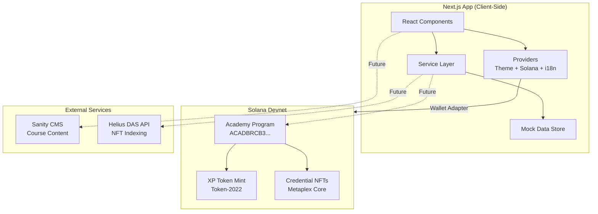

# Architecture Overview — Superteam Academy

## System Architecture


```mermaid
graph TB
    subgraph Frontend["Next.js App (Client-Side)"]
        UI[React Components]
        Providers[Providers<br/>Theme + Solana + i18n]
        Services[Service Layer]
        MockData[Mock Data Store]
    end

    subgraph Blockchain["Solana Devnet"]
        Program[Academy Program<br/>ACADBRCB3...]
        XPMint[XP Token Mint<br/>Token-2022]
        NFTs[Credential NFTs<br/>Metaplex Core]
    end

    subgraph External["External Services"]
        CMS[Sanity CMS<br/>Course Content]
        DAS[Helius DAS API<br/>NFT Indexing]
    end

    UI --> Providers
    UI --> Services
    Services --> MockData
    Services -.->|Future| Program
    Services -.->|Future| DAS
    UI -.->|Future| CMS

    Providers -->|Wallet Adapter| Blockchain
    Program --> XPMint
    Program --> NFTs
```

## Design Principles

1. **Offline-First**: All features work with mock data; on-chain features are progressively enhanced.
2. **Clean Interfaces**: The service layer abstracts data sources, making it trivial to swap mock data for real blockchain reads.
3. **Server-Client Boundary**: The root layout is a server component (async locale/messages). All pages are client components for wallet state access.
4. **i18n Without Routing**: Locale is stored in cookies, not URL paths, keeping routes clean.

## Service Layer

| Service | Responsibility | Data Source |
|---------|---------------|-------------|
| `CourseService` | Course CRUD, search, filtering | Mock data → CMS |
| `LearningProgressService` | Enrollment, lesson completion, XP, streaks | localStorage → on-chain |
| `LeaderboardService` | Rankings by timeframe | Mock data → Helius DAS |
| `AchievementService` | Badge definitions, unlock status | Mock data → on-chain |
| `CredentialService` | NFT credentials, verification | Mock data → Helius DAS |
| `UserService` | Profile, activity feed | localStorage → backend |

## On-Chain Integration Points

### Fully Implemented (Client-Signed)
- **Wallet Authentication**: Auto-connect with Phantom/Solflare via wallet adapter.
- **Course Enrollment**: `enroll_learner` instruction — PDAs derived from `[b"enrollment", course_id, wallet]`.
- **XP Balance Read**: Token-2022 `getTokenAccountBalance` for the XP mint ATA.
- **Credential Display**: Helius DAS `getAssetsByOwner` filtered by Metaplex Core authority.

### Stubbed (Requires Backend Signer)
- **Lesson Completion**: `complete_lesson` requires minter signature; backend cosigner needed.
- **Course Finalization**: `finalize_course` requires minter; currently local progress tracking.
- **Credential Issuance**: `issue_credential` mints soulbound NFT; requires authorized minter.

## PDA Derivation

```
enrollment_pda = findPDA([
  Buffer.from("enrollment"),
  courseId.toBytes(),
  learner.toBytes()
], PROGRAM_ID)

course_pda = findPDA([
  Buffer.from("course"),
  courseId.toBytes()
], PROGRAM_ID)
```

## Page Rendering Strategy

All pages use **dynamic server-rendering** (`ƒ`) because they depend on cookies (locale) and wallet state:

| Route | Type | Key Dependencies |
|-------|------|-----------------|
| `/` | ƒ Dynamic | i18n messages, wallet state |
| `/courses` | ƒ Dynamic | Course filtering, search params |
| `/courses/[slug]` | ƒ Dynamic | Course data, enrollment state |
| `/courses/[slug]/lessons/[id]` | ƒ Dynamic | Lesson content, Monaco editor |
| `/dashboard` | ƒ Dynamic | User profile, XP, streaks |
| `/leaderboard` | ƒ Dynamic | Leaderboard data, timeframe |
| `/profile` | ƒ Dynamic | User data, credentials, achievements |
| `/settings` | ƒ Dynamic | User preferences, wallet state |
| `/certificates/[id]` | ƒ Dynamic | Credential data, on-chain verification |

## Key Dependencies

| Package | Version | Purpose |
|---------|---------|---------|
| `next` | 16.1.6 | Framework (Turbopack) |
| `next-intl` | latest | i18n without route prefixes |
| `next-themes` | latest | Dark/light mode |
| `@solana/web3.js` | 1.x | Solana interactions |
| `@solana/wallet-adapter-react` | latest | Wallet connection |
| `@monaco-editor/react` | latest | Code editor for challenges |
| `recharts` | latest | Skills radar chart |
| `framer-motion` | latest | Animations |
| `lucide-react` | latest | Icon library |
