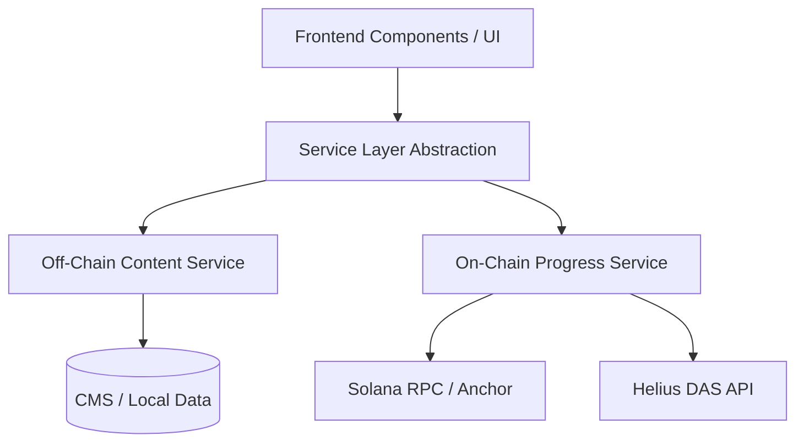

# Architecture & Service Layer Design

**Superteam Academy** follows a strict hybrid architecture combining verifiable on-chain data with editorial off-chain content, adhering to the principle: **"On-chain proves learning happened. The CMS explains what was learned."**

## System Overview

```mermaid
graph TD
    UI[Frontend Components / UI] --> SL[Service Layer Abstraction]
    
    SL --> OffC[Off-Chain Content Service]
    SL --> OnC[On-Chain Progress Service]
    
    OffC --> CMS[(CMS / Local Data)]
    OnC --> RPC[Solana RPC / Anchor]
    OnC --> DAS[Helius DAS API]
```

### 1. Off-Chain (CMS / Content)
The content of courses, lessons, challenges, translations, and metadata are all stored off-chain. This allows for:
- Professional authoring workflows
- Fast, rich markdown/code iteration without transaction costs
- Low-latency delivery of heavy content
- i18n localization

*In our MVP, this is represented by `lib/data.ts`, but it is abstracted so a real CMS can drop right in.*

### 2. On-Chain (Anchor Program)
On-chain data is strictly reserved for verifiable proofs of learning and identity:
- **Enrollments:** Per-learner per-course PDAs storing a 256-bit bitmap of completed lessons.
- **XP:** A Token-2022 non-transferable soulbound token minted as a reward for completed lessons.
- **Credentials:** Metaplex Core NFTs updated in-place as learners complete tracks.

### 3. Service Layer Abstractions (`lib/services/`)
To ensure the UI components remain decoupled from the data sources, the client consumes data exclusively through service interfaces. The services act as the glue linking CMS content IDs with On-Chain PDA seeds.

#### `IContentService`
Responsible for delivering off-chain course structures, textual content, and metadata.
- `getCourses()`: Returns array of available courses
- `getCourseContent(slug)`: Returns detailed module/lesson structures
- `getLesson(courseSlug, lessonId)`: Returns markdown and definitions for a specific lesson

#### `IProgressService`
Responsible for interacting with the Anchor program (or localStorage stub) to manage state.
- `getEnrollment(courseId, walletPublicKey)`: Checks if a learner is enrolled
- `enroll(courseId, walletPublicKey)`: Signs and sends the enroll transaction
- `completeLesson(courseId, lessonIndex, walletPublicKey)`: Backend-signed operation to mark a bit in the bitmap
- `getCompletedLessons(courseId, walletPublicKey)`: Translates the 256-bit array into a UI-friendly boolean array.

#### `IXpService & ICredentialService`
- `getXpBalance(walletPublicKey)`: Queries the Token-2022 ATA balance.
- `getCredentials(walletPublicKey)`: Queries Helius DAS API for Metaplex Core course completion NFTs.

## Data Merging in the Application
When a user views `/courses/[slug]`, the page fetches the content via `IContentService` and their progress via `IProgressService`. It merges these into a single `CourseWithProgress` object before passing it down to the UI. The UI never knows or cares if the progress came from localStorage or an on-chain PDA, allowing seamless swapping of implementations.
