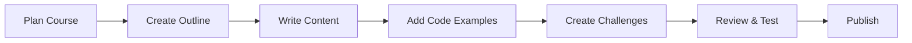

# Content Management System Guide

This guide explains how to create, edit, and manage courses in the Superteam Academy LMS. While the current implementation uses static data structures, this guide outlines the CMS integration strategy and content management workflow.

## 📚 Content Architecture Overview

### Content Hierarchy

```
Course
├── Basic Information (title, description, difficulty, etc.)
├── Modules (grouped lessons)
│   └── Lessons
│       ├── Content (markdown)
│       ├── Code Challenges (optional)
│       ├── Quizzes (optional)
│       └── Resources
└── Metadata (prerequisites, outcomes, etc.)
```

### Content Types

1. **Courses** - Top-level learning containers
2. **Modules** - Logical groupings of related lessons
3. **Lessons** - Individual learning units with content
4. **Challenges** - Interactive coding exercises
5. **Resources** - Supplementary materials and links

## 🛠 Current Implementation

### Static Data Structure

Currently, courses are defined in TypeScript files for rapid development:

```typescript
// src/services/course.service.ts
const courses: Course[] = [
  {
    id: 'solana-fundamentals',
    slug: 'solana-fundamentals',
    title: 'Solana Fundamentals',
    description: 'Learn the basics of Solana blockchain development',
    difficulty: 'beginner',
    duration: 20,
    xpReward: 1500,
    modules: [
      {
        id: 'intro-to-solana',
        title: 'Introduction to Solana',
        lessons: [
          {
            id: 'what-is-solana',
            title: 'What is Solana?',
            content: `# What is Solana?\n\nSolana is a high-performance blockchain...`,
            type: 'lesson',
            xpReward: 25
          }
        ]
      }
    ]
  }
]
```

## 🎯 Sanity CMS Integration Strategy

### Phase 1: CMS Setup

#### 1. Sanity Project Configuration

```bash
# Install Sanity CLI
npm install -g @sanity/cli

# Initialize new project
sanity init

# Configure schemas
cd studio
sanity start
```

#### 2. Content Schema Definition

```typescript
// sanity/schemas/course.ts
export default {
  name: 'course',
  title: 'Course',
  type: 'document',
  fields: [
    {
      name: 'title',
      title: 'Course Title',
      type: 'string',
      validation: Rule => Rule.required().max(100)
    },
    {
      name: 'slug',
      title: 'Slug',
      type: 'slug',
      options: {
        source: 'title',
        maxLength: 96,
      },
      validation: Rule => Rule.required()
    },
    {
      name: 'description',
      title: 'Short Description',
      type: 'text',
      validation: Rule => Rule.required().max(200)
    },
    {
      name: 'longDescription',
      title: 'Detailed Description',
      type: 'text',
      validation: Rule => Rule.required()
    },
    {
      name: 'difficulty',
      title: 'Difficulty Level',
      type: 'string',
      options: {
        list: [
          {title: 'Beginner', value: 'beginner'},
          {title: 'Intermediate', value: 'intermediate'},
          {title: 'Advanced', value: 'advanced'}
        ]
      },
      validation: Rule => Rule.required()
    },
    {
      name: 'duration',
      title: 'Duration (hours)',
      type: 'number',
      validation: Rule => Rule.required().positive()
    },
    {
      name: 'xpReward',
      title: 'XP Reward',
      type: 'number',
      validation: Rule => Rule.required().positive()
    },
    {
      name: 'thumbnail',
      title: 'Thumbnail Image',
      type: 'image',
      options: {
        hotspot: true
      }
    },
    {
      name: 'tags',
      title: 'Tags',
      type: 'array',
      of: [{type: 'string'}],
      options: {
        layout: 'tags'
      }
    },
    {
      name: 'category',
      title: 'Category',
      type: 'string',
      options: {
        list: [
          'Blockchain Development',
          'Framework',
          'NFTs',
          'DeFi',
          'Smart Contracts'
        ]
      }
    },
    {
      name: 'instructor',
      title: 'Instructor',
      type: 'reference',
      to: [{type: 'instructor'}]
    },
    {
      name: 'modules',
      title: 'Course Modules',
      type: 'array',
      of: [{type: 'reference', to: [{type: 'module'}]}]
    },
    {
      name: 'prerequisites',
      title: 'Prerequisites',
      type: 'array',
      of: [{type: 'string'}]
    },
    {
      name: 'learningOutcomes',
      title: 'Learning Outcomes',
      type: 'array',
      of: [{type: 'string'}]
    },
    {
      name: 'isPublished',
      title: 'Published',
      type: 'boolean',
      initialValue: false
    },
    {
      name: 'publishedAt',
      title: 'Published At',
      type: 'datetime'
    }
  ]
}
```

#### 3. Module Schema

```typescript
// sanity/schemas/module.ts
export default {
  name: 'module',
  title: 'Course Module',
  type: 'document',
  fields: [
    {
      name: 'title',
      title: 'Module Title',
      type: 'string',
      validation: Rule => Rule.required()
    },
    {
      name: 'description',
      title: 'Description',
      type: 'text'
    },
    {
      name: 'order',
      title: 'Order',
      type: 'number',
      validation: Rule => Rule.required().positive()
    },
    {
      name: 'lessons',
      title: 'Lessons',
      type: 'array',
      of: [{type: 'reference', to: [{type: 'lesson'}]}]
    },
    {
      name: 'xpReward',
      title: 'Total XP Reward',
      type: 'number'
    },
    {
      name: 'estimatedDuration',
      title: 'Estimated Duration (minutes)',
      type: 'number'
    }
  ]
}
```

#### 4. Lesson Schema

```typescript
// sanity/schemas/lesson.ts
export default {
  name: 'lesson',
  title: 'Lesson',
  type: 'document',
  fields: [
    {
      name: 'title',
      title: 'Lesson Title',
      type: 'string',
      validation: Rule => Rule.required()
    },
    {
      name: 'description',
      title: 'Description',
      type: 'text'
    },
    {
      name: 'content',
      title: 'Lesson Content',
      type: 'array',
      of: [
        {
          type: 'block',
          marks: {
            decorators: [
              {title: 'Strong', value: 'strong'},
              {title: 'Emphasis', value: 'em'},
              {title: 'Code', value: 'code'}
            ]
          }
        },
        {
          type: 'code',
          options: {
            language: 'rust',
            languageAlternatives: [
              {title: 'Rust', value: 'rust'},
              {title: 'JavaScript', value: 'javascript'},
              {title: 'TypeScript', value: 'typescript'},
              {title: 'JSON', value: 'json'}
            ]
          }
        },
        {
          type: 'image',
          options: {hotspot: true}
        }
      ]
    },
    {
      name: 'type',
      title: 'Lesson Type',
      type: 'string',
      options: {
        list: [
          {title: 'Lesson', value: 'lesson'},
          {title: 'Challenge', value: 'challenge'},
          {title: 'Quiz', value: 'quiz'}
        ]
      },
      initialValue: 'lesson'
    },
    {
      name: 'order',
      title: 'Order',
      type: 'number',
      validation: Rule => Rule.required()
    },
    {
      name: 'xpReward',
      title: 'XP Reward',
      type: 'number',
      initialValue: 25
    },
    {
      name: 'estimatedDuration',
      title: 'Estimated Duration (minutes)',
      type: 'number'
    },
    {
      name: 'codeChallenge',
      title: 'Code Challenge',
      type: 'object',
      fields: [
        {
          name: 'prompt',
          title: 'Challenge Prompt',
          type: 'text'
        },
        {
          name: 'starterCode',
          title: 'Starter Code',
          type: 'code',
          options: {language: 'rust'}
        },
        {
          name: 'solutionCode',
          title: 'Solution Code',
          type: 'code',
          options: {language: 'rust'}
        },
        {
          name: 'testCases',
          title: 'Test Cases',
          type: 'array',
          of: [{
            type: 'object',
            fields: [
              {name: 'input', type: 'string', title: 'Input'},
              {name: 'expectedOutput', type: 'string', title: 'Expected Output'},
              {name: 'description', type: 'string', title: 'Description'},
              {name: 'isHidden', type: 'boolean', title: 'Hidden from Student'}
            ]
          }]
        },
        {
          name: 'hints',
          title: 'Hints',
          type: 'array',
          of: [{type: 'string'}]
        }
      ]
    },
    {
      name: 'resources',
      title: 'Resources',
      type: 'array',
      of: [{
        type: 'object',
        fields: [
          {name: 'title', type: 'string', title: 'Resource Title'},
          {name: 'url', type: 'url', title: 'URL'},
          {name: 'type', type: 'string', title: 'Type', options: {
            list: ['link', 'file', 'video']
          }},
          {name: 'description', type: 'text', title: 'Description'}
        ]
      }]
    }
  ]
}
```

#### 5. Instructor Schema

```typescript
// sanity/schemas/instructor.ts
export default {
  name: 'instructor',
  title: 'Instructor',
  type: 'document',
  fields: [
    {
      name: 'name',
      title: 'Full Name',
      type: 'string',
      validation: Rule => Rule.required()
    },
    {
      name: 'bio',
      title: 'Biography',
      type: 'text'
    },
    {
      name: 'avatar',
      title: 'Avatar',
      type: 'image',
      options: {hotspot: true}
    },
    {
      name: 'socialLinks',
      title: 'Social Links',
      type: 'object',
      fields: [
        {name: 'twitter', type: 'url', title: 'Twitter'},
        {name: 'github', type: 'url', title: 'GitHub'},
        {name: 'linkedin', type: 'url', title: 'LinkedIn'},
        {name: 'website', type: 'url', title: 'Website'}
      ]
    }
  ]
}
```

### Phase 2: Frontend Integration

#### 1. Sanity Client Setup

```typescript
// src/lib/sanity.ts
import { createClient } from 'next-sanity'

export const client = createClient({
  projectId: process.env.NEXT_PUBLIC_SANITY_PROJECT_ID!,
  dataset: process.env.NEXT_PUBLIC_SANITY_DATASET!,
  apiVersion: '2024-01-01',
  useCdn: true, // Enable for production
  token: process.env.SANITY_API_TOKEN // Only for write operations
})

// GROQ queries
export const queries = {
  allCourses: `
    *[_type == "course" && isPublished == true] | order(publishedAt desc) {
      _id,
      title,
      slug,
      description,
      difficulty,
      duration,
      xpReward,
      thumbnail,
      tags,
      category,
      instructor->{name, bio, avatar},
      publishedAt
    }
  `,
  
  courseBySlug: `
    *[_type == "course" && slug.current == $slug][0] {
      _id,
      title,
      slug,
      description,
      longDescription,
      difficulty,
      duration,
      xpReward,
      thumbnail,
      tags,
      category,
      instructor->{name, bio, avatar},
      modules[]->{
        _id,
        title,
        description,
        order,
        xpReward,
        estimatedDuration,
        lessons[]->{
          _id,
          title,
          description,
          content,
          type,
          order,
          xpReward,
          estimatedDuration,
          codeChallenge,
          resources
        }
      },
      prerequisites,
      learningOutcomes,
      publishedAt
    }
  `
}
```

#### 2. Updated Course Service

```typescript
// src/services/course.service.ts (Updated for CMS)
import { client, queries } from '@/lib/sanity'
import type { Course, CourseFilters } from '@/types'

class SanityEnabledCourseService implements CourseService {
  async getCourses(filters?: CourseFilters): Promise<Course[]> {
    let query = queries.allCourses
    
    // Add filters to GROQ query
    if (filters?.difficulty) {
      query += ` && difficulty == "${filters.difficulty}"`
    }
    
    if (filters?.category) {
      query += ` && category == "${filters.category}"`
    }
    
    const courses = await client.fetch(query)
    return courses.map(this.transformCourse)
  }
  
  async getCourse(slug: string): Promise<Course | null> {
    const course = await client.fetch(queries.courseBySlug, { slug })
    return course ? this.transformCourse(course) : null
  }
  
  private transformCourse(sanityData: any): Course {
    // Transform Sanity data to application Course type
    return {
      id: sanityData._id,
      slug: sanityData.slug.current,
      title: sanityData.title,
      // ... other field transformations
    }
  }
}
```

## ✍️ Content Creation Workflow

### For Course Authors

#### 1. Course Planning
1. **Define Learning Objectives**
   - What skills will students gain?
   - What can they build after completion?
   - How does this fit in the learning path?

2. **Structure the Course**
   - Break into logical modules (3-6 modules recommended)
   - Plan 2-5 lessons per module
   - Include 1-2 challenges per module

3. **Estimate Effort**
   - Duration per lesson (15-45 minutes)
   - XP rewards (lessons: 10-50, challenges: 25-100)
   - Prerequisites and difficulty level

#### 2. Content Creation Process



#### 3. Writing Guidelines

**Course Title & Description**
- Title: Clear, descriptive, SEO-friendly
- Description: 1-2 sentences explaining the course value
- Long Description: Detailed overview with outcomes

**Module Structure**
- Start with overview and objectives
- Progress from simple to complex concepts
- End with practical application

**Lesson Content**
- Use clear headings (H1, H2, H3)
- Include code examples with syntax highlighting
- Add diagrams and visuals where helpful
- Keep paragraphs short and scannable

**Code Challenges**
- Clear, specific requirements
- Provide starter code template
- Include comprehensive test cases
- Offer progressive hints

### Content Quality Standards

#### Technical Writing Standards
1. **Clarity**: Simple language, clear explanations
2. **Accuracy**: Technically correct, up-to-date
3. **Completeness**: No missing steps or assumptions
4. **Consistency**: Uniform terminology and style

#### Code Standards
1. **Syntax**: Valid, runnable code examples
2. **Comments**: Well-commented for learning
3. **Best Practices**: Follow Solana development standards
4. **Testing**: All challenges thoroughly tested

### Content Review Process

#### 1. Author Review
- [ ] Content accuracy and completeness
- [ ] Code examples tested and working
- [ ] Proper markdown formatting
- [ ] Learning objectives met

#### 2. Technical Review
- [ ] Code follows best practices
- [ ] Security considerations addressed
- [ ] Performance implications noted
- [ ] Up-to-date with ecosystem changes

#### 3. Editorial Review
- [ ] Clear, engaging writing
- [ ] Proper grammar and spelling
- [ ] Consistent tone and style
- [ ] Appropriate difficulty progression

#### 4. Student Testing
- [ ] Course flow makes sense
- [ ] Challenges are appropriately difficult
- [ ] Instructions are clear
- [ ] Time estimates are accurate

## 🚀 Publishing Workflow

### Content States

1. **Draft**: Work in progress, not visible to students
2. **Review**: Ready for technical/editorial review
3. **Testing**: Being tested with beta students
4. **Published**: Live and available to all students
5. **Archived**: No longer actively promoted

### Publishing Checklist

#### Pre-Publication
- [ ] All content reviewed and approved
- [ ] Code examples tested in clean environment
- [ ] Images optimized and properly credited
- [ ] SEO metadata completed
- [ ] Course prerequisites verified
- [ ] XP rewards balanced with other courses

#### Publication
- [ ] Set published status to true
- [ ] Add to appropriate learning paths
- [ ] Update course catalog
- [ ] Generate social media assets
- [ ] Notify community of new course

#### Post-Publication
- [ ] Monitor student engagement metrics
- [ ] Collect and review student feedback
- [ ] Track completion rates and difficulty
- [ ] Plan updates based on ecosystem changes

## 🔧 Content Management Tools

### Sanity Studio Features

#### Content Editor
- Rich text editor with markdown export
- Code syntax highlighting
- Image upload and optimization
- Real-time collaboration

#### Preview Mode
- Live preview of course content
- Mobile/tablet responsive testing
- Dark/light mode preview

#### Version Control
- Content versioning and rollback
- Draft/published state management
- Scheduled publishing

#### Asset Management
- Centralized media library
- Automatic image optimization
- CDN integration

### Custom Studio Features (Future)

#### Course Analytics Dashboard
- Student engagement metrics
- Completion rate tracking
- Popular content identification
- Performance bottleneck detection

#### A/B Testing Tools
- Content variation testing
- Engagement optimization
- Difficulty calibration

#### Automated Workflows
- Content quality checks
- Broken link detection
- Code example validation
- Accessibility scanning

## 📊 Content Performance Metrics

### Engagement Metrics
- Course enrollment rate
- Lesson completion rate
- Time spent per lesson
- Challenge success rate

### Quality Indicators
- Student ratings and feedback
- Support ticket frequency
- Content update frequency
- Technical accuracy reports

### Business Metrics
- Course conversion rates
- Student retention by course
- Revenue per course (if applicable)
- Instructor performance

## 🎯 Content Strategy

### Course Catalog Planning

#### Learning Paths
1. **Beginner Path**
   - Solana Fundamentals
   - Basic Rust Programming
   - Your First Program

2. **Developer Path**
   - Anchor Framework
   - Advanced Program Development
   - Security Best Practices

3. **Specialization Paths**
   - DeFi Development
   - NFT Collections
   - Gaming on Solana

#### Content Calendar
- **Monthly**: 1-2 new courses or major updates
- **Weekly**: New lessons or challenges
- **Daily**: Content improvements and bug fixes

### Community-Driven Content

#### Student Contributions
- Community-submitted challenges
- Student project showcases
- Peer review system

#### Instructor Program
- Application and vetting process
- Content creation guidelines
- Revenue sharing model

This CMS guide provides a comprehensive framework for content creation, management, and optimization in the Superteam Academy LMS. The modular architecture supports both rapid development with static content and seamless migration to a full CMS solution.