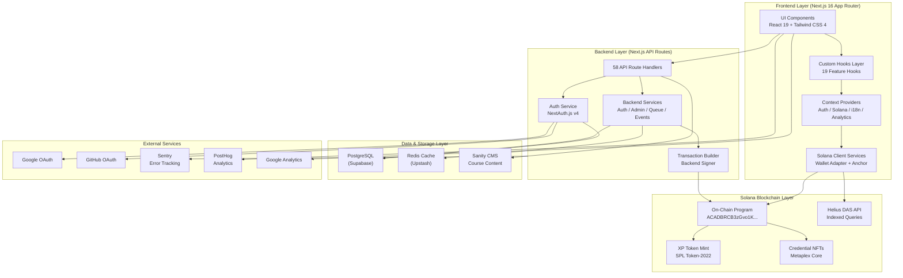
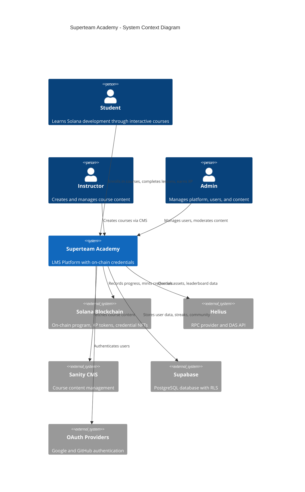
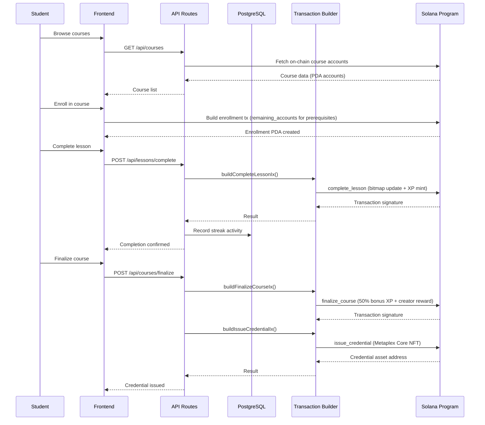
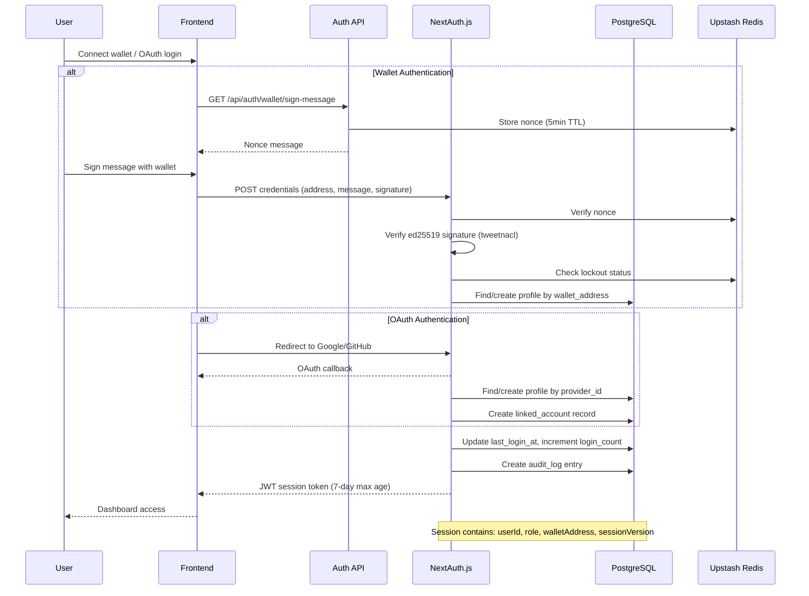
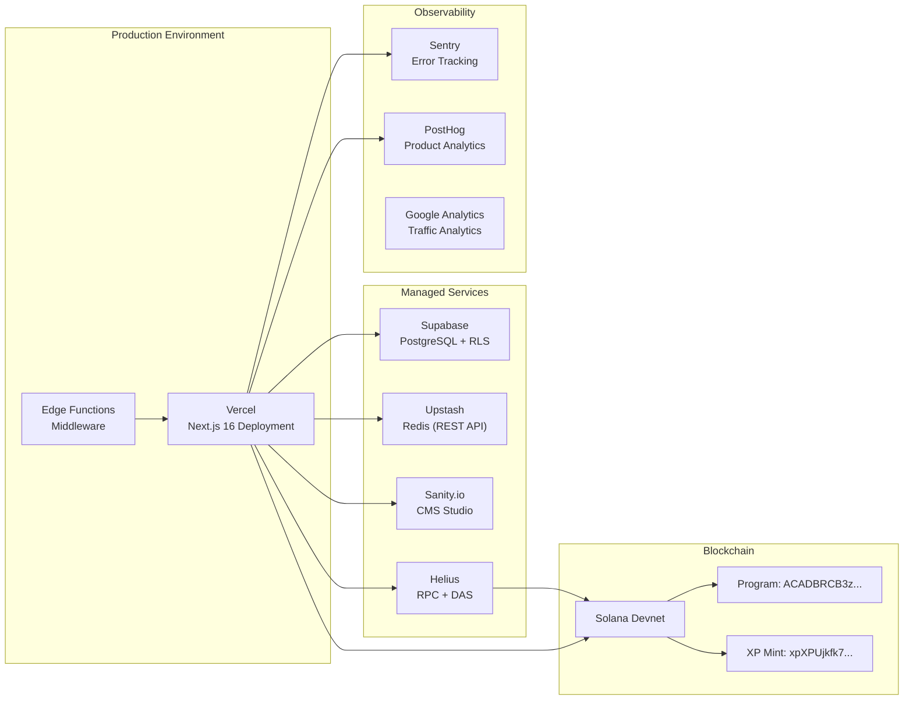
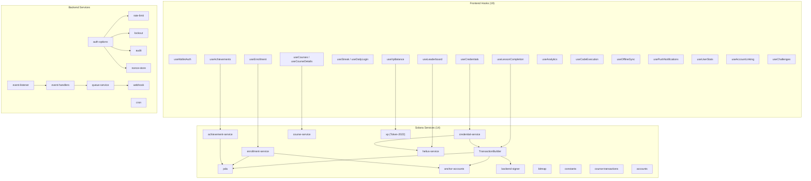

# Superteam Academy - Architecture Overview

## Table of Contents

- [System Overview](#system-overview)
- [High-Level Architecture](#high-level-architecture)
- [Technology Stack](#technology-stack)
- [System Component Diagram](#system-component-diagram)
- [Data Flow Architecture](#data-flow-architecture)
- [Deployment Architecture](#deployment-architecture)
- [Module Dependency Graph](#module-dependency-graph)

---

## System Overview

Superteam Academy is a production-ready Learning Management System (LMS) built for Solana blockchain development education. It combines a modern web application with on-chain credential management, gamification mechanics, and multi-language support.

**Core Capabilities:**

| Capability | Description |
|---|---|
| Interactive Courses | Project-based Solana courses with integrated code editing |
| On-Chain Credentials | Soulbound Metaplex Core NFTs as course completion certificates |
| Gamification | XP token system (SPL Token-2022), level progression, streaks, achievements |
| Multi-Auth | Solana wallet, Google OAuth, GitHub OAuth with account linking |
| Multi-Language | Internationalized UI supporting English, Portuguese (BR), and Spanish |
| Community Forum | Discussion threads tied to courses and lessons |
| Admin Dashboard | Course management, user moderation, analytics |
| CMS Integration | Sanity CMS for course content management |
| Analytics | PostHog product analytics, Google Analytics, Sentry error tracking |

---

## High-Level Architecture



---

## Technology Stack

### Frontend

| Technology | Version | Purpose |
|---|---|---|
| Next.js | 16.1.6 | Framework (App Router, SSR, API Routes) |
| React | 19.2.3 | UI Library |
| TypeScript | 5.x | Type Safety (strict mode) |
| Tailwind CSS | 4.x | Utility-first Styling |
| Framer Motion | 12.x | Animations and Transitions |
| Radix UI | 1.4.x | Accessible UI Primitives |
| next-intl | 4.8.x | Internationalization |
| @solana/wallet-adapter | 0.15.x | Wallet Connection |
| @coral-xyz/anchor | 0.32.x | Solana Program Client |
| @tanstack/react-query | 5.x | Server State Management |
| CodeMirror | 6.x | Code Editor Integration |
| Lucide React | 0.575.x | Icon System |

### Backend

| Technology | Version | Purpose |
|---|---|---|
| NextAuth.js | 4.24.x | Authentication (JWT Strategy) |
| Prisma | 7.4.x | Database ORM |
| Supabase | 2.96.x | PostgreSQL + Auth Infrastructure |
| Upstash Redis | 1.36.x | Caching and Rate Limiting |
| @upstash/ratelimit | 2.0.x | Tiered Rate Limiting |
| @sanity/client | 7.15.x | CMS Integration |
| @sentry/nextjs | 10.39.x | Error Monitoring |

### Blockchain

| Technology | Purpose |
|---|---|
| Solana (Devnet) | Program Deployment Network |
| Anchor Framework | Program Development |
| SPL Token-2022 | Soulbound XP Tokens |
| Metaplex Core | Credential and Achievement NFTs |
| Helius DAS API | Indexed Asset Queries |

### Infrastructure

| Service | Purpose |
|---|---|
| Vercel | Frontend Deployment |
| Supabase | Managed PostgreSQL |
| Upstash | Serverless Redis |
| Helius | Solana RPC and DAS API |
| Sanity.io | Headless CMS |

---

## System Component Diagram



---

## Data Flow Architecture

### Course Enrollment and Completion Flow



### Authentication Flow



---

## Deployment Architecture



---

## Module Dependency Graph



---

## Directory Structure

```
app/
  app/                    # Next.js App Router
    (admin)/              # Admin route group
    [locale]/             # Internationalized routes
      (routes)/           # Authenticated page routes
        achievements/     # Achievement showcase
        admin/            # Admin dashboard pages
        auth/             # Auth callback pages
        certificates/     # Certificate viewer
        challenges/       # Daily challenges
        community/        # Forum (threads, new thread, thread detail)
        courses/          # Course catalog and detail
        dashboard/        # User dashboard
        leaderboard/      # XP leaderboard
        login/            # Login page
        onboarding/       # User onboarding flow
        profile/          # User profile and public profiles
        settings/         # User settings
    api/                  # 58 API route handlers
      achievements/       # Achievement endpoints
      admin/              # Admin management endpoints
      auth/               # Authentication endpoints (9 groups)
      cms/                # CMS integration
      code/               # Code execution
      community/          # Forum endpoints
      courses/            # Course CRUD
      credentials/        # Credential operations
      cron/               # Scheduled jobs
      events/             # Event listener
      health/             # Health check
      leaderboard/        # Leaderboard queries
      lessons/            # Lesson completion
      notifications/      # Push subscriptions
      profile/            # Profile management
      queue/              # Queue processing
      streak/             # Streak management
      xp/                 # XP balance queries
    providers/            # React context providers

  backend/                # Server-side business logic
    admin/                # Admin service functions
    auth/                 # Auth utilities (12 files)
    certificate/          # Certificate generation
    cms/                  # CMS service
    events/               # Event listener and handlers
    queue/                # Job queue and webhooks
    
  components/             # React components (23 feature areas)
  context/                # Frontend context and utilities
    hooks/                # 19 custom React hooks
    solana/               # 14 Solana integration services
    types/                # 10 TypeScript type definitions
    i18n/                 # Internationalization config
    analytics/            # Analytics integration
    
  prisma/                 # Database schema and migrations
    schema.prisma         # 14 models, 334 lines
    migrations/           # 11 migration files
    
  sanity/                 # CMS schema definitions
    schemas/              # 6 content schemas
    
  public/                 # Static assets (205 items)
```

---

## On-Chain Program Addresses

| Component | Address | Network |
|---|---|---|
| Program ID | `ACADBRCB3zGvo1KSCbkztS33ZNzeBv2d7bqGceti3ucf` | Devnet |
| XP Token Mint | `xpXPUjkfk7t4AJF1tYUoyAYxzuM5DhinZWS1WjfjAu3` | Devnet |
| Authority | `ACAd3USj2sMV6drKcMY2wZtNkhVDHWpC4tfJe93hgqYn` | Devnet |

**Program Statistics:** 16 instructions, 6 PDA types, 26 error variants, 15 events

---

## Performance Targets

| Metric | Target |
|---|---|
| Lighthouse Performance | 90+ |
| Lighthouse Accessibility | 95+ |
| Lighthouse Best Practices | 95+ |
| Lighthouse SEO | 90+ |
| Largest Contentful Paint | < 2.5s |
| First Input Delay | < 100ms |
| Cumulative Layout Shift | < 0.1 |
