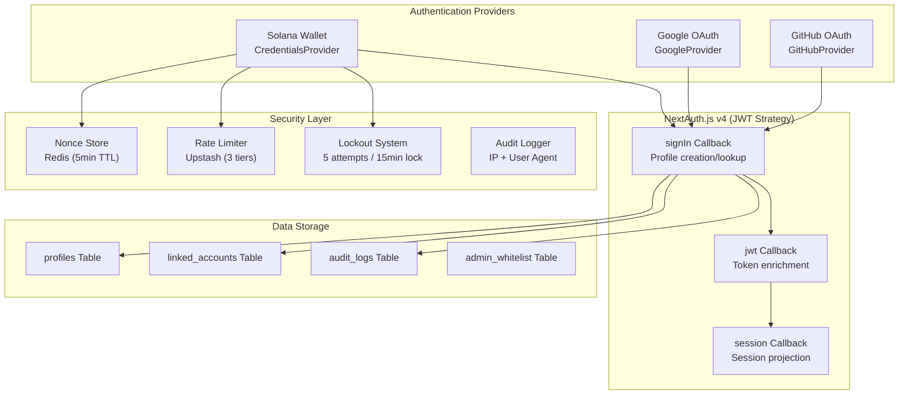
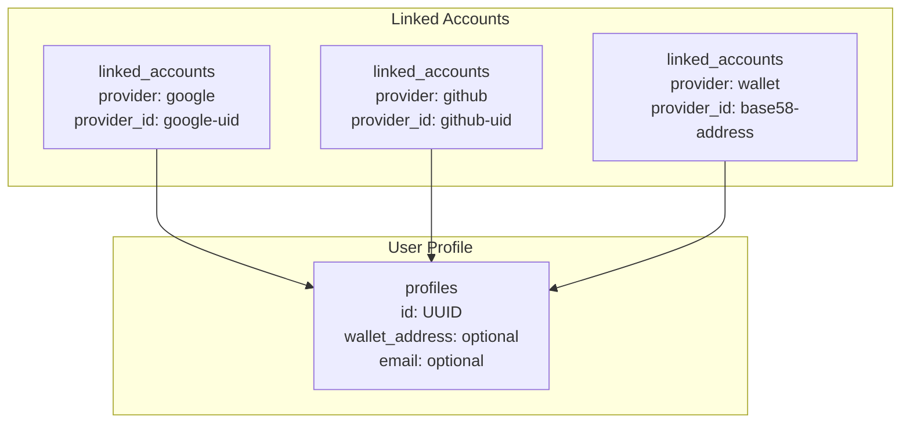
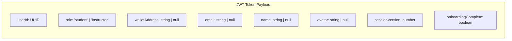
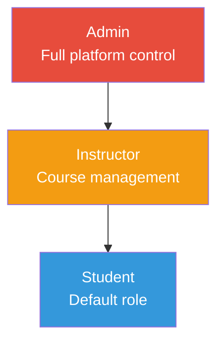
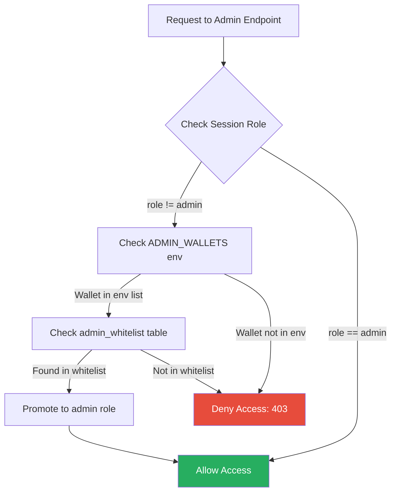
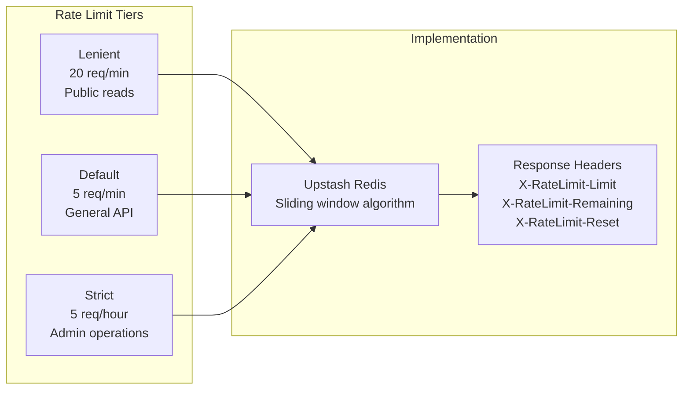
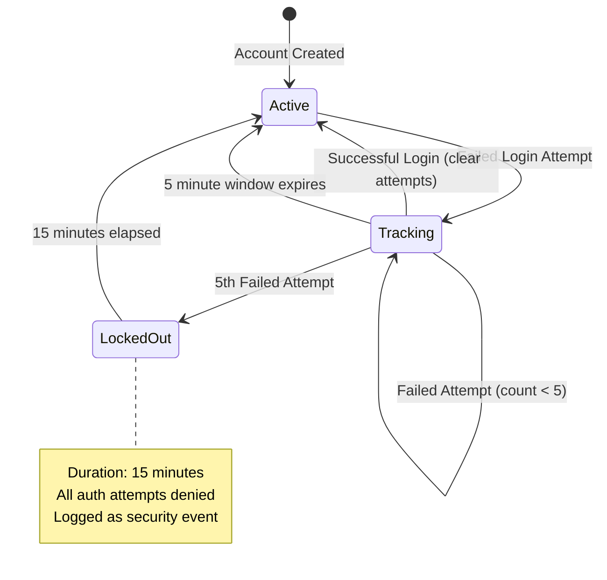

# Authentication and Role-Based Access Control

## Table of Contents

- [Authentication Architecture](#authentication-architecture)
- [Authentication Providers](#authentication-providers)
- [Wallet Authentication Flow](#wallet-authentication-flow)
- [OAuth Authentication Flow](#oauth-authentication-flow)
- [Account Linking](#account-linking)
- [Session Management](#session-management)
- [RBAC System](#rbac-system)
- [Security Controls](#security-controls)
- [API Endpoints](#api-endpoints)

---

## Authentication Architecture



---

## Authentication Providers

### Provider Configuration

| Provider | Type | Mechanism | Session Data |
|---|---|---|---|
| Google | OAuth 2.0 | OIDC tokens | email, name, avatar |
| GitHub | OAuth 2.0 | Access tokens | email, name, avatar |
| Solana Wallet | Credentials | Ed25519 signature | wallet_address |

### Provider Setup

```typescript
// backend/auth/auth-options.ts
export const authOptions: NextAuthOptions = {
    providers: [
        GoogleProvider({
            clientId: process.env.GOOGLE_CLIENT_ID!,
            clientSecret: process.env.GOOGLE_CLIENT_SECRET!,
        }),
        GitHubProvider({
            clientId: process.env.GITHUB_CLIENT_ID!,
            clientSecret: process.env.GITHUB_CLIENT_SECRET!,
        }),
        CredentialsProvider({
            id: 'wallet',
            credentials: {
                walletAddress: { label: 'Wallet Address', type: 'text' },
                message: { label: 'Message', type: 'text' },
                signature: { label: 'Signature', type: 'text' },
            },
            authorize(credentials) { /* Wallet verification logic */ }
        }),
    ],
    session: { strategy: 'jwt', maxAge: 7 * 24 * 60 * 60 },
    pages: { signIn: '/login' },
    secret: process.env.AUTH_SECRET,
};
```

---

## Wallet Authentication Flow

```mermaid
sequenceDiagram
    participant User
    participant Frontend as Frontend
    participant SignMsg as GET /api/auth/wallet/sign-message
    participant Redis as Redis (Nonce Store)
    participant NextAuth as NextAuth Credentials
    participant Lockout as Lockout Check
    participant DB as PostgreSQL

    User->>Frontend: Click "Connect Wallet"
    Frontend->>Frontend: Wallet adapter popup

    rect rgb(40, 40, 60)
        Note over Frontend,Redis: Step 1: Nonce Generation
        Frontend->>SignMsg: GET /api/auth/wallet/sign-message?address={pubkey}
        SignMsg->>Redis: Store nonce with 5-minute TTL
        SignMsg-->>Frontend: Nonce message string
    end

    rect rgb(40, 60, 40)
        Note over User,Frontend: Step 2: Message Signing
        User->>Frontend: Approve signature in wallet
        Frontend->>Frontend: Encode message to Uint8Array
        Frontend->>Frontend: Sign with wallet adapter
    end

    rect rgb(60, 40, 40)
        Note over Frontend,DB: Step 3: Verification
        Frontend->>NextAuth: POST /api/auth/[...nextauth] (credentials)
        NextAuth->>Lockout: Check if wallet is locked out
        alt Locked Out
            Lockout-->>NextAuth: Deny access
            NextAuth-->>Frontend: 401 Unauthorized
        end
        NextAuth->>Redis: Verify nonce exists and matches
        NextAuth->>Redis: Delete nonce (single-use)
        NextAuth->>NextAuth: Verify ed25519 signature (tweetnacl)
        alt Invalid Signature
            NextAuth->>Lockout: Record failed attempt
            NextAuth-->>Frontend: 401 Unauthorized
        end
        NextAuth->>Lockout: Clear failed attempts
        NextAuth->>DB: Find or create profile by wallet_address
        NextAuth->>DB: Update last_login_at, login_count++
        NextAuth->>DB: Insert audit_log (action: "login")
        NextAuth-->>Frontend: JWT token (HttpOnly cookie)
    end

    Frontend-->>User: Redirect to Dashboard
```



### Nonce Store Implementation

The nonce store uses Redis in production with an in-memory fallback for development:

| Parameter | Value |
|---|---|
| TTL | 5 minutes |
| Format | Random string |
| Storage Key | `nonce:{wallet_address}` |
| Single Use | Yes (deleted after verification) |

### Signature Verification

Wallet authentication uses `tweetnacl` for Ed25519 signature verification:

1. Convert the signed message to `Uint8Array`
2. Decode the base58 signature
3. Decode the wallet public key
4. Verify using `nacl.sign.detached.verify(message, signature, publicKey)`

---

## OAuth Authentication Flow

```mermaid
sequenceDiagram
    participant User
    participant Frontend
    participant NextAuth
    participant OAuth as Google/GitHub
    participant DB as PostgreSQL

    User->>Frontend: Click "Sign in with Google/GitHub"
    Frontend->>NextAuth: Redirect to OAuth provider

    NextAuth->>OAuth: Authorization request
    OAuth->>User: Consent screen
    User->>OAuth: Grant access
    OAuth->>NextAuth: Authorization code
    NextAuth->>OAuth: Exchange code for tokens
    OAuth-->>NextAuth: Access token + profile data

    rect rgb(40, 40, 60)
        Note over NextAuth,DB: signIn Callback Processing
        NextAuth->>DB: Check linked_accounts for provider+provider_id
        alt Existing Linked Account
            NextAuth->>DB: Get associated profile
            NextAuth->>DB: Update linked_account.last_used_at
        else New User
            NextAuth->>DB: Create new profile (email, name, avatar)
            NextAuth->>DB: Create linked_account record
        end
        NextAuth->>DB: Update profile.last_login_at, login_count++
        NextAuth->>DB: Insert audit_log entry
    end

    NextAuth-->>Frontend: JWT session token
    Frontend-->>User: Dashboard access
```



---

## Account Linking

Users can link multiple authentication methods to a single profile, enabling login via wallet, Google, or GitHub interchangeably.



### Account Linking API Endpoints

| Method | Endpoint | Description |
|---|---|---|
| POST | `/api/auth/link/google` | Link Google account to profile |
| POST | `/api/auth/link/github` | Link GitHub account to profile |
| POST | `/api/auth/link/wallet` | Link Solana wallet to profile |
| DELETE | `/api/auth/unlink/{provider}` | Unlink an authentication provider |
| GET | `/api/auth/linked-accounts` | List all linked accounts |

### Linking Rules

1. A provider+provider_id pair can only be linked to one profile
2. Users must retain at least one linked authentication method
3. Linking a wallet requires signature verification (same as wallet login)
4. Linking OAuth requires OAuth flow completion

---

## Session Management

### JWT Token Structure



| Parameter | Value |
|---|---|
| Strategy | JWT |
| Max Age | 7 days |
| Storage | HttpOnly cookie |
| Refresh | On session access via jwt callback |
| Invalidation | Session version check against database |

### Session Version Mechanism

The `session_version` field in the `profiles` table allows forced session invalidation:

1. Each profile has a `session_version` integer (default: 1)
2. The JWT token stores the version at time of issue
3. On each request, the jwt callback compares token version to database version
4. If mismatch, the session is invalidated (forces re-login)
5. Incrementing `session_version` effectively logs out all sessions

---

## RBAC System

### Role Hierarchy



### Role Definitions

| Role | Capabilities |
|---|---|
| **student** | Browse courses, enroll, complete lessons, earn XP, community participation |
| **instructor** | All student capabilities + create/manage courses via CMS |
| **admin** | All capabilities + user management, content moderation, platform analytics, whitelist management |

### Admin Determination Flow



### Admin Whitelist Management

The admin whitelist is stored in the `admin_whitelist` table:

| Field | Type | Description |
|---|---|---|
| `id` | UUID | Primary key |
| `email` | String | Admin email (nullable) |
| `wallet` | String | Solana base58 address (nullable) |
| `added_by` | UUID | Profile ID of the admin who added this entry |
| `added_at` | DateTime | When the admin was added |
| `removed_at` | DateTime | When the admin was removed (soft delete) |

### Role Change Logging

All role changes are tracked in the `role_change_log` table:

| Field | Type | Description |
|---|---|---|
| `profile_id` | UUID | User whose role changed |
| `old_role` | String | Previous role |
| `new_role` | String | New role |
| `changed_by` | UUID | Admin who made the change |
| `reason` | String | Reason for the change |
| `created_at` | DateTime | Timestamp |

---

## Security Controls

### Rate Limiting



### Account Lockout

| Parameter | Value |
|---|---|
| Max Failed Attempts | 5 |
| Lockout Window | 5 minutes (300s) |
| Lockout Duration | 15 minutes (900s) |
| Storage | Redis (production) / In-memory Map (development) |
| Key Format | `lockout:{identifier}` / `attempts:{identifier}` |

### Lockout Flow



### Audit Logging

Every authentication event is recorded in the `audit_logs` table:

| Tracked Events | Data Captured |
|---|---|
| Login (all providers) | user_id, IP address, User-Agent |
| Failed login attempts | Identifier, attempt count |
| Account linking/unlinking | Provider, user_id |
| Role changes | Old role, new role, changed_by |
| Account deletion | user_id, timestamp |

---

## API Endpoints

### Authentication Endpoints

| Method | Endpoint | Auth | Rate Limit | Description |
|---|---|---|---|---|
| ALL | `/api/auth/[...nextauth]` | None | Default | NextAuth handler (login, callback, session) |
| GET | `/api/auth/session` | JWT | Lenient | Get current session |
| POST | `/api/auth/session/refresh` | JWT | Default | Force session refresh |
| GET | `/api/auth/callback-url` | None | Lenient | Get OAuth callback URL |
| POST | `/api/auth/logout` | JWT | Default | Logout and clear session |
| DELETE | `/api/auth/delete-account` | JWT | Strict | Permanently delete account |

### Wallet Endpoints

| Method | Endpoint | Auth | Rate Limit | Description |
|---|---|---|---|---|
| GET | `/api/auth/wallet/sign-message` | None | Default | Generate nonce for signing |
| POST | `/api/auth/wallet/verify` | None | Default | Verify wallet signature |
| POST | `/api/auth/wallet/link` | JWT | Default | Link wallet to profile |

### Account Linking Endpoints

| Method | Endpoint | Auth | Rate Limit | Description |
|---|---|---|---|---|
| POST | `/api/auth/link/google` | JWT | Default | Link Google account |
| POST | `/api/auth/link/github` | JWT | Default | Link GitHub account |
| POST | `/api/auth/link/wallet` | JWT | Default | Link Solana wallet |
| GET | `/api/auth/linked-accounts` | JWT | Lenient | List linked accounts |
| DELETE | `/api/auth/unlink/{provider}` | JWT | Default | Unlink a provider |
