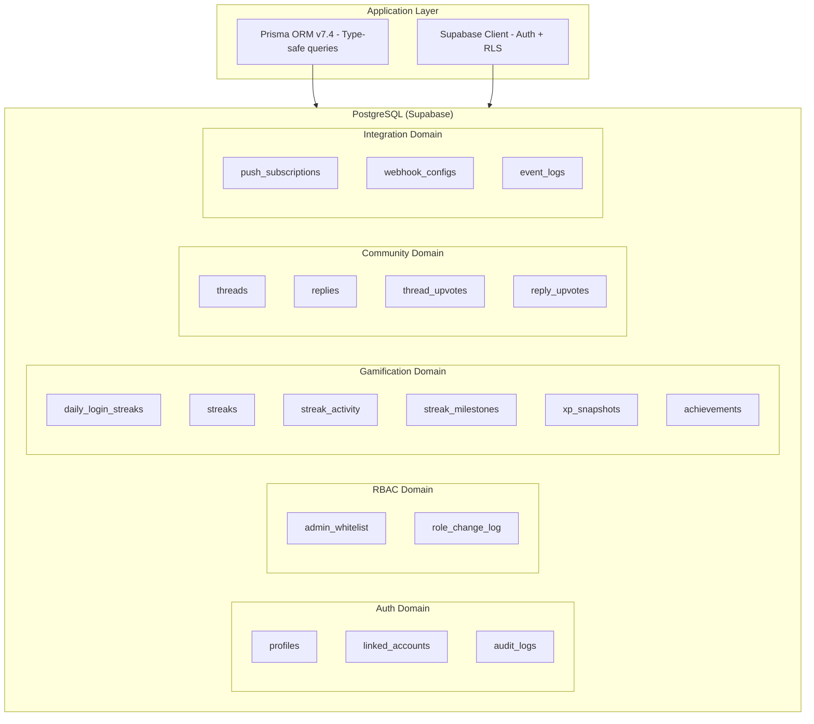
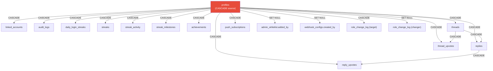
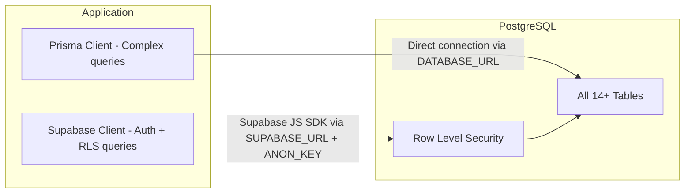

# Database Design

## Table of Contents

- [Database Architecture](#database-architecture)
- [Entity Relationship Diagram](#entity-relationship-diagram)
- [Schema Overview](#schema-overview)
- [Table Definitions](#table-definitions)
- [Relationships and Constraints](#relationships-and-constraints)
- [Indexing Strategy](#indexing-strategy)
- [Migration History](#migration-history)

---

## Database Architecture

---

## Entity Relationship Diagram

```mermaid
erDiagram
    profiles ||--o{ linked_accounts : "has many"
    profiles ||--o{ audit_logs : "generates"
    profiles ||--o| daily_login_streaks : "has one"
    profiles ||--o| streaks : "has one"
    profiles ||--o{ streak_activity : "logs"
    profiles ||--o{ streak_milestones : "earns"
    profiles ||--o{ achievements : "receives"
    profiles ||--o{ threads : "authors"
    profiles ||--o{ replies : "writes"
    profiles ||--o{ thread_upvotes : "casts"
    profiles ||--o{ reply_upvotes : "casts"
    profiles ||--o{ push_subscriptions : "registers"
    profiles ||--o{ webhook_configs : "creates"
    profiles ||--o{ admin_whitelist : "adds"
    profiles ||--o{ role_change_log : "targets"
    profiles ||--o{ role_change_log : "changes"

    threads ||--o{ replies : "contains"
    threads ||--o{ thread_upvotes : "receives"
    replies ||--o{ reply_upvotes : "receives"

    profiles {
        uuid id PK
        string wallet_address UK
        string email
        string username UK
        string name
        string avatar_url
        string bio
        json social_links
        boolean is_public
        string role
        boolean onboarding_complete
        int session_version
        datetime last_login_at
        int login_count
        int offchain_xp
        datetime deleted_at
        datetime created_at
        datetime updated_at
    }

    linked_accounts {
        uuid id PK
        uuid user_id FK
        string provider
        string provider_id
        json provider_data
        datetime last_used_at
        datetime created_at
    }

    audit_logs {
        uuid id PK
        uuid user_id FK
        string action
        string ip_address
        string user_agent
        json metadata
        datetime created_at
    }

    daily_login_streaks {
        uuid id PK
        uuid user_id FK
        int current_streak
        int longest_streak
        date last_login_date
        int total_login_xp
        boolean streak_broken
        datetime created_at
        datetime updated_at
    }

    streaks {
        uuid id PK
        uuid user_id FK
        int current_streak
        int longest_streak
        date last_activity_date
        int freeze_count
        int max_freezes
        datetime created_at
        datetime updated_at
    }

    streak_activity {
        uuid id PK
        uuid user_id FK
        date activity_date
        int xp_earned
        int lessons_completed
        int courses_completed
        datetime created_at
        datetime updated_at
    }

    streak_milestones {
        uuid id PK
        uuid user_id FK
        int milestone_days
        int xp_reward
        datetime claimed_at
        string tx_signature
    }

    xp_snapshots {
        uuid id PK
        string wallet
        bigint xp_balance
        datetime snapped_at
    }

    achievements {
        uuid id PK
        uuid user_id FK
        string achievement_id
        datetime awarded_at
        string asset_address
        string tx_hash
    }

    threads {
        uuid id PK
        string title
        string content
        uuid author_id FK
        string category
        string course_id
        string lesson_id
        string_array tags
        int upvotes
        int reply_count
        boolean is_pinned
        boolean is_locked
        datetime created_at
        datetime updated_at
    }

    replies {
        uuid id PK
        uuid thread_id FK
        string content
        uuid author_id FK
        int upvotes
        boolean is_accepted
        datetime created_at
        datetime updated_at
    }

    thread_upvotes {
        uuid id PK
        uuid thread_id FK
        uuid user_id FK
        datetime created_at
    }

    reply_upvotes {
        uuid id PK
        uuid reply_id FK
        uuid user_id FK
        datetime created_at
    }

    push_subscriptions {
        uuid id PK
        uuid user_id FK
        string endpoint UK
        string p256dh
        string auth
        datetime created_at
    }

    webhook_configs {
        uuid id PK
        string url
        string secret
        string_array events
        boolean active
        uuid created_by FK
        datetime created_at
        datetime updated_at
    }

    event_logs {
        uuid id PK
        string event_type
        string tx_hash
        int slot
        datetime timestamp
        json data
        boolean processed
        datetime created_at
    }

    admin_whitelist {
        uuid id PK
        string email
        string wallet
        uuid added_by FK
        datetime added_at
        datetime removed_at
    }

    role_change_log {
        uuid id PK
        uuid profile_id FK
        string old_role
        string new_role
        uuid changed_by FK
        string reason
        datetime created_at
    }
```

---

## Schema Overview

| Table | Domain | Records Per User | Purpose |
|---|---|---|---|
| `profiles` | Auth | 1 | Core user profile and identity |
| `linked_accounts` | Auth | 1-3 | Multi-provider login credentials |
| `audit_logs` | Auth | Many | Security and compliance tracking |
| `daily_login_streaks` | Gamification | 0-1 | Daily login streak tracking |
| `streaks` | Gamification | 0-1 | Activity-based streak tracking |
| `streak_activity` | Gamification | 0-365/year | Daily activity records |
| `streak_milestones` | Gamification | 0-many | Claimed streak reward milestones |
| `xp_snapshots` | Gamification | Periodic | Time-windowed leaderboard data |
| `achievements` | Gamification | 0-13 | Earned achievement badges |
| `threads` | Community | 0-many | Forum discussion threads |
| `replies` | Community | 0-many | Thread reply posts |
| `thread_upvotes` | Community | 0-many | Thread vote records |
| `reply_upvotes` | Community | 0-many | Reply vote records |
| `push_subscriptions` | Integration | 0-many | Push notification endpoints |
| `webhook_configs` | Integration | 0-many | Webhook delivery configs |
| `event_logs` | Integration | System-wide | On-chain event records |
| `admin_whitelist` | RBAC | Admin only | Admin access control |
| `role_change_log` | RBAC | Per role change | Role change audit trail |

---

## Table Definitions

### profiles

The central user table. All other tables reference this via `user_id`.

| Column | Type | Constraints | Description |
|---|---|---|---|
| `id` | UUID | PK, auto-generated | Primary key |
| `wallet_address` | String | Unique, nullable | Solana wallet (base58) |
| `email` | String | Nullable | User email address |
| `name` | String | Nullable | Display name |
| `username` | String | Unique, nullable | URL-safe username for public profiles |
| `avatar_url` | String | Nullable | Profile picture URL |
| `bio` | String | Nullable | User biography |
| `social_links` | JSONB | Nullable | `{ twitter?, github?, website? }` |
| `is_public` | Boolean | Default: true | Public profile visibility |
| `role` | String | Default: "student" | `'student'` (admin determined via whitelist) |
| `onboarding_complete` | Boolean | Default: false | Onboarding flow status |
| `session_version` | Int | Default: 1 | For forced session invalidation |
| `last_login_at` | Timestamptz | Nullable | Last login timestamp |
| `login_count` | Int | Default: 0 | Total login count |
| `offchain_xp` | Int | Default: 0 | Off-chain XP (resets on streak break) |
| `deleted_at` | Timestamptz | Nullable | Soft delete timestamp |
| `created_at` | Timestamptz | Default: now() | Account creation time |
| `updated_at` | Timestamptz | Auto-updated | Last profile update |

### Off-Chain vs On-Chain XP

| XP Type | Storage | Resets | Source |
|---|---|---|---|
| On-Chain XP | Solana (SPL Token-2022) | Never | Lesson completion, course finalization, achievements |
| Off-Chain XP | `profiles.offchain_xp` | On streak break | Daily login streaks |

---

## Relationships and Constraints

### Cascade Deletion Rules

### Unique Constraints

| Table | Constraint | Purpose |
|---|---|---|
| `profiles` | `wallet_address` | One profile per wallet |
| `profiles` | `username` | Unique usernames for public profiles |
| `linked_accounts` | `(provider, provider_id)` | One link per provider account |
| `daily_login_streaks` | `user_id` | One streak record per user |
| `streaks` | `user_id` | One activity streak per user |
| `streak_activity` | `(user_id, activity_date)` | One record per user per day |
| `streak_milestones` | `(user_id, milestone_days)` | One claim per milestone |
| `xp_snapshots` | `(wallet, snapped_at)` | One snapshot per wallet per time |
| `achievements` | `(user_id, achievement_id)` | One achievement per user |
| `thread_upvotes` | `(thread_id, user_id)` | One vote per user per thread |
| `reply_upvotes` | `(reply_id, user_id)` | One vote per user per reply |
| `push_subscriptions` | `endpoint` | Unique push endpoints |

---

## Indexing Strategy

| Table | Indexed Columns | Purpose |
|---|---|---|
| `linked_accounts` | `user_id` | Fast account lookup by user |
| `audit_logs` | `user_id`, `action` | Security queries and filtering |
| `streak_activity` | `user_id` | Activity history queries |
| `streak_milestones` | `user_id` | Milestone claim checks |
| `xp_snapshots` | `snapped_at` | Time-windowed leaderboard |
| `achievements` | `user_id`, `achievement_id` | Achievement checks |
| `threads` | `category`, `course_id`, `author_id`, `created_at DESC` | Forum browsing and filtering |
| `replies` | `thread_id`, `author_id` | Reply listing |
| `push_subscriptions` | `user_id` | Notification targeting |
| `webhook_configs` | `active` | Active webhook filtering |
| `event_logs` | `event_type`, `tx_hash`, `timestamp DESC`, `processed` | Event processing queries |
| `role_change_log` | `profile_id` | Role history lookup |

---

## Migration History

| Migration | File | Purpose |
|---|---|---|
| 001 | `001_create_auth_tables.sql` | profiles, linked_accounts, audit_logs |
| 003 | `003_create_streak_tables.sql` | daily_login_streaks, streaks, streak_activity, streak_milestones, xp_snapshots |
| 004 | `004_create_achievement_tables.sql` | achievements |
| 006 | `006_rbac.sql` | admin_whitelist, role_change_log |
| 007 | `007_event_logs.sql` | event_logs |
| 008 | `008_community_forum.sql` | threads, replies, thread_upvotes, reply_upvotes |
| 009 | `009_push_subscriptions.sql` | push_subscriptions |
| 010 | `010_webhook_configs.sql` | webhook_configs |

### Database Connection

The application uses a dual-connection approach:

1. **Prisma Client** (`backend/prisma.ts`): For complex queries (leaderboards, admin, community)
2. **Supabase Client** (`@supabase/ssr`): For auth operations and RLS-protected queries

