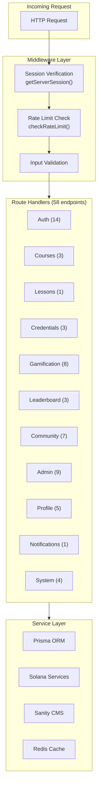
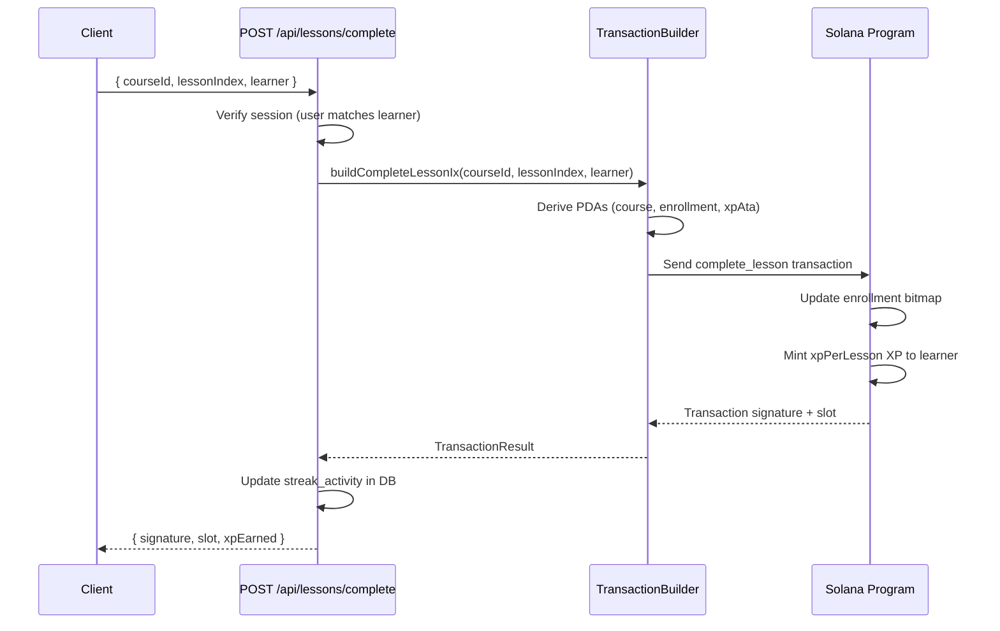
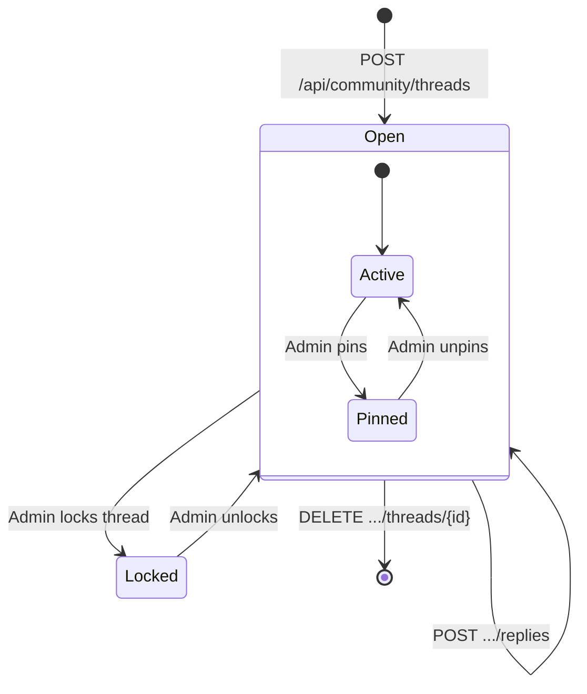
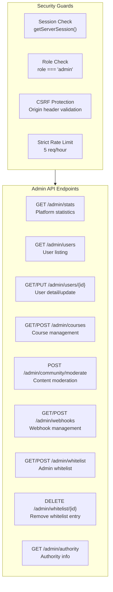

# API Reference

## Table of Contents

- [API Architecture](#api-architecture)
- [Authentication Endpoints](#authentication-endpoints)
- [Course Endpoints](#course-endpoints)
- [Lesson Endpoints](#lesson-endpoints)
- [Credential Endpoints](#credential-endpoints)
- [Gamification Endpoints](#gamification-endpoints)
- [Leaderboard Endpoints](#leaderboard-endpoints)
- [Community Endpoints](#community-endpoints)
- [Admin Endpoints](#admin-endpoints)
- [Profile Endpoints](#profile-endpoints)
- [Notification Endpoints](#notification-endpoints)
- [System Endpoints](#system-endpoints)
- [Error Handling](#error-handling)

---

## API Architecture

All API endpoints are implemented as Next.js App Router route handlers under `app/api/`.



### Common Response Format

All API responses follow a consistent JSON structure:

**Success Response:**
```json
{
    "data": { /* response payload */ },
    "message": "Operation successful"
}
```

**Error Response:**
```json
{
    "error": "Human-readable error message",
    "code": "ERROR_CODE",
    "details": "Additional context (dev only)"
}
```

### Authentication

Most endpoints require a valid JWT session. Authentication is verified via `getServerSession(authOptions)`.

| Auth Level | Description | How to Authenticate |
|---|---|---|
| None | Public endpoint | No authentication required |
| JWT | Requires valid session | Session cookie (automatic) |
| Admin | Requires admin role | JWT + admin role check |

---

## Authentication Endpoints

### NextAuth Handler

| | |
|---|---|
| **Method** | ALL |
| **Path** | `/api/auth/[...nextauth]` |
| **Auth** | None |
| **Description** | Core NextAuth.js handler for all auth operations |

### Wallet Sign Message

| | |
|---|---|
| **Method** | GET |
| **Path** | `/api/auth/wallet/sign-message` |
| **Auth** | None |
| **Rate Limit** | Default (5/min) |

**Query Parameters:**

| Parameter | Type | Required | Description |
|---|---|---|---|
| `address` | string | Yes | Solana wallet address (base58) |

**Response (200):**
```json
{
    "message": "Sign this message to verify your wallet ownership: {nonce}",
    "nonce": "random-string"
}
```

### Wallet Verify

| | |
|---|---|
| **Method** | POST |
| **Path** | `/api/auth/wallet/verify` |
| **Auth** | None |
| **Rate Limit** | Default (5/min) |

**Request Body:**
```json
{
    "walletAddress": "base58-address",
    "message": "signed-message-string",
    "signature": "base58-signature"
}
```

### Session

| | |
|---|---|
| **Method** | GET |
| **Path** | `/api/auth/session` |
| **Auth** | JWT |

**Response (200):**
```json
{
    "user": {
        "id": "uuid",
        "name": "string",
        "email": "string",
        "role": "student|instructor",
        "walletAddress": "base58|null",
        "onboardingComplete": true
    }
}
```

### Logout

| | |
|---|---|
| **Method** | POST |
| **Path** | `/api/auth/logout` |
| **Auth** | JWT |

### Delete Account

| | |
|---|---|
| **Method** | DELETE |
| **Path** | `/api/auth/delete-account` |
| **Auth** | JWT |
| **Rate Limit** | Strict (5/hr) |

### Account Linking

| Method | Path | Auth | Description |
|---|---|---|---|
| POST | `/api/auth/link/google` | JWT | Link Google account |
| POST | `/api/auth/link/github` | JWT | Link GitHub account |
| POST | `/api/auth/link/wallet` | JWT | Link Solana wallet |
| GET | `/api/auth/linked-accounts` | JWT | List linked accounts |
| DELETE | `/api/auth/unlink/{provider}` | JWT | Unlink provider |

---

## Course Endpoints

### List Courses

| | |
|---|---|
| **Method** | GET |
| **Path** | `/api/courses` |
| **Auth** | None |
| **Rate Limit** | Lenient (20/min) |
| **Source** | On-chain program accounts |

**Query Parameters:**

| Parameter | Type | Default | Description |
|---|---|---|---|
| `page` | number | 1 | Page number |
| `limit` | number | 50 | Results per page |
| `track` | number | - | Filter by track ID |
| `active` | boolean | - | Filter active courses only |

**Response (200):**
```json
{
    "courses": [
        {
            "courseId": "string",
            "coursePda": "base58",
            "creator": "base58",
            "lessonCount": 10,
            "difficulty": "beginner|intermediate|advanced",
            "xpPerLesson": 100,
            "trackId": 1,
            "trackLevel": 1,
            "prerequisite": "base58|null",
            "totalCompletions": 42,
            "totalEnrollments": 150,
            "isActive": true
        }
    ],
    "total": 25,
    "page": 1,
    "limit": 50
}
```

### Get Course by ID

| | |
|---|---|
| **Method** | GET |
| **Path** | `/api/courses/{id}` |
| **Auth** | None |

### Finalize Course

| | |
|---|---|
| **Method** | POST |
| **Path** | `/api/courses/finalize` |
| **Auth** | JWT |
| **Rate Limit** | Default (5/min) |

**Request Body:**
```json
{
    "courseId": "string",
    "learner": "base58-address"
}
```

**Response (200):**
```json
{
    "signature": "tx-signature",
    "slot": 123456,
    "bonusXp": 500
}
```

---

## Lesson Endpoints

### Complete Lesson

| | |
|---|---|
| **Method** | POST |
| **Path** | `/api/lessons/complete` |
| **Auth** | JWT |
| **Rate Limit** | Default (5/min) |

**Request Body:**
```json
{
    "courseId": "string",
    "lessonIndex": 0,
    "learner": "base58-address"
}
```

**Process Flow:**



---

## Credential Endpoints

### Issue Credential

| | |
|---|---|
| **Method** | POST |
| **Path** | `/api/credentials/issue` |
| **Auth** | JWT |
| **Rate Limit** | Default (5/min) |

**Request Body:**
```json
{
    "courseId": "string",
    "credentialName": "Anchor Developer Level 1",
    "metadataUri": "https://arweave.net/{txId}",
    "coursesCompleted": 3,
    "totalXp": 5000,
    "trackCollection": "base58-address"
}
```

### Get Credential

| | |
|---|---|
| **Method** | GET |
| **Path** | `/api/credentials/{id}` |
| **Auth** | None |
| **Source** | Helius DAS API |

### Credential Metadata

| | |
|---|---|
| **Method** | GET |
| **Path** | `/api/credentials/metadata/{id}` |
| **Auth** | None |

---

## Gamification Endpoints

### Streak Endpoints

| Method | Path | Auth | Description |
|---|---|---|---|
| GET | `/api/streak/current` | JWT | Get current streak data |
| POST | `/api/streak/checkin` | JWT | Record daily check-in |
| GET | `/api/streak/history` | JWT | Get streak activity history |
| POST | `/api/streak/milestone` | JWT | Claim streak milestone reward |

### XP Endpoints

| Method | Path | Auth | Description |
|---|---|---|---|
| GET | `/api/xp/balance` | JWT | Get on-chain XP balance |
| GET | `/api/xp/history` | JWT | Get XP earning history |

### Achievement Endpoints

| Method | Path | Auth | Description |
|---|---|---|---|
| GET | `/api/achievements` | JWT | List user achievements |
| POST | `/api/achievements/award` | JWT | Award an achievement |

---

## Leaderboard Endpoints

### Get Leaderboard

| | |
|---|---|
| **Method** | GET |
| **Path** | `/api/leaderboard` |
| **Auth** | None |
| **Rate Limit** | Lenient (20/min) |
| **Source** | Helius DAS API (XP token holders) |

**Query Parameters:**

| Parameter | Type | Default | Description |
|---|---|---|---|
| `limit` | number | 100 | Number of entries |
| `window` | string | "all" | Time window: "all", "weekly", "monthly" |

**Response (200):**
```json
{
    "entries": [
        {
            "rank": 1,
            "wallet": "base58-address",
            "xpBalance": 50000,
            "username": "solana_dev",
            "avatarUrl": "https://..."
        }
    ],
    "total": 500
}
```

### Get Rank

| | |
|---|---|
| **Method** | GET |
| **Path** | `/api/leaderboard/rank` |
| **Auth** | JWT |

### Get Stats

| | |
|---|---|
| **Method** | GET |
| **Path** | `/api/leaderboard/stats` |
| **Auth** | None |

---

## Community Endpoints

### Thread Lifecycle



### Thread Endpoints

| Method | Path | Auth | Description |
|---|---|---|---|
| GET | `/api/community/threads` | None | List threads (paginated, filtered) |
| POST | `/api/community/threads` | JWT | Create new thread |
| GET | `/api/community/threads/{id}` | None | Get thread detail |
| PUT | `/api/community/threads/{id}` | JWT | Update thread (author only) |
| DELETE | `/api/community/threads/{id}` | JWT | Delete thread (author/admin) |
| POST | `/api/community/threads/{id}/upvote` | JWT | Toggle upvote |
| GET | `/api/community/threads/{id}/replies` | None | List replies |
| POST | `/api/community/threads/{id}/replies` | JWT | Post reply |

### Reply Endpoints

| Method | Path | Auth | Description |
|---|---|---|---|
| PUT | `/api/community/replies/{replyId}` | JWT | Edit reply (author only) |
| DELETE | `/api/community/replies/{replyId}` | JWT | Delete reply (author/admin) |
| POST | `/api/community/replies/{replyId}/upvote` | JWT | Toggle upvote |
| POST | `/api/community/replies/{replyId}/accept` | JWT | Accept answer (thread author) |

---

## Admin Endpoints

All admin endpoints require admin role authentication and use the strict rate limit tier.



### Admin Stats

| | |
|---|---|
| **Method** | GET |
| **Path** | `/api/admin/stats` |
| **Auth** | Admin |

**Response (200):**
```json
{
    "totalUsers": 1500,
    "activeUsers": 450,
    "totalCourses": 25,
    "totalEnrollments": 3200,
    "totalCompletions": 890,
    "totalThreads": 340,
    "totalReplies": 1200
}
```

### User Management

| Method | Path | Description |
|---|---|---|
| GET | `/api/admin/users` | List users with filtering and pagination |
| GET | `/api/admin/users/{id}` | Get user detail |
| PUT | `/api/admin/users/{id}` | Update user (role, status) |

### Whitelist Management

| Method | Path | Description |
|---|---|---|
| GET | `/api/admin/whitelist` | List admin whitelist entries |
| POST | `/api/admin/whitelist` | Add to whitelist (email or wallet) |
| DELETE | `/api/admin/whitelist/{id}` | Remove from whitelist (soft delete) |

---

## Profile Endpoints

| Method | Path | Auth | Description |
|---|---|---|---|
| GET | `/api/profile` | JWT | Get own profile |
| PUT | `/api/profile` | JWT | Update profile |
| GET | `/api/profile/{username}` | None | Get public profile |
| POST | `/api/profile/avatar` | JWT | Upload avatar |
| POST | `/api/profile/onboarding` | JWT | Complete onboarding |

---

## Notification Endpoints

| Method | Path | Auth | Description |
|---|---|---|---|
| POST | `/api/notifications/subscribe` | JWT | Register push subscription |

---

## System Endpoints

| Method | Path | Auth | Description |
|---|---|---|---|
| GET | `/api/health` | None | Health check |
| POST | `/api/cron/sync-xp-snapshots` | Cron Secret | Sync XP snapshots for leaderboard |
| POST | `/api/events` | Internal | Process on-chain events |
| POST | `/api/queue` | Internal | Process queued jobs |
| POST | `/api/code/execute` | JWT | Execute code in sandbox |
| GET | `/api/cms/course` | None | Fetch course content from CMS |

---

## Error Handling

### Standard Error Codes

| HTTP Status | Error Code | Description |
|---|---|---|
| 400 | `VALIDATION_ERROR` | Invalid request body or parameters |
| 401 | `UNAUTHORIZED` | Missing or invalid session |
| 403 | `FORBIDDEN` | Insufficient permissions |
| 404 | `NOT_FOUND` | Resource not found |
| 409 | `CONFLICT` | Duplicate or state conflict |
| 429 | `RATE_LIMITED` | Too many requests |
| 500 | `INTERNAL_ERROR` | Server error (details hidden in production) |
| 503 | `SERVICE_UNAVAILABLE` | Dependency unavailable |

### Rate Limit Response Headers

| Header | Description |
|---|---|
| `X-RateLimit-Limit` | Maximum requests in window |
| `X-RateLimit-Remaining` | Remaining requests |
| `X-RateLimit-Reset` | Window reset timestamp |

### Error Response Format

```json
{
    "error": "Too many requests. Try again later.",
    "code": "RATE_LIMITED",
    "retryAfter": 60
}
```

### ServiceError Class

The backend uses a custom `ServiceError` class for structured error handling:

```typescript
class ServiceError extends Error {
    constructor(
        message: string,
        public code: string,
        public statusCode: number
    ) { super(message); }
}
```

### RpcError Class

On-chain operation failures use the `RpcError` class with automatic retry support for transient errors:

```typescript
class RpcError extends Error {
    constructor(message: string, options?: { cause?: unknown }) {
        super(message, options);
    }
}
```
