# Solana Blockchain Integration

## Table of Contents

- [On-Chain Architecture](#on-chain-architecture)
- [Program Account Structure](#program-account-structure)
- [PDA Derivation](#pda-derivation)
- [Transaction Builder](#transaction-builder)
- [XP Token System](#xp-token-system)
- [Credential NFT System](#credential-nft-system)
- [Achievement NFT System](#achievement-nft-system)
- [Enrollment Service](#enrollment-service)
- [Course Service](#course-service)
- [Helius DAS Integration](#helius-das-integration)
- [On-Chain to Off-Chain Bridge](#on-chain-to-off-chain-bridge)

---

## On-Chain Architecture

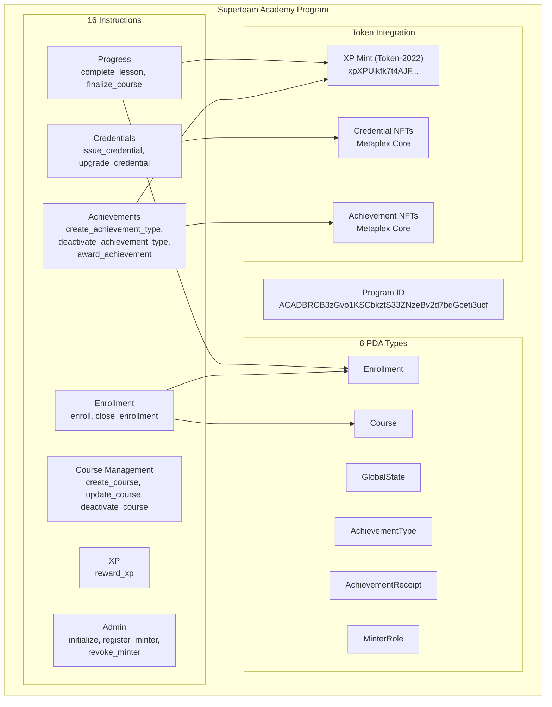

---

## Program Account Structure

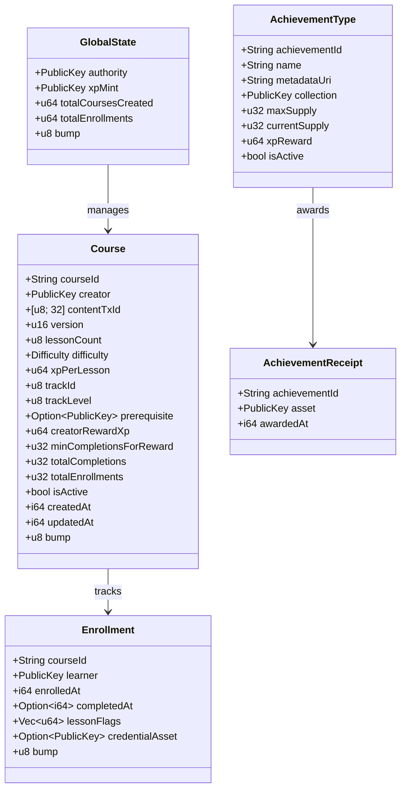

---

## PDA Derivation

All PDAs are derived using the program ID and deterministic seeds:

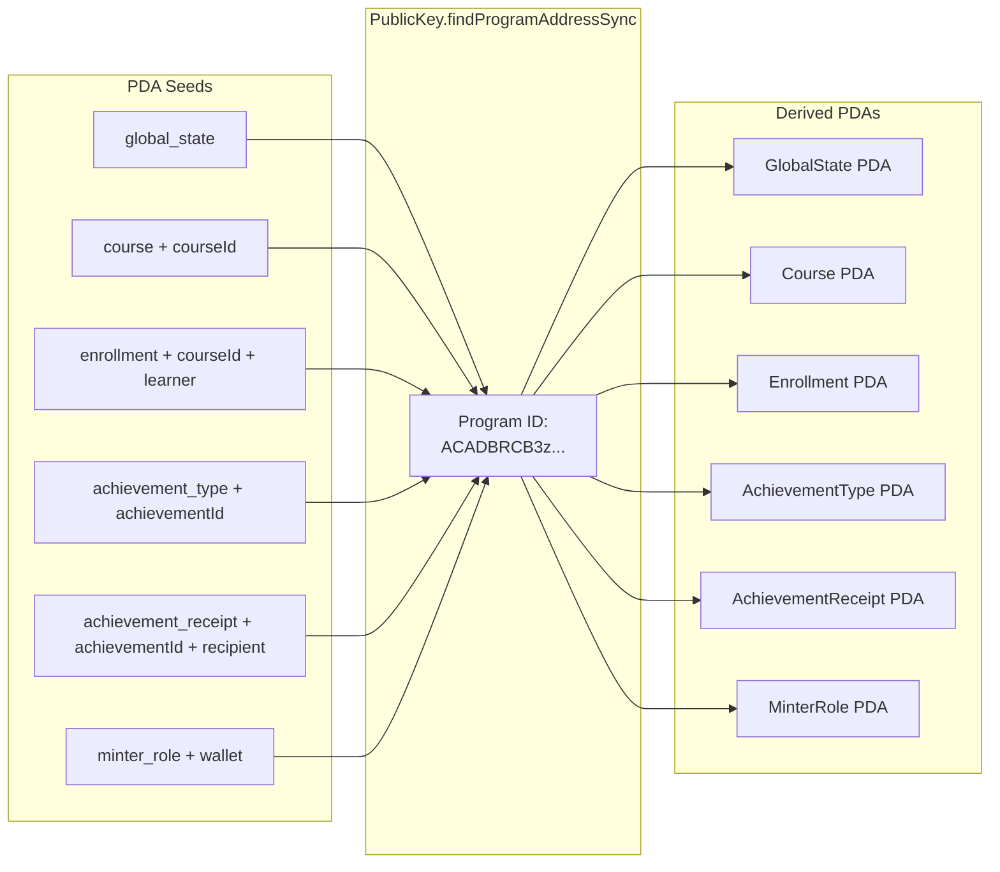

### PDA Derivation Functions

| Function | Seeds | Returns |
|---|---|---|
| `deriveCoursePda(courseId)` | `["course", courseId]` | `[PublicKey, bump]` |
| `deriveEnrollmentPda(courseId, learner)` | `["enrollment", courseId, learner]` | `[PublicKey, bump]` |

---

## Transaction Builder

The `TransactionBuilder` class handles all backend-signed on-chain operations.

### Architecture

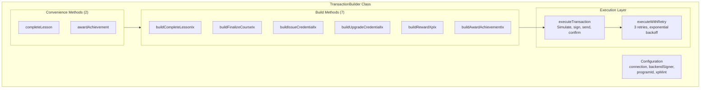

### Transaction Execution Pipeline

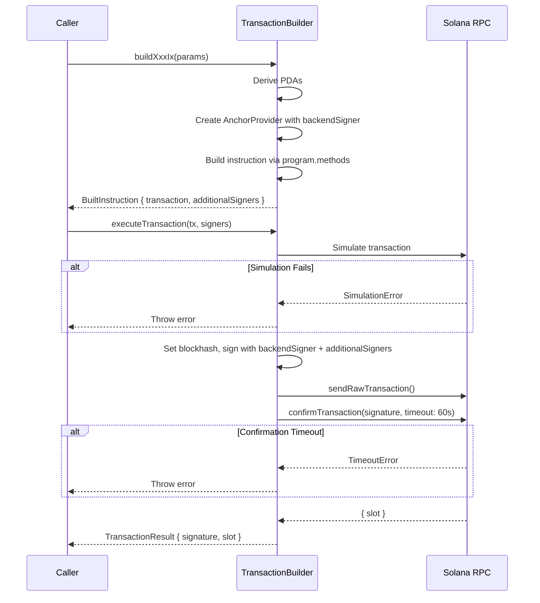

### Retry Logic

The `executeWithRetry` method provides automatic retry for transient failures:

| Parameter | Value |
|---|---|
| Max Retries | 3 |
| Backoff | Exponential (1s, 2s, 4s) |
| Retryable Errors | Network timeouts, blockhash expiry, RPC 429/503 |
| Non-Retryable | Insufficient funds, invalid params, program errors |

---

## XP Token System

### Token Specifications

| Property | Value |
|---|---|
| Standard | SPL Token-2022 |
| Mint Address | `xpXPUjkfk7t4AJF1tYUoyAYxzuM5DhinZWS1WjfjAu3` |
| Type | Soulbound (non-transferable) |
| Decimals | Default |
| ATA Program | TOKEN_2022_PROGRAM_ID |

### XP Token Flow

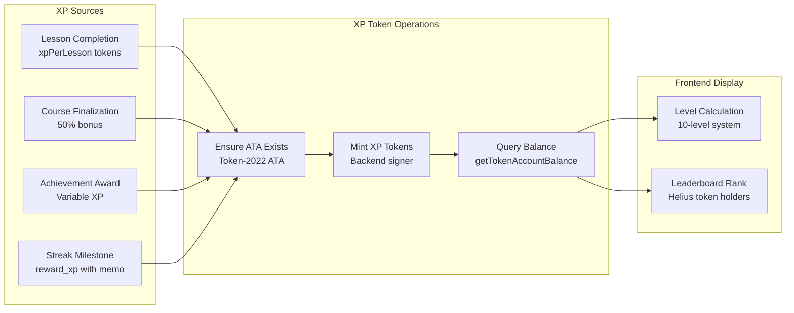

### XP Service Functions

| Function | Description |
|---|---|
| `deriveXpAta(owner)` | Derive Token-2022 ATA address |
| `xpAtaExists(connection, owner)` | Check if ATA exists |
| `ensureXpAta(connection, owner, payer)` | Create ATA if missing |
| `buildCreateXpAtaInstruction(owner, payer)` | Build ATA creation instruction (for bundling) |
| `getXpBalance(connection, owner)` | Get XP balance (returns 0 if no ATA) |
| `getXpBalances(connection, owners[])` | Batch balance query via getMultipleAccountsInfo |

### Level Thresholds

| Level | XP Required | Cumulative |
|---|---|---|
| 1 | 0 | 0 |
| 2 | 1,000 | 1,000 |
| 3 | 2,500 | 2,500 |
| 4 | 5,000 | 5,000 |
| 5 | 10,000 | 10,000 |
| 6 | 20,000 | 20,000 |
| 7 | 35,000 | 35,000 |
| 8 | 55,000 | 55,000 |
| 9 | 80,000 | 80,000 |
| 10 | 120,000 | 120,000 |

---

## Credential NFT System

### Credential Lifecycle

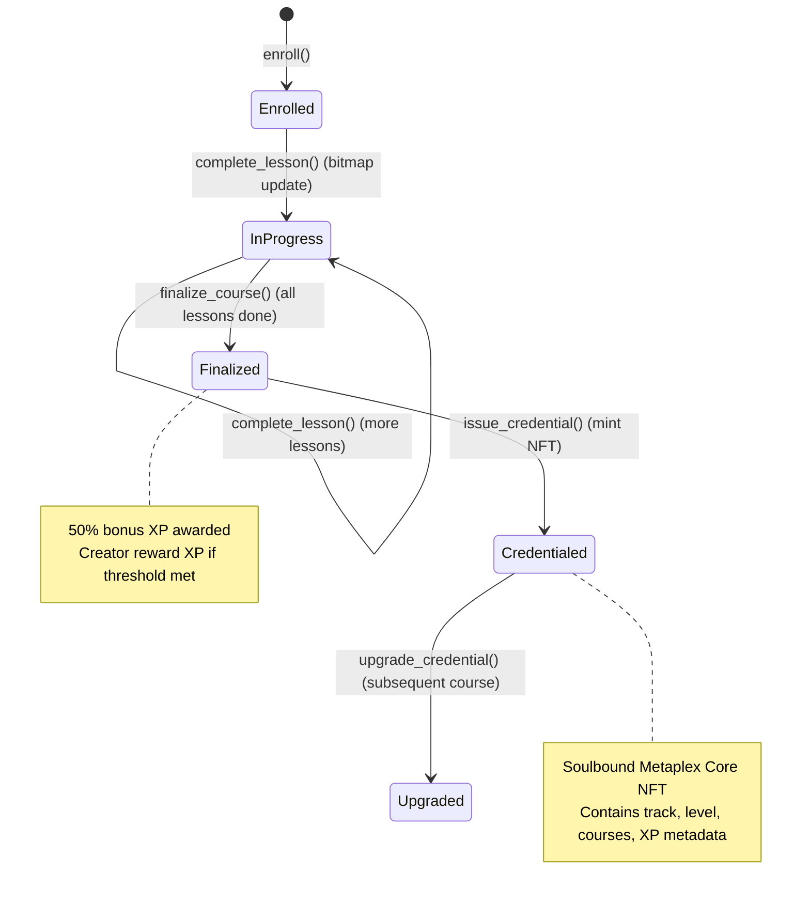

### Credential Service Functions

| Function | Description |
|---|---|
| `issueCredential(connection, signer, payer, params)` | Mint new credential NFT |
| `upgradeCredential(connection, signer, payer, params)` | Update existing credential metadata |
| `checkCredentialStatus(connection, courseId, learner)` | Check if credential exists |
| `getCredentialDetails(assetId)` | Fetch credential via Helius DAS |
| `getUserCredentials(ownerAddress, trackCollections?)` | Get all user credentials |
| `hasTrackCredential(ownerAddress, trackCollection)` | Check track credential ownership |

### Track Collections

| Track ID | Track Name |
|---|---|
| 1 | Anchor Developer |
| 2 | DeFi Specialist |
| 3 | Mobile Developer |
| 4 | Pinocchio Developer |
| 5 | Token Engineer |

---

## Achievement NFT System

### Achievement Architecture

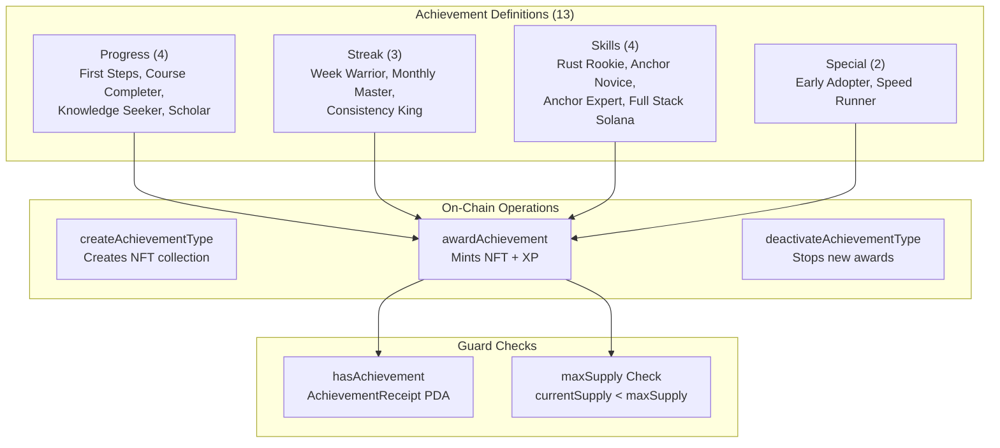

### Achievement Definitions

| ID | Name | Category | XP Reward | Condition |
|---|---|---|---|---|
| `first-steps` | First Steps | Progress | 50 | Complete first lesson |
| `course-completer` | Course Completer | Progress | 100 | Complete first course |
| `five-courses` | Knowledge Seeker | Progress | 500 | Complete 5 courses |
| `ten-courses` | Scholar | Progress | 1,000 | Complete 10 courses |
| `week-warrior` | Week Warrior | Streak | 100 | 7-day streak |
| `monthly-master` | Monthly Master | Streak | 500 | 30-day streak |
| `consistency-king` | Consistency King | Streak | 2,000 | 100-day streak |
| `rust-rookie` | Rust Rookie | Skill | 100 | 5 Rust lessons |
| `anchor-novice` | Anchor Novice | Skill | 100 | Anchor basics |
| `anchor-expert` | Anchor Expert | Skill | 500 | Anchor track |
| `full-stack-solana` | Full Stack Solana | Skill | 1,000 | All Solana tracks |
| `early-adopter` | Early Adopter | Special | 500 | Join during beta |
| `speed-runner` | Speed Runner | Special | 300 | Course in 24 hours |

---

## Enrollment Service

### Enrollment Flow with Prerequisites

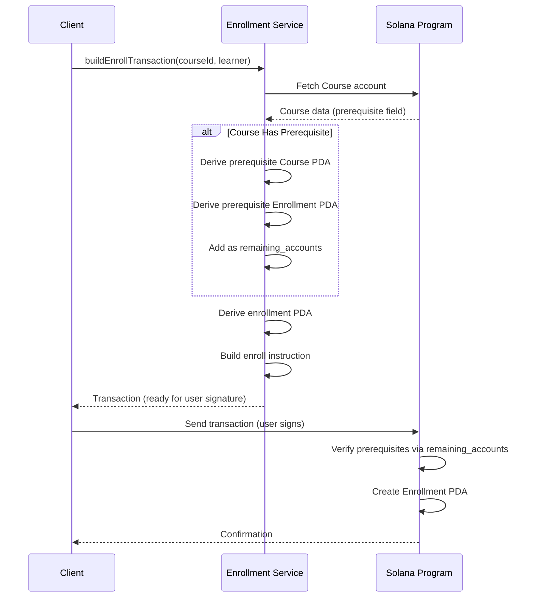

### Enrollment Service Functions

| Function | Description |
|---|---|
| `buildEnrollTransaction(connection, courseId, learner, prerequisiteCourseId?)` | Build enrollment tx with prerequisite handling |
| `fetchEnrollment(connection, courseId, learner)` | Fetch enrollment state |
| `checkPrerequisiteMet(connection, courseId, learner)` | Check prerequisite completion |
| `buildCloseEnrollmentTransaction(connection, courseId, learner)` | Build close enrollment tx (24h cooldown for incomplete) |

### Lesson Completion Bitmap

Lesson progress is tracked using a bitmap pattern in the `lessonFlags` field:

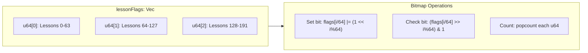

---

## Course Service

### Course Data Flow

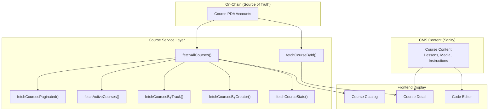

---

## Helius DAS Integration

### Helius Service Architecture

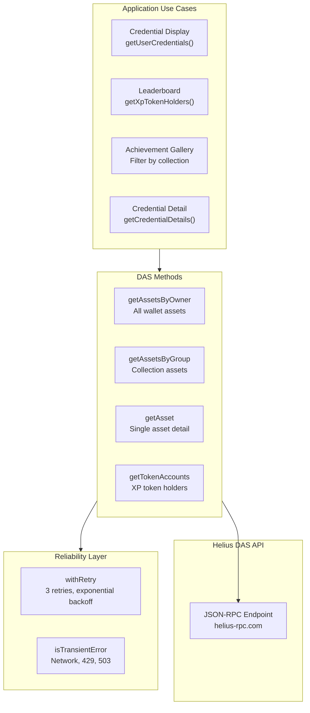

---

## On-Chain to Off-Chain Bridge

### Event Processing Pipeline

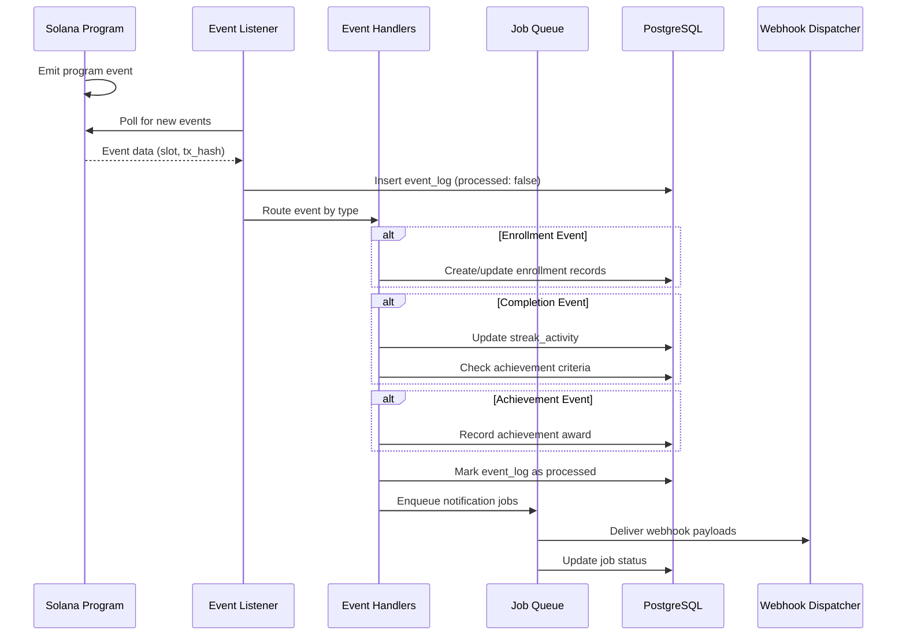

### Data Synchronization

| Data Type | Source of Truth | Sync Direction | Mechanism |
|---|---|---|---|
| Course catalog | On-chain | Chain to Frontend | Direct RPC query |
| Enrollment status | On-chain | Chain to Frontend | Direct RPC query |
| Lesson progress | On-chain (bitmap) | Chain to Frontend | Direct RPC query |
| XP balance | On-chain (Token-2022) | Chain to Frontend | Direct RPC / Helius DAS |
| Credentials | On-chain (Metaplex Core) | Chain to Frontend | Helius DAS API |
| Achievements | On-chain + DB | Bidirectional | Event listener sync |
| Streaks | Off-chain (DB) | DB to Frontend | Prisma queries |
| Community data | Off-chain (DB) | DB to Frontend | Prisma queries |
| Leaderboard | On-chain (snapshots) | Cron sync | `/api/cron/sync-xp-snapshots` |
