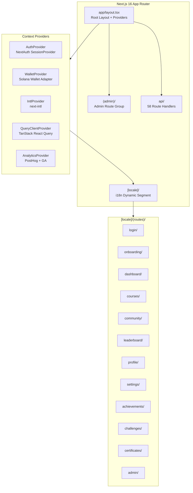
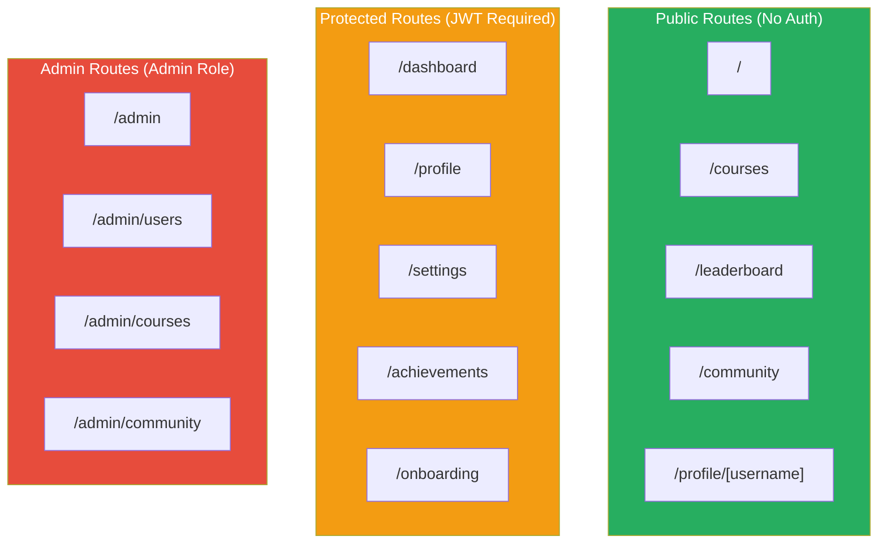
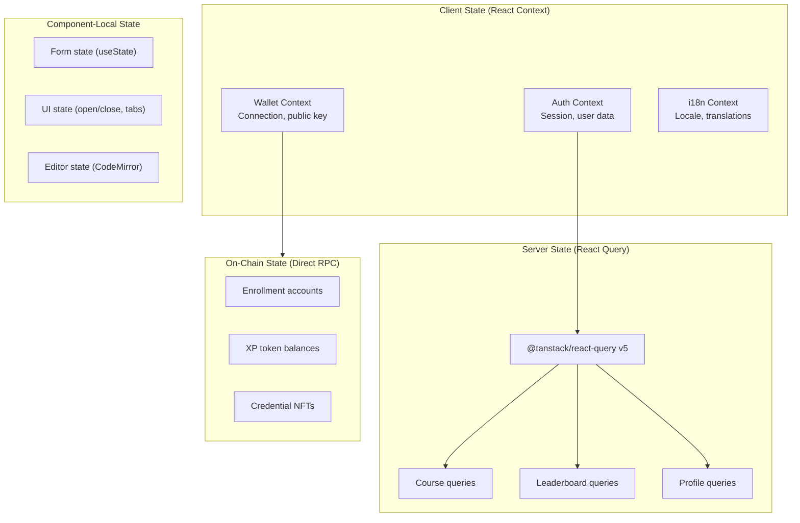
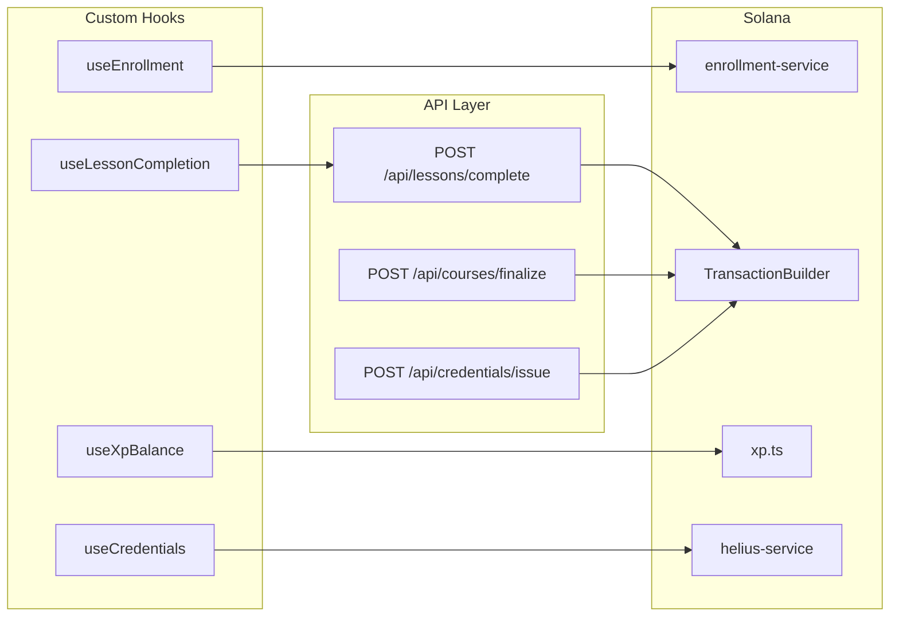
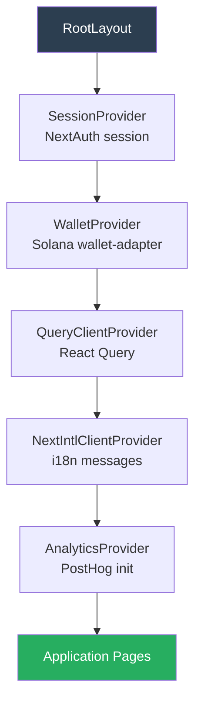
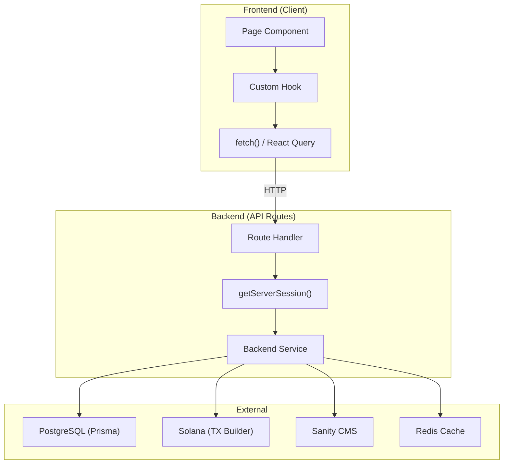

# Frontend Architecture

## Table of Contents

- [Application Structure](#application-structure)
- [Routing Architecture](#routing-architecture)
- [Component Architecture](#component-architecture)
- [State Management](#state-management)
- [Custom Hooks](#custom-hooks)
- [Context Providers](#context-providers)
- [Frontend-Backend Integration](#frontend-backend-integration)

---

## Application Structure

---

## Routing Architecture

### Page Routes

| Route | Component Directory | Auth Required | Description |
|---|---|---|---|
| `/` | `[locale]/page.tsx` | No | Landing page |
| `/login` | `[locale]/(routes)/login/` | No | Login page |
| `/onboarding` | `[locale]/(routes)/onboarding/` | Yes | New user onboarding flow |
| `/dashboard` | `[locale]/(routes)/dashboard/` | Yes | User dashboard |
| `/courses` | `[locale]/(routes)/courses/` | No | Course catalog |
| `/courses/[slug]` | `[locale]/(routes)/courses/[slug]/` | No | Course detail |
| `/courses/[slug]/lessons/[id]` | `[locale]/(routes)/courses/[slug]/lessons/` | Yes | Lesson view with editor |
| `/leaderboard` | `[locale]/(routes)/leaderboard/` | No | XP leaderboard |
| `/achievements` | `[locale]/(routes)/achievements/` | Yes | Achievement showcase |
| `/challenges` | `[locale]/(routes)/challenges/` | Yes | Daily challenges |
| `/community` | `[locale]/(routes)/community/` | No | Forum listing |
| `/community/[threadId]` | `[locale]/(routes)/community/[id]/` | No | Thread detail |
| `/community/new` | `[locale]/(routes)/community/new/` | Yes | Create thread |
| `/profile` | `[locale]/(routes)/profile/` | Yes | User profile |
| `/profile/[username]` | `[locale]/(routes)/profile/[username]/` | No | Public profile |
| `/settings` | `[locale]/(routes)/settings/` | Yes | User settings |
| `/certificates/[id]` | `[locale]/(routes)/certificates/` | No | Certificate viewer |
| `/admin/*` | `[locale]/(routes)/admin/` | Admin | Admin dashboard |
| `/offline` | `[locale]/offline/` | No | PWA offline fallback |

### Route Groups and Middleware

---

## Component Architecture

### Component Organization (23 Feature Areas)

```mermaid
graph TB
    subgraph Components["components/"]
        SHARED["shared/<br/>ErrorBoundary"]
        UI_COMP["ui/<br/>14 base components"]

        subgraph Feature["Feature Components"]
            C_AUTH["auth/ (2)"]
            C_LANDING["landing/ (9)"]
            C_DASH["dashboard/ (15)"]
            C_COURSE["course/ (15)"]
            C_LESSON["lesson/ (4)"]
            C_EDITOR["editor/ (5)"]
            C_PROFILE["profile/ (6)"]
            C_SETTINGS["settings/ (5)"]
            C_LB["leaderboard/ (10)"]
            C_ACH["achievement/ (5)"]
            C_COMM["community/ (9)"]
            C_ADMIN["admin/ (8)"]
            C_STREAK["streak/ (4)"]
            C_XP["xp/ (2)"]
            C_CRED["credential/ (2)"]
            C_NOTIF["notification/ (3)"]
            C_ONBOARD["onboarding/ (3)"]
            C_CHALLENGE["challenges/ (2)"]
            C_ANALYTICS["analytics/ (2)"]
            C_I18N["i18n/ (1)"]
            C_PWA["pwa/ (1)"]
        end
    end

    UI_COMP --> Feature
    SHARED --> Feature
```

### UI Base Components

| Component | Description |
|---|---|
| Button | Variant-based button with CVA |
| Card | Content container with header/footer |
| Dialog | Modal dialog (Radix UI) |
| Dropdown | Dropdown menu (Radix UI) |
| Input | Form input with validation |
| Select | Dropdown select (Radix UI) |
| Sheet | Slide-out panel |
| Skeleton | Loading placeholder |
| Tabs | Tab navigation (Radix UI) |
| Toast | Notification toasts (goey-toast) |
| Tooltip | Hover tooltips |
| Badge | Status badges |
| Avatar | User avatars |
| Calendar | Date picker (react-day-picker) |

---

## State Management

---

## Custom Hooks

### Hook Catalog (19 Hooks)

| Hook | Purpose | Data Source |
|---|---|---|
| `useWalletAuth` | Wallet connection and sign-in | Wallet Adapter + API |
| `useAccountLinking` | Link/unlink auth providers | API endpoints |
| `useEnrollment` | Course enrollment management | Solana Program |
| `useLessonCompletion` | Lesson progress and completion | API + Solana |
| `useCourses` | Course catalog queries | API (on-chain data) |
| `useCourseDetails` | Single course with CMS content | API + Sanity |
| `useXpBalance` | On-chain XP balance | Solana RPC |
| `useStreak` | Activity streak data | API (PostgreSQL) |
| `useDailyLogin` | Daily login streak recording | API (PostgreSQL) |
| `useLeaderboard` | Leaderboard rankings | API (Helius DAS) |
| `useAchievements` | User achievement gallery | API (DB + on-chain) |
| `useCredentials` | Credential NFTs display | Helius DAS API |
| `useChallenges` | Daily challenge system | API |
| `useCodeExecution` | Code editor run/test | API sandbox |
| `useAnalytics` | Event tracking | PostHog + GA |
| `useUserStats` | Dashboard statistics | API aggregate |
| `useOfflineSync` | PWA offline data sync | IndexedDB |
| `usePushNotifications` | Push notification management | API + Browser Push |
| `useMobile` | Responsive breakpoint detection | Window resize |

### Hook Data Flow

---

## Context Providers

### Provider Hierarchy

### Provider Configuration

| Provider | Package | Key Configuration |
|---|---|---|
| SessionProvider | next-auth/react | Session refetch on window focus |
| WalletProvider | @solana/wallet-adapter-react | Multi-wallet support, auto-connect |
| QueryClientProvider | @tanstack/react-query | Stale time, retry config |
| NextIntlClientProvider | next-intl | Locale from URL segment, message bundles |
| PostHog | posthog-js | API key, automatic page view tracking |

---

## Frontend-Backend Integration

### Integration Pattern

### Data Fetching Patterns

| Pattern | Used For | Example |
|---|---|---|
| Server Components | Initial page data | Course catalog SSR |
| React Query | Client-side data with caching | Leaderboard, profile |
| Direct RPC | On-chain reads | XP balance, enrollment status |
| API Routes | Mutations with auth | Lesson completion, thread creation |
| Sanity Client | CMS content | Course lessons, media |
