# Gamification System

## Table of Contents

- [Gamification Architecture](#gamification-architecture)
- [XP System](#xp-system)
- [Level Progression](#level-progression)
- [Streak System](#streak-system)
- [Achievement System](#achievement-system)
- [Daily Challenges](#daily-challenges)
- [Credential System](#credential-system)

---

## Gamification Architecture

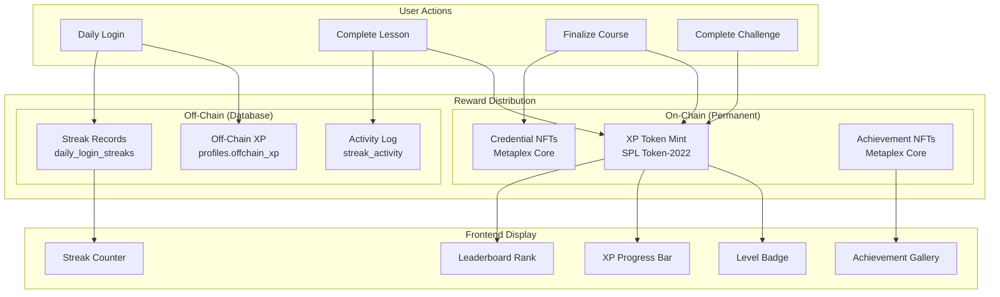

---

## XP System

### XP Sources and Amounts

| Source | XP Amount | Storage | Persistence |
|---|---|---|---|
| Lesson completion | `xpPerLesson` (course-defined) | On-chain token | Permanent |
| Course finalization bonus | `floor(xpPerLesson * lessonCount / 2)` | On-chain token | Permanent |
| Creator reward XP | `creatorRewardXp` (if threshold met) | On-chain token | Permanent |
| Achievement award | Variable (50-2000) | On-chain token | Permanent |
| Streak milestone | Variable XP | On-chain token (via `reward_xp`) | Permanent |
| Daily login | Incremental | Off-chain (`profiles.offchain_xp`) | Resets on streak break |

### XP Calculation Functions

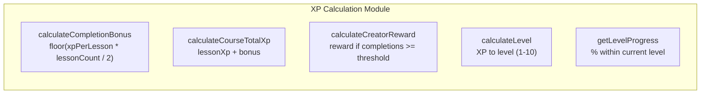

### XP Flow: Lesson to Leaderboard

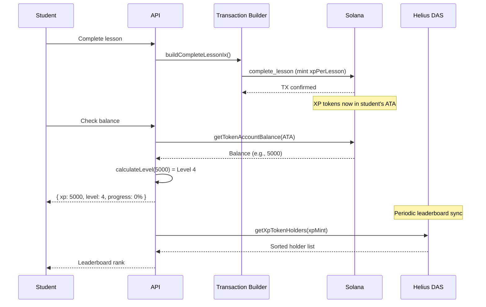

---

## Level Progression

### Level Thresholds

```mermaid
graph LR
    L1["Level 1<br/>0 XP"]
    L2["Level 2<br/>1,000 XP"]
    L3["Level 3<br/>2,500 XP"]
    L4["Level 4<br/>5,000 XP"]
    L5["Level 5<br/>10,000 XP"]
    L6["Level 6<br/>20,000 XP"]
    L7["Level 7<br/>35,000 XP"]
    L8["Level 8<br/>55,000 XP"]
    L9["Level 9<br/>80,000 XP"]
    L10["Level 10<br/>120,000 XP"]

    L1 --> L2 --> L3 --> L4 --> L5
    L5 --> L6 --> L7 --> L8 --> L9 --> L10

    style L1 fill:#95a5a6,color:#fff
    style L2 fill:#3498db,color:#fff
    style L3 fill:#2ecc71,color:#fff
    style L4 fill:#f1c40f,color:#000
    style L5 fill:#e67e22,color:#fff
    style L6 fill:#e74c3c,color:#fff
    style L7 fill:#9b59b6,color:#fff
    style L8 fill:#1abc9c,color:#fff
    style L9 fill:#c0392b,color:#fff
    style L10 fill:#f39c12,color:#fff
```

### Level Calculation Logic

| Function | Input | Output | Description |
|---|---|---|---|
| `calculateLevel(xp)` | XP amount | 1-10 | Current level |
| `getXpForLevel(level)` | Level number | XP threshold | XP needed to reach level |
| `getNextLevelXp(xp)` | Current XP | XP threshold | XP needed for next level |
| `getLevelProgress(xp)` | Current XP | 0-100% | Progress within current level |

---

## Streak System

### Dual Streak Model

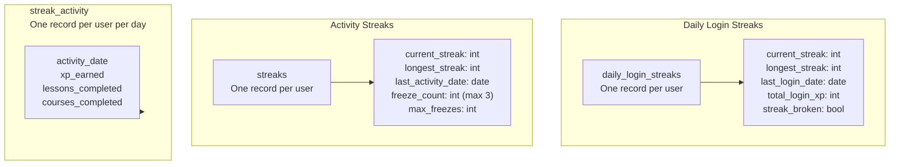

### Streak Lifecycle

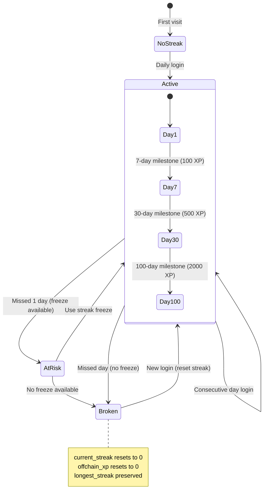

### Streak Milestones

| Milestone | Days | XP Reward | On-Chain |
|---|---|---|---|
| Week Warrior | 7 | 100 | `reward_xp` with memo |
| Monthly Master | 30 | 500 | `reward_xp` with memo |
| Consistency King | 100 | 2,000 | `reward_xp` with memo |

### Streak API Flow

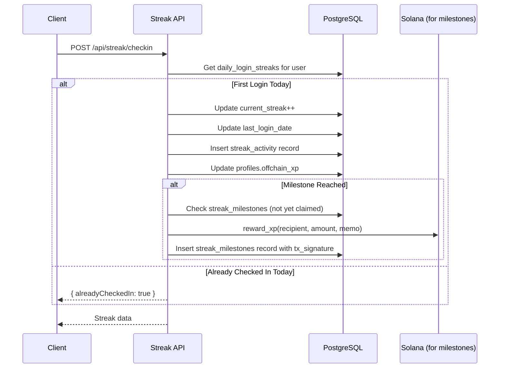

---

## Achievement System

### Achievement Classification

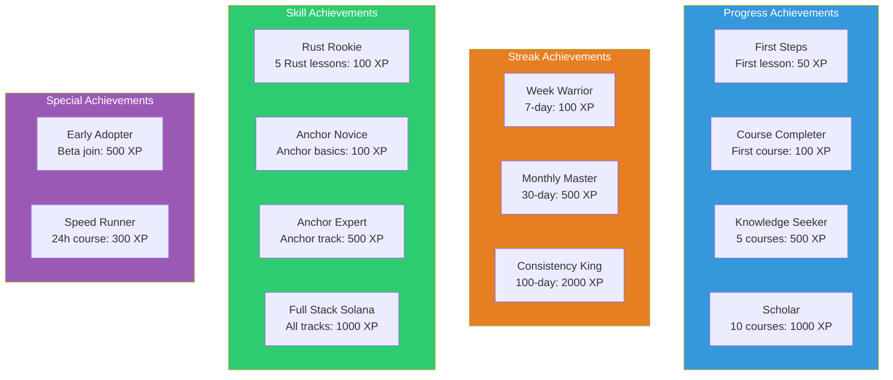

### Achievement Award Flow

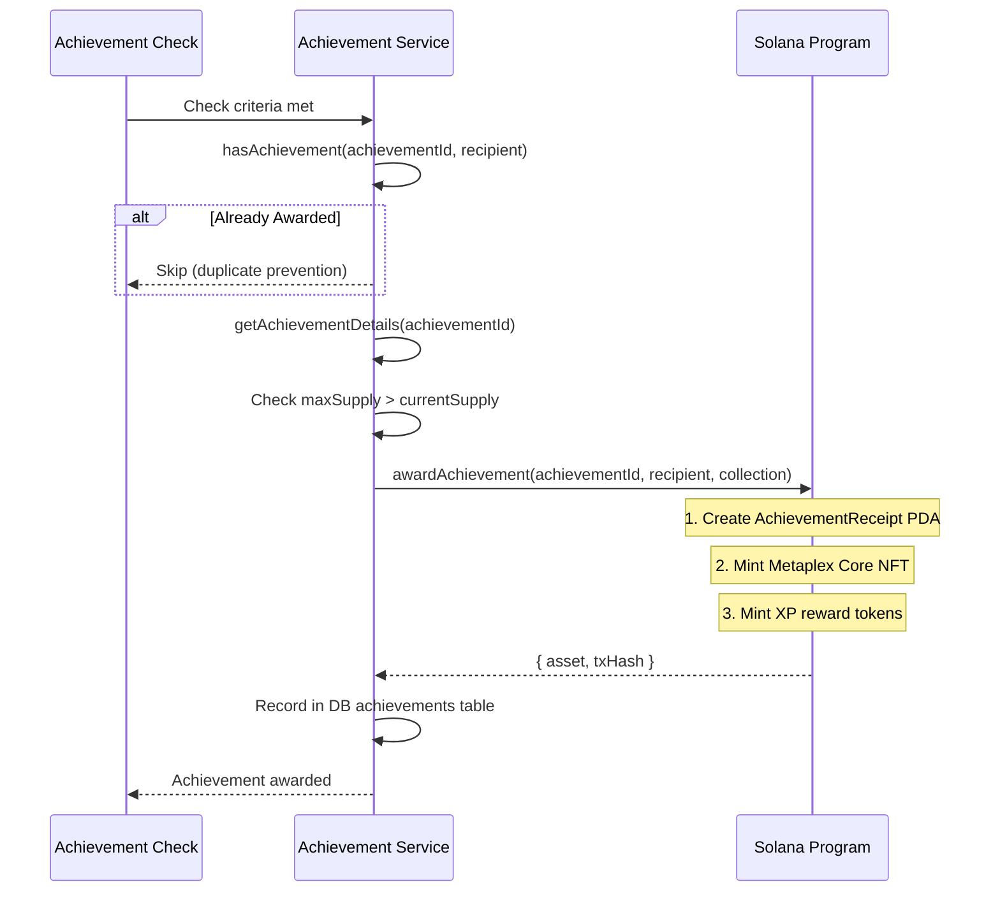

---

## Daily Challenges

The challenge system provides daily goals to encourage consistent engagement:

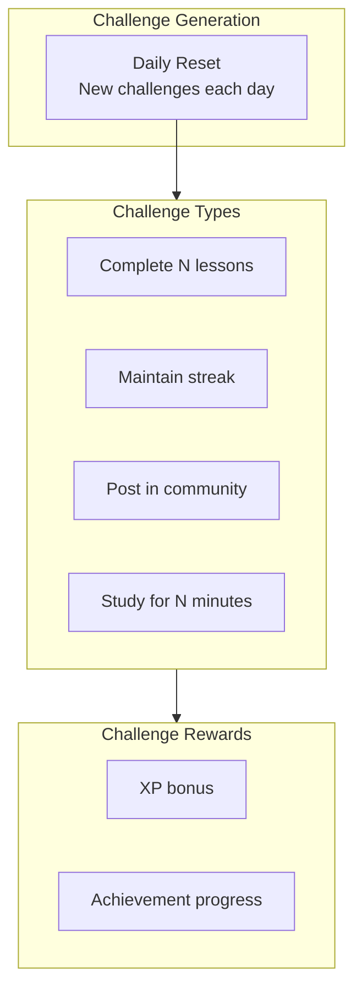

---

## Credential System

### Credential Architecture

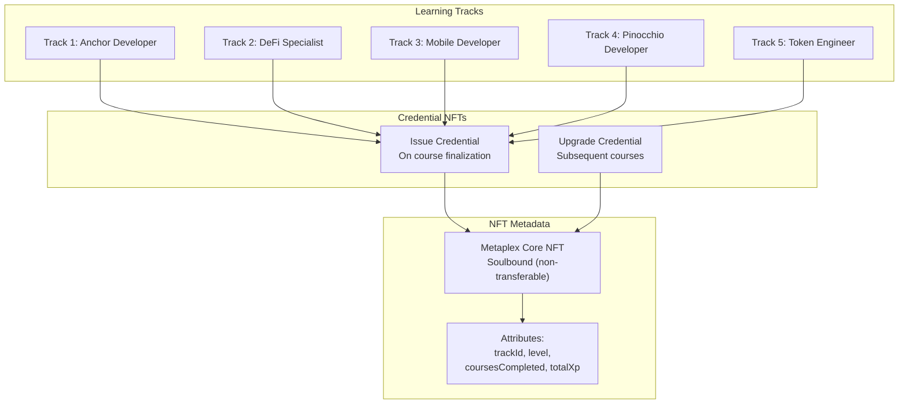

### Credential Lifecycle

| Stage | Trigger | On-Chain Action |
|---|---|---|
| Enrollment | User enrolls in course | Enrollment PDA created |
| Lesson Progress | Each lesson completed | Bitmap updated, XP minted |
| Course Finalization | All lessons done | 50% bonus XP, creator reward |
| Credential Issue | First course in track | Metaplex Core NFT minted |
| Credential Upgrade | Subsequent track course | NFT metadata updated |
