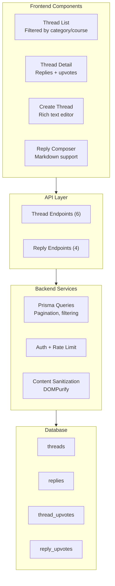
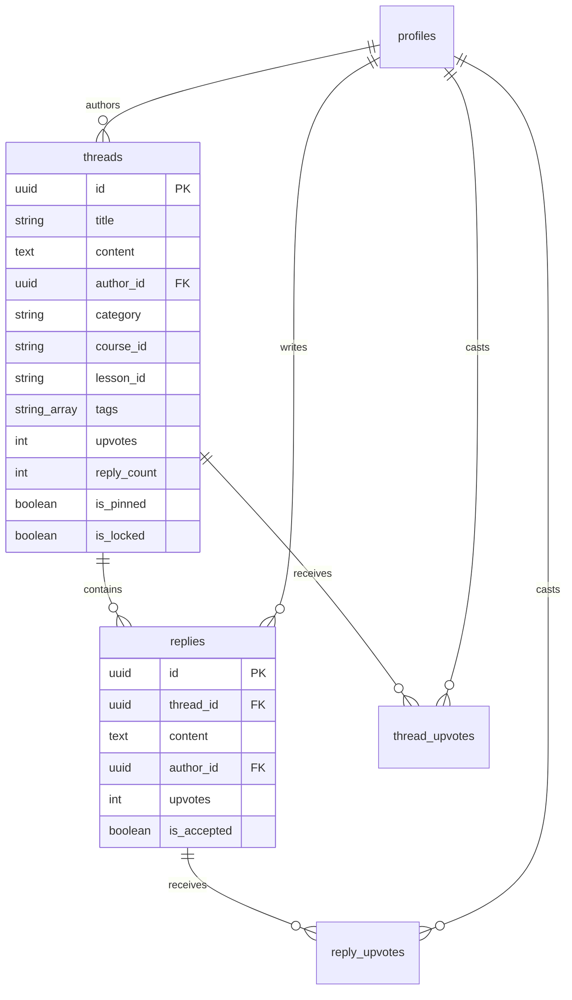
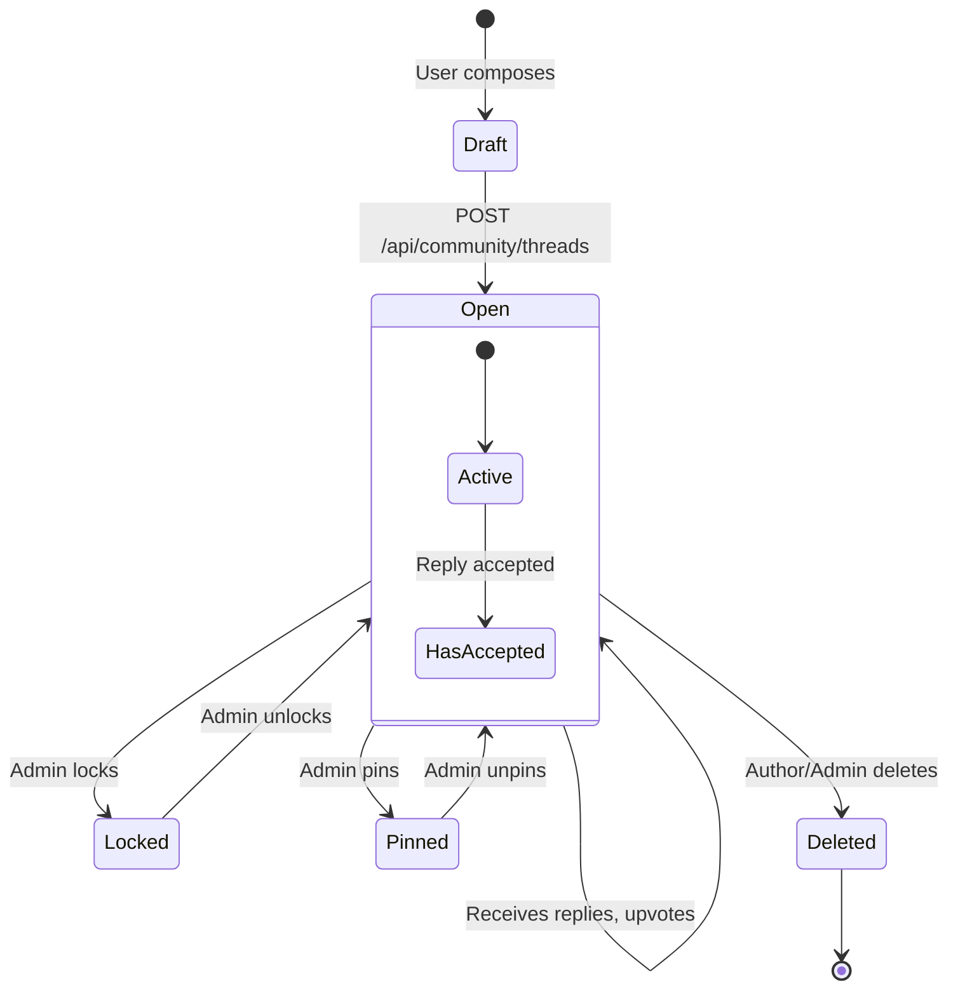
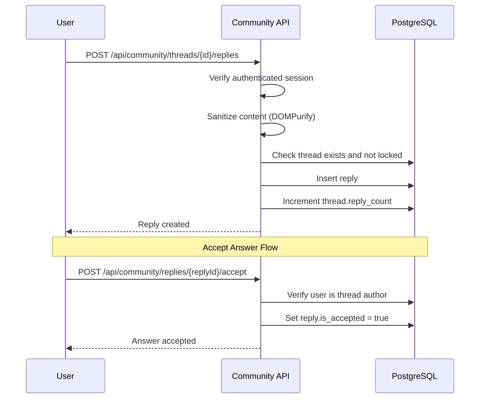
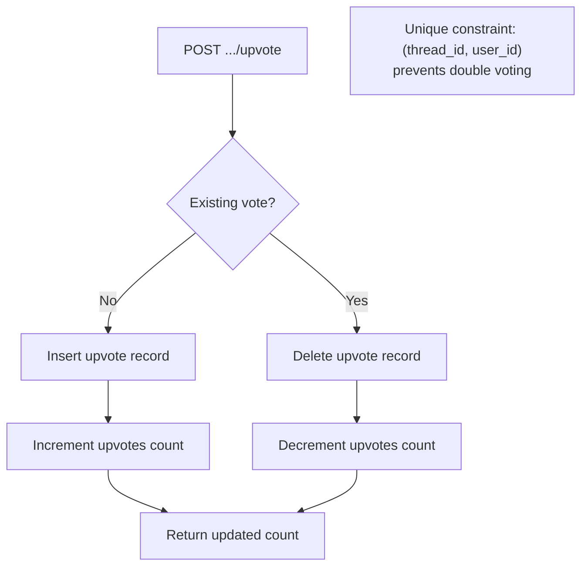
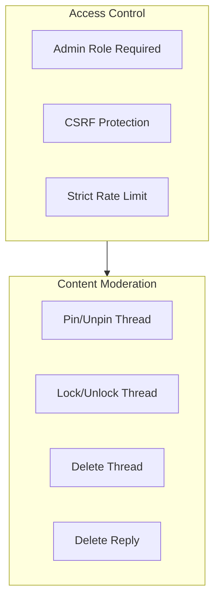

# Community Forum

## Table of Contents

- [Forum Architecture](#forum-architecture)
- [Data Model](#data-model)
- [Thread Management](#thread-management)
- [Reply System](#reply-system)
- [Upvote System](#upvote-system)
- [Moderation](#moderation)
- [API Endpoints](#api-endpoints)

---

## Forum Architecture

---

## Data Model

### Thread Categories

| Category | Description | Context |
|---|---|---|
| `general` | General discussion | Platform-wide |
| `help` | Help requests | Platform-wide |
| `course` | Course-specific discussion | Linked to `course_id` |
| `lesson` | Lesson-specific questions | Linked to `course_id` + `lesson_id` |
| `showcase` | Project showcases | Platform-wide |
| `feedback` | Platform feedback | Platform-wide |

---

## Thread Management

### Thread Lifecycle

### Thread Operations

| Operation | Who Can | Endpoint | Method |
|---|---|---|---|
| Create thread | Any authenticated user | `/api/community/threads` | POST |
| Edit thread | Author only | `/api/community/threads/{id}` | PUT |
| Delete thread | Author or Admin | `/api/community/threads/{id}` | DELETE |
| Pin/Unpin | Admin only | `/api/admin/community/moderate` | POST |
| Lock/Unlock | Admin only | `/api/admin/community/moderate` | POST |

---

## Reply System

---

## Upvote System

### Toggle Upvote Pattern

---

## Moderation

### Admin Moderation Capabilities

---

## API Endpoints

| Method | Endpoint | Auth | Description |
|---|---|---|---|
| GET | `/api/community/threads` | None | List threads (paginated, filtered by category/course) |
| POST | `/api/community/threads` | JWT | Create thread |
| GET | `/api/community/threads/{id}` | None | Get thread with author details |
| PUT | `/api/community/threads/{id}` | JWT | Update thread (author only) |
| DELETE | `/api/community/threads/{id}` | JWT | Delete thread (author/admin) |
| POST | `/api/community/threads/{id}/upvote` | JWT | Toggle upvote |
| GET | `/api/community/threads/{id}/replies` | None | List replies (paginated) |
| POST | `/api/community/threads/{id}/replies` | JWT | Post reply |
| PUT | `/api/community/replies/{replyId}` | JWT | Edit reply (author only) |
| DELETE | `/api/community/replies/{replyId}` | JWT | Delete reply (author/admin) |
| POST | `/api/community/replies/{replyId}/upvote` | JWT | Toggle reply upvote |
| POST | `/api/community/replies/{replyId}/accept` | JWT | Accept answer (thread author) |
| POST | `/api/admin/community/moderate` | Admin | Pin/lock/moderate threads |
