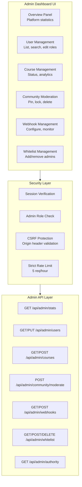
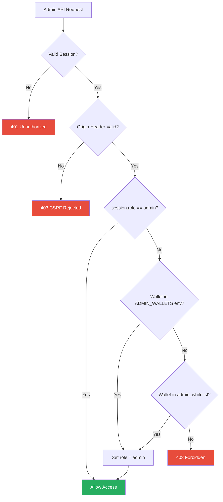
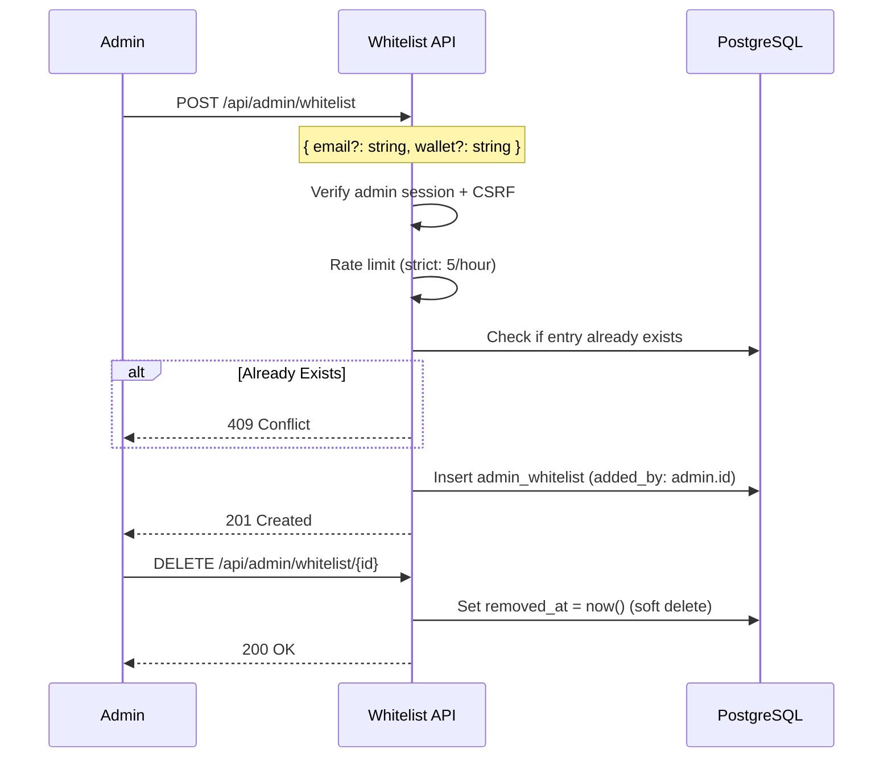
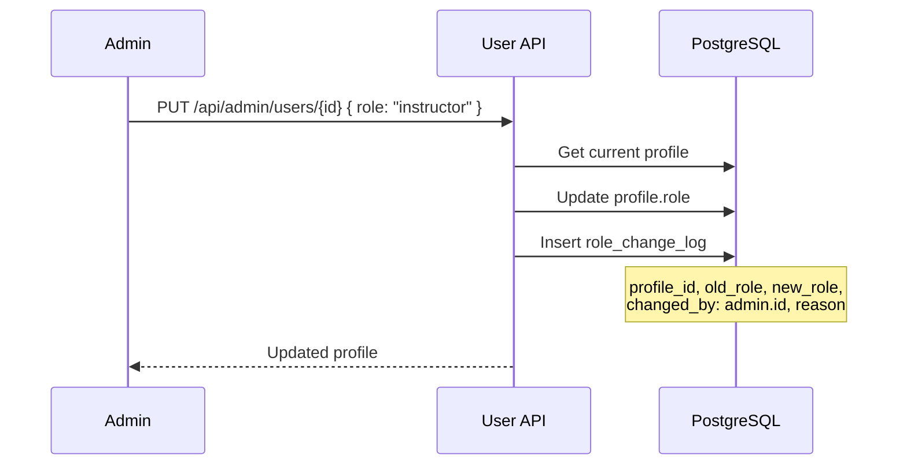
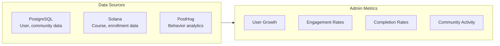

# Admin Dashboard

## Table of Contents

- [Admin Architecture](#admin-architecture)
- [Access Control](#access-control)
- [Admin Features](#admin-features)
- [Whitelist Management](#whitelist-management)
- [User Management](#user-management)
- [Content Moderation](#content-moderation)
- [Platform Analytics](#platform-analytics)
- [API Endpoints](#api-endpoints)

---

## Admin Architecture

---

## Access Control

### Admin Determination Flow

### CSRF Protection

Admin endpoints validate the `Origin` header against `NEXTAUTH_URL`:

| Check | Implementation |
|---|---|
| Origin validation | `req.headers.get('origin')` must match `NEXTAUTH_URL` |
| Environment | Only enforced when `NEXTAUTH_URL` is set |
| Failure | Returns 403 with CSRF rejection message |

---

## Admin Features

### Overview Dashboard

| Metric | Source | Description |
|---|---|---|
| Total Users | Prisma query | All registered profiles |
| Active Users | Prisma query | Users with login in last 30 days |
| Total Courses | On-chain query | All courses on program |
| Total Enrollments | On-chain aggregate | Sum of course enrollments |
| Total Completions | On-chain aggregate | Sum of course completions |
| Total Threads | Prisma count | Forum thread count |
| Total Replies | Prisma count | Forum reply count |

---

## Whitelist Management

### Whitelist Operations

---

## User Management

### User Operations

| Operation | Method | Endpoint | Description |
|---|---|---|---|
| List users | GET | `/api/admin/users` | Paginated, searchable user list |
| Get user detail | GET | `/api/admin/users/{id}` | Full user profile with stats |
| Update user | PUT | `/api/admin/users/{id}` | Change role, status |

### Role Change Logging

All role changes are persisted in `role_change_log`:

---

## Content Moderation

| Action | Target | Effect |
|---|---|---|
| Pin thread | Thread | Appears at top of listing |
| Unpin thread | Thread | Removes pinned status |
| Lock thread | Thread | Prevents new replies |
| Unlock thread | Thread | Re-enables replies |
| Delete thread | Thread | Cascades to replies and upvotes |
| Delete reply | Reply | Cascades to upvotes |

---

## Platform Analytics

---

## API Endpoints

| Method | Endpoint | Rate Limit | Description |
|---|---|---|---|
| GET | `/api/admin/stats` | Strict | Platform-wide statistics |
| GET | `/api/admin/users` | Strict | User listing with pagination |
| GET | `/api/admin/users/{id}` | Strict | User detail |
| PUT | `/api/admin/users/{id}` | Strict | Update user role/status |
| GET | `/api/admin/courses` | Strict | Course management listing |
| POST | `/api/admin/courses` | Strict | Course operations |
| POST | `/api/admin/community/moderate` | Strict | Content moderation actions |
| GET | `/api/admin/webhooks` | Strict | List webhook configs |
| POST | `/api/admin/webhooks` | Strict | Create webhook config |
| GET | `/api/admin/whitelist` | Strict | List whitelist entries |
| POST | `/api/admin/whitelist` | Strict | Add whitelist entry |
| DELETE | `/api/admin/whitelist/{id}` | Strict | Remove whitelist entry |
| GET | `/api/admin/authority` | Strict | Program authority info |
