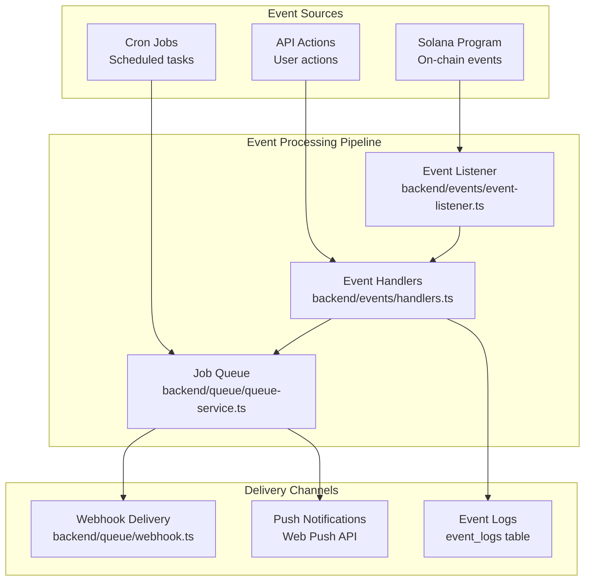
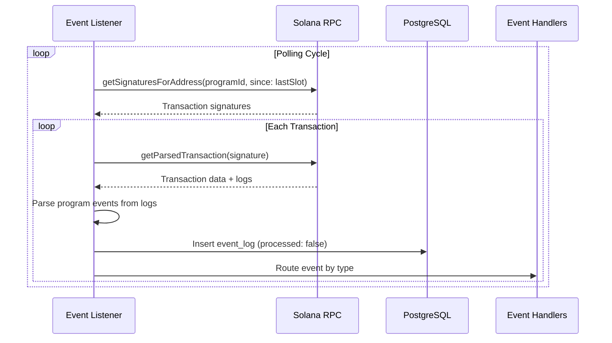
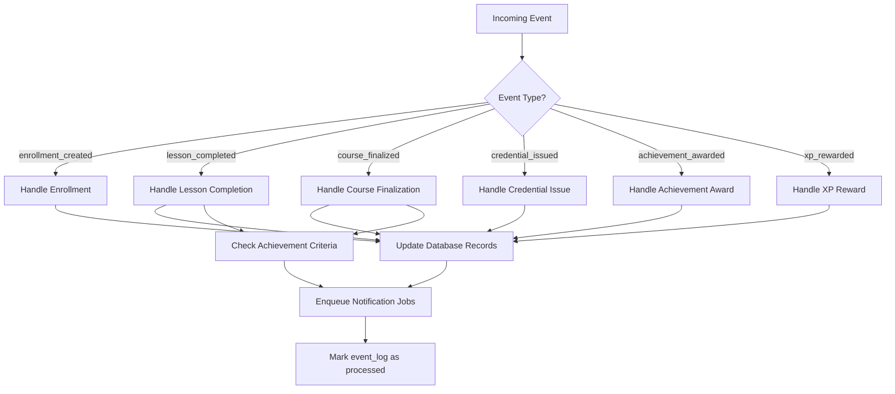
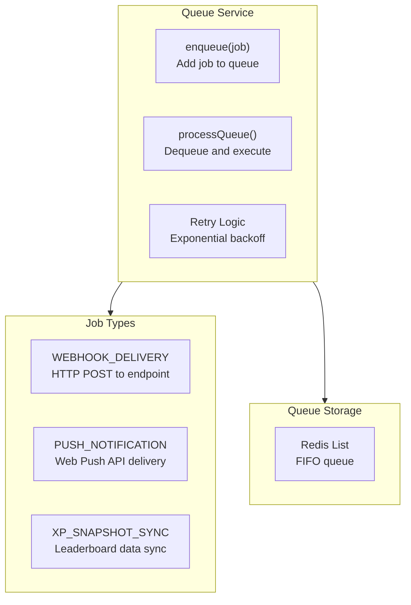
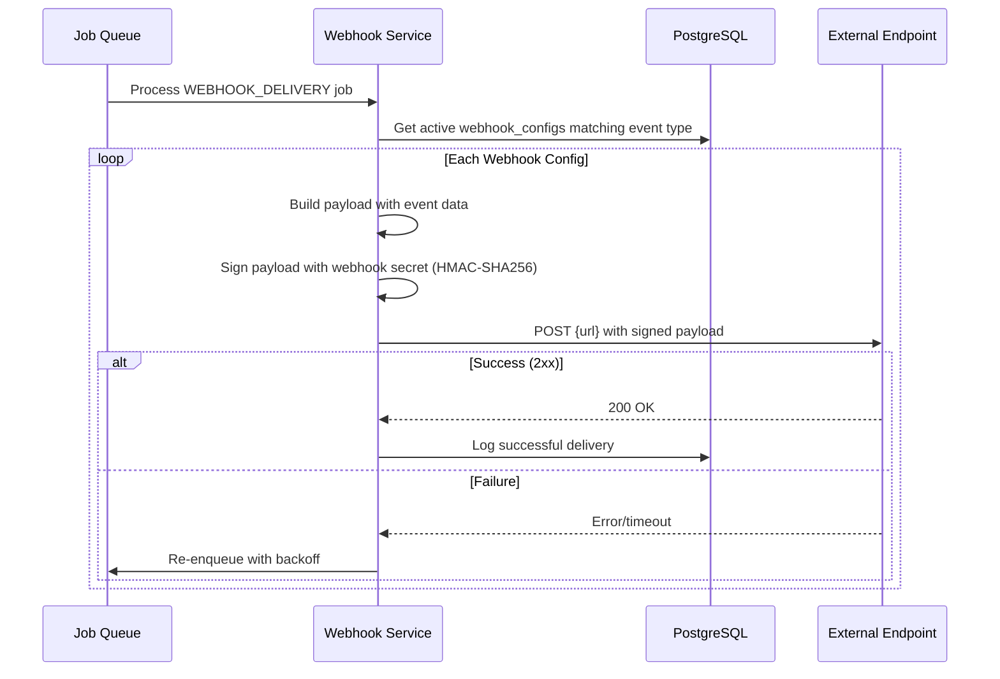
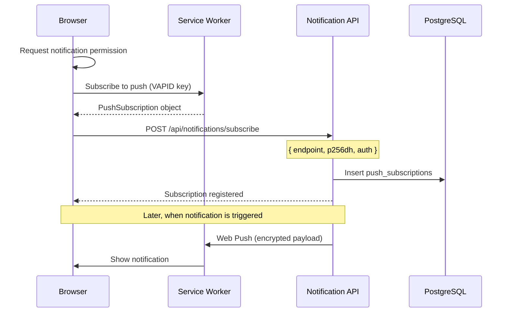
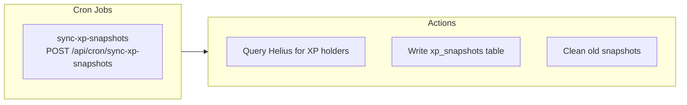
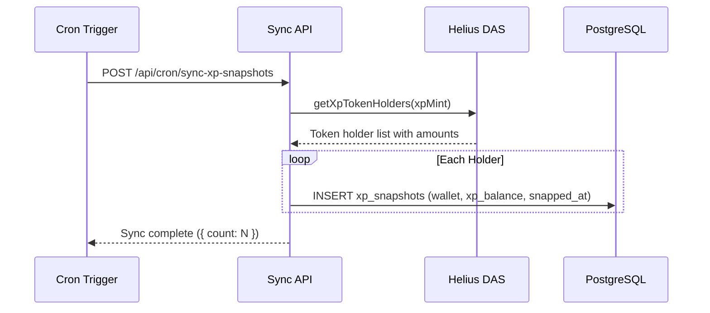

# Notifications and Event System

## Table of Contents

- [Event System Architecture](#event-system-architecture)
- [Event Listener](#event-listener)
- [Event Handlers](#event-handlers)
- [Job Queue](#job-queue)
- [Webhook System](#webhook-system)
- [Push Notifications](#push-notifications)
- [Cron Jobs](#cron-jobs)

---

## Event System Architecture



---

## Event Listener

### On-Chain Event Polling



### Event Types

| Event Type | Source | Description |
|---|---|---|
| `enrollment_created` | On-chain | New course enrollment |
| `lesson_completed` | On-chain | Lesson marked complete |
| `course_finalized` | On-chain | All lessons completed |
| `credential_issued` | On-chain | NFT credential minted |
| `credential_upgraded` | On-chain | Credential metadata updated |
| `achievement_awarded` | On-chain | Achievement NFT minted |
| `xp_rewarded` | On-chain | XP tokens minted (streak, etc.) |
| `course_created` | On-chain | New course created |

---

## Event Handlers

### Handler Routing



---

## Job Queue

### Queue Service Architecture



### Job Type Definitions

| Job Type | Payload | Delivery | Retry |
|---|---|---|---|
| `WEBHOOK_DELIVERY` | event data + webhook config | HTTP POST | 3 retries, exponential backoff |
| `PUSH_NOTIFICATION` | title, body, user_id | Web Push API | 2 retries |
| `XP_SNAPSHOT_SYNC` | wallet list | Database write | 3 retries |

---

## Webhook System

### Webhook Delivery Flow



### Webhook Configuration

| Field | Type | Description |
|---|---|---|
| `url` | String | Delivery endpoint URL |
| `secret` | String | HMAC signing secret |
| `events` | String[] | Subscribed event types |
| `active` | Boolean | Enable/disable toggle |
| `created_by` | UUID | Creator profile reference |

### Webhook Payload Format

```json
{
    "event": "lesson_completed",
    "timestamp": "2026-03-03T10:00:00Z",
    "data": {
        "userId": "uuid",
        "courseId": "string",
        "lessonIndex": 5,
        "xpEarned": 100,
        "txHash": "solana-tx-signature"
    },
    "signature": "hmac-sha256-signature"
}
```

---

## Push Notifications

### Push Subscription Flow



### Push Subscription Schema

| Field | Type | Description |
|---|---|---|
| `user_id` | UUID | User who subscribed |
| `endpoint` | String (unique) | Push API endpoint URL |
| `p256dh` | String | Client public key |
| `auth` | String | Client auth secret |

---

## Cron Jobs

### Scheduled Tasks



### XP Snapshot Sync

| Parameter | Value |
|---|---|
| Endpoint | `POST /api/cron/sync-xp-snapshots` |
| Schedule | Configurable (e.g., every 6 hours) |
| Auth | Cron secret header |
| Purpose | Enables time-windowed leaderboard queries |


