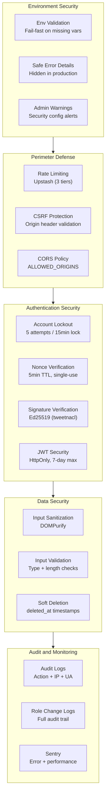
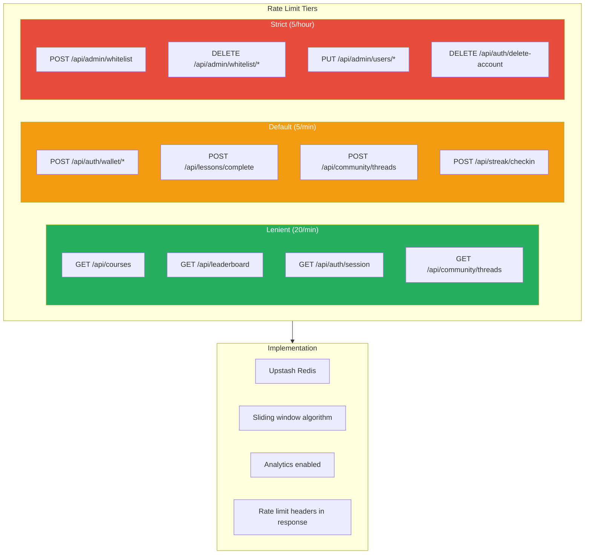
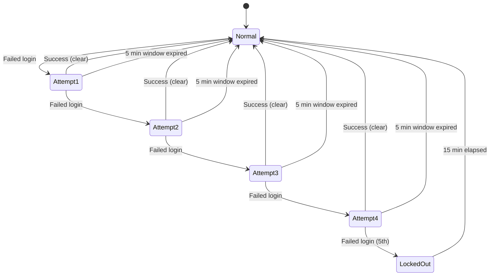
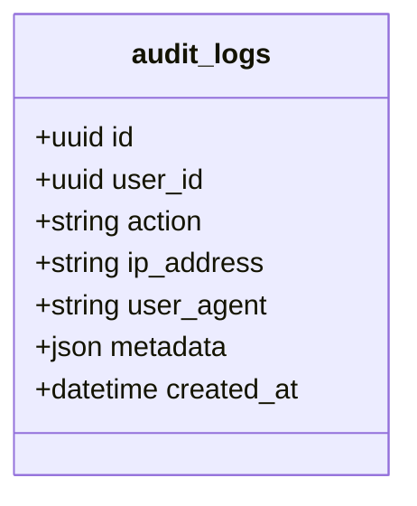
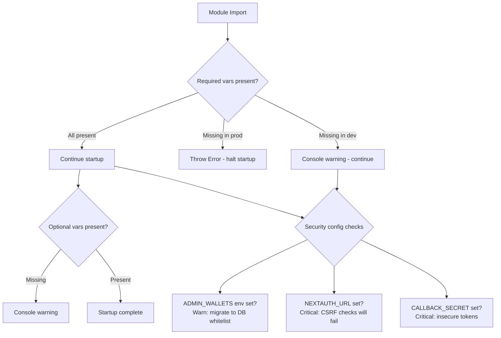
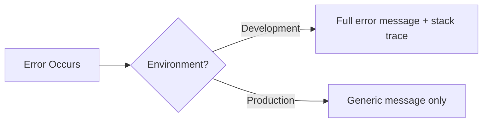

# Security Practices

## Table of Contents

- [Security Architecture](#security-architecture)
- [Authentication Security](#authentication-security)
- [Rate Limiting](#rate-limiting)
- [Account Lockout](#account-lockout)
- [Audit Logging](#audit-logging)
- [Input Validation and Sanitization](#input-validation-and-sanitization)
- [Environment Security](#environment-security)
- [Session Security](#session-security)
- [Transaction Security](#transaction-security)
- [Error Handling Security](#error-handling-security)

---

## Security Architecture



---

## Authentication Security

### Wallet Authentication Security Measures

| Control | Implementation | Purpose |
|---|---|---|
| Nonce verification | Redis with 5-min TTL | Prevent replay attacks |
| Single-use nonces | Deleted after verification | Prevent nonce reuse |
| Ed25519 verification | `tweetnacl.sign.detached.verify()` | Cryptographic proof of wallet ownership |
| Lockout protection | 5 failed attempts = 15-min lock | Prevent brute force |
| Rate limiting | 5 requests/minute | Prevent automated attacks |
| Audit logging | Every auth attempt logged | Security forensics |

### OAuth Security

| Control | Implementation |
|---|---|
| Provider verification | Configured `clientId` + `clientSecret` |
| State parameter | NextAuth CSRF token |
| Provider data validation | provider_id uniqueness check |
| Session binding | JWT strategy with server-side verification |

---

## Rate Limiting

### Three-Tier Rate Limiting Architecture



### Rate Limit Response

When rate limited, the API returns:

| Header | Example |
|---|---|
| `X-RateLimit-Limit` | `5` |
| `X-RateLimit-Remaining` | `0` |
| `X-RateLimit-Reset` | `1709478000` |

### Production Safety

| Scenario | Behavior |
|---|---|
| Redis configured | Normal rate limiting |
| Redis not configured (dev) | Rate limiting bypassed |
| Redis not configured (prod) | Returns 503 Service Unavailable |

---

## Account Lockout

### Lockout Parameters

| Parameter | Value | Configurable |
|---|---|---|
| Max failed attempts | 5 | Constant |
| Lockout window | 5 minutes | Constant |
| Lockout duration | 15 minutes | Constant |
| Storage | Redis (prod) / in-memory Map (dev) | Automatic |

### Lockout State Machine



### Key Storage Schema

| Key Pattern | Type | TTL | Description |
|---|---|---|---|
| `lockout:{identifier}` | String ("locked") | 900s | Lockout flag |
| `attempts:{identifier}` | Counter | 300s | Failed attempt count |

---

## Audit Logging

### Logged Events

| Action | Data Captured | Retention |
|---|---|---|
| `login` | User ID, IP, User-Agent, provider | Indefinite |
| `login_failed` | Identifier, attempt count | Indefinite |
| `logout` | User ID | Indefinite |
| `account_link` | User ID, provider | Indefinite |
| `account_unlink` | User ID, provider | Indefinite |
| `role_change` | Profile, old/new role, changed_by, reason | Indefinite |
| `account_delete` | User ID, timestamp | Indefinite |

### Audit Log Schema



---

## Input Validation and Sanitization

### Content Sanitization

| Context | Library | Purpose |
|---|---|---|
| Forum content | DOMPurify | Prevent XSS in user-generated content |
| API inputs | TypeScript validation | Type safety and bounds checking |
| URL parameters | Manual validation | Prevent injection |

### Validation Patterns

| Validated Fields | Rules |
|---|---|
| Wallet address | Base58 format, 32-44 characters |
| Email | Standard email format |
| Username | Alphanumeric + underscore, 3-30 characters |
| Thread title | 1-255 characters, sanitized |
| Thread content | Non-empty, sanitized |
| Course ID | Non-empty string |
| Lesson index | Non-negative integer |

---

## Environment Security

### Validation Module

The `context/env.ts` module provides fail-fast environment validation:



### Required Environment Variables

| Variable | Category | Purpose |
|---|---|---|
| `NEXT_PUBLIC_SUPABASE_URL` | Database | Supabase connection |
| `NEXT_PUBLIC_SUPABASE_ANON_KEY` | Database | Supabase anonymous key |
| `SUPABASE_SERVICE_ROLE_KEY` | Database | Supabase admin key |
| `AUTH_SECRET` | Authentication | NextAuth JWT signing |
| `GOOGLE_CLIENT_ID` | Authentication | Google OAuth |
| `GOOGLE_CLIENT_SECRET` | Authentication | Google OAuth |
| `GITHUB_CLIENT_ID` | Authentication | GitHub OAuth |
| `GITHUB_CLIENT_SECRET` | Authentication | GitHub OAuth |

### Safe Error Handling

```typescript
// context/env.ts
export function safeErrorDetails(error: unknown): string | undefined {
    if (process.env.NODE_ENV === 'development') {
        return error instanceof Error ? error.message : String(error);
    }
    return undefined; // Hide details in production
}
```

---

## Session Security

| Control | Value | Description |
|---|---|---|
| Strategy | JWT | Stateless, no server-side session store |
| Cookie | HttpOnly | Not accessible via JavaScript |
| Max Age | 7 days | Automatic expiry |
| Session Version | Integer (profiles.session_version) | Force invalidation by incrementing |
| Token Content | userId, role, walletAddress | Minimal sensitive data |

---

## Transaction Security

### Backend Signer Security

| Control | Implementation |
|---|---|
| Private key storage | `BACKEND_SIGNER_PRIVATE_KEY` env var |
| Key access | Server-side only (never exposed to client) |
| Transaction simulation | Simulated before sending |
| Confirmation | Waited with 60-second timeout |
| Retry guards | `isTransientError` check before retry |
| Nonce reuse prevention | Fresh blockhash per transaction |

---

## Error Handling Security

### Production Error Responses

| Scenario | Response | Details |
|---|---|---|
| Validation error | 400 with message | Field-level details |
| Auth failure | 401 generic message | No reason disclosed |
| Forbidden | 403 generic message | No role information leaked |
| Not found | 404 generic message | No resource type disclosed |
| Server error | 500 generic message | Implementation details hidden |

### Error Detail Exposure Control


