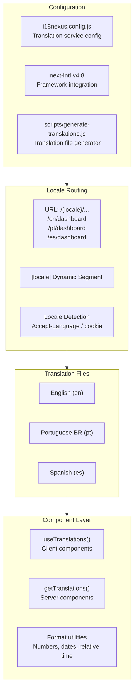
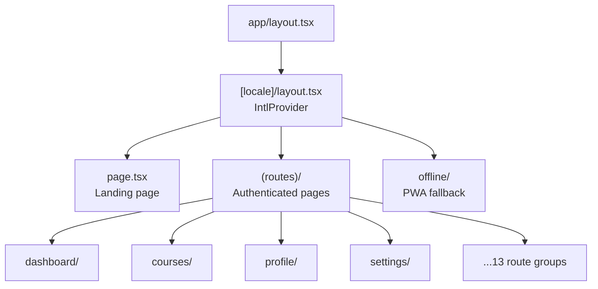
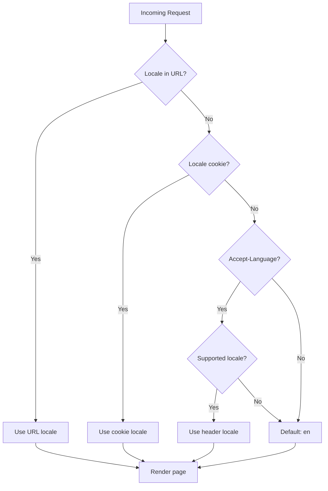
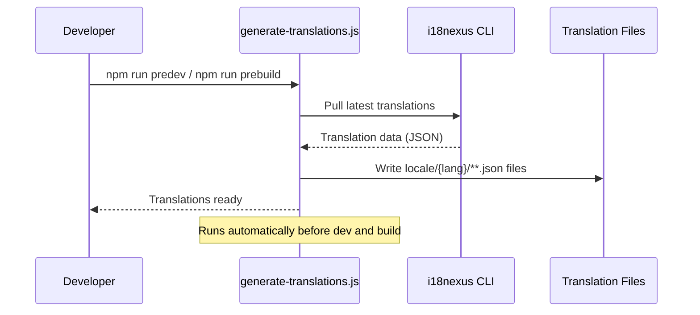
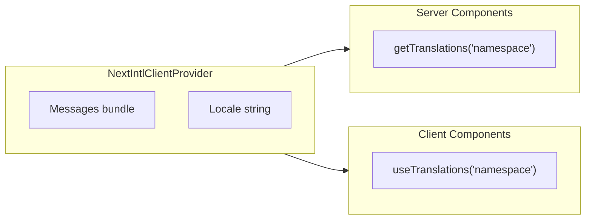
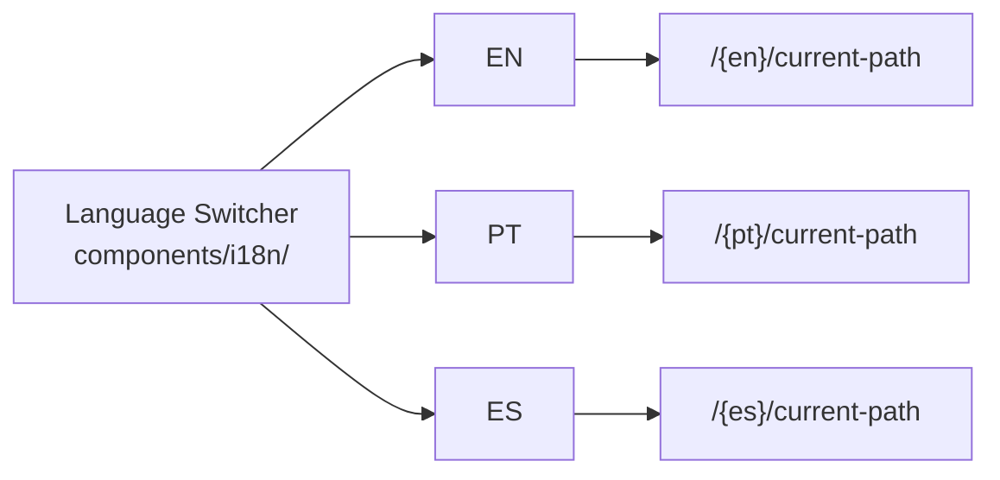

# Internationalization (i18n)

## Table of Contents

- [i18n Architecture](#i18n-architecture)
- [Locale Routing](#locale-routing)
- [Translation System](#translation-system)
- [Translation Workflow](#translation-workflow)
- [Frontend Integration](#frontend-integration)

---

## i18n Architecture



---

## Locale Routing

### URL Structure

| Locale | URL Pattern | Example |
|---|---|---|
| English | `/en/{path}` | `/en/dashboard` |
| Portuguese (BR) | `/pt/{path}` | `/pt/dashboard` |
| Spanish | `/es/{path}` | `/es/dashboard` |

### Route Architecture



### Locale Detection Flow



---

## Translation System

### Supported Locales

| Locale Code | Language | Status |
|---|---|---|
| `en` | English | Primary |
| `pt` | Portuguese (Brazil) | Supported |
| `es` | Spanish | Supported |

### Translation File Structure

```
context/
  i18n/                    # i18n configuration
    {locale}/              # Per-locale message bundles
      common.json          # Shared translations
      dashboard.json       # Dashboard page
      courses.json         # Course pages
      settings.json        # Settings page
      ...
```

---

## Translation Workflow

### Build-Time Generation



### CLI Commands

| Command | Description |
|---|---|
| `npm run i18n:pull` | Pull translations from i18nexus |
| `npm run i18n:generate` | Generate translation files from pulled data |
| `npm run predev` | Auto-runs generate before `next dev` |
| `npm run prebuild` | Auto-runs generate before `next build` |

---

## Frontend Integration

### Component Usage



### Usage Patterns

| Pattern | Context | Function |
|---|---|---|
| `useTranslations()` | Client components | Hook for reactive translations |
| `getTranslations()` | Server components | Async translation loader |
| `{t('key')}` | JSX | Render translated string |
| `{t('key', { count: 5 })}` | JSX | Translations with interpolation |
| Locale switcher | UI Component | Language toggle in navbar |

### Language Switcher Component


