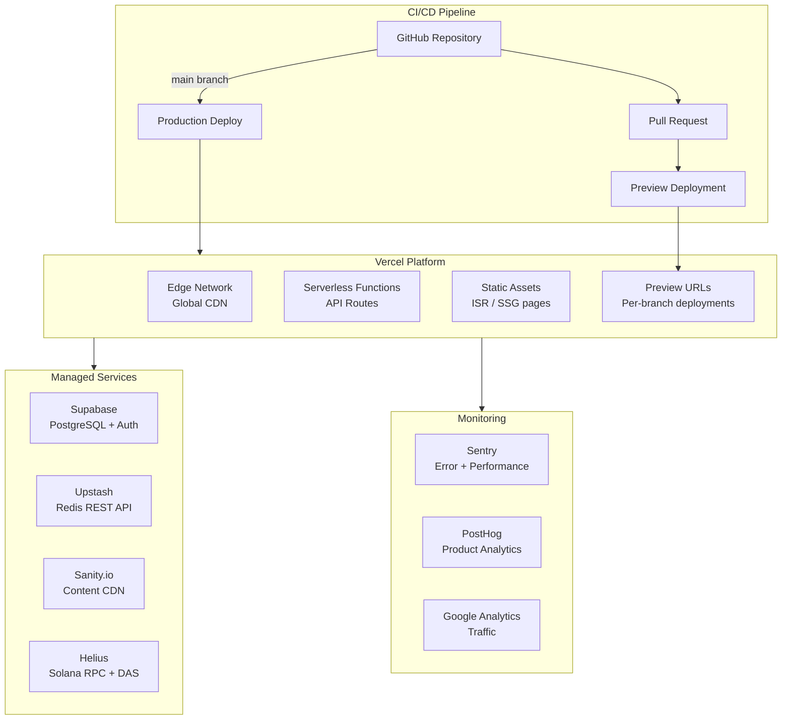
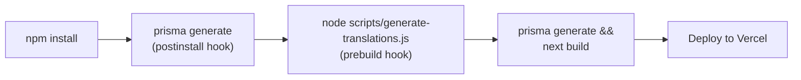
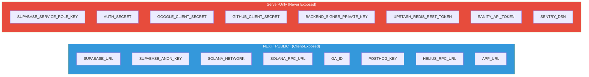
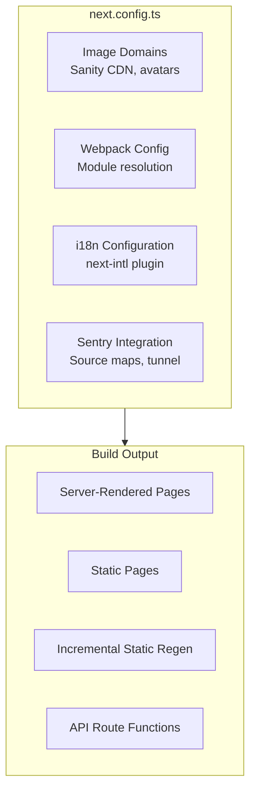
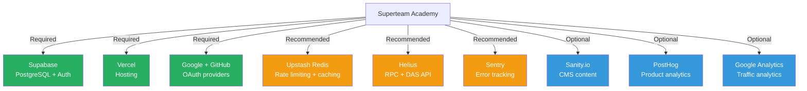
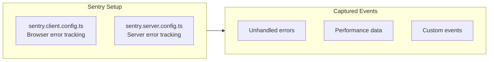
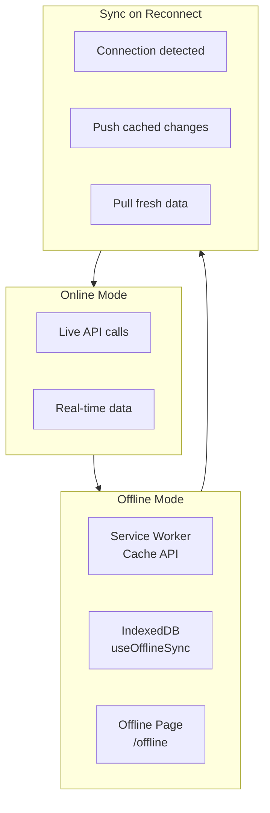
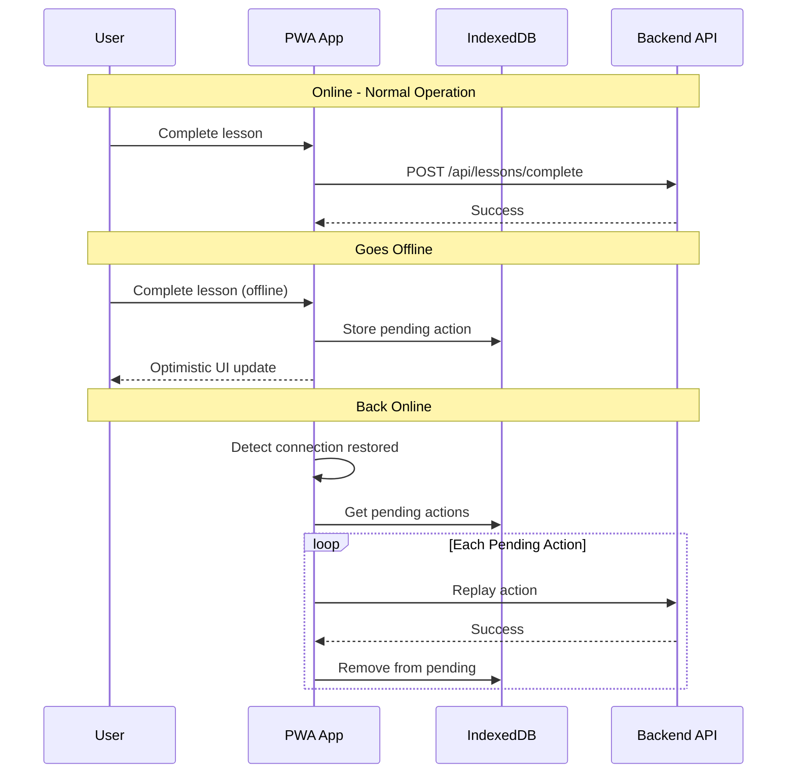

# Deployment and Infrastructure

## Table of Contents

- [Deployment Architecture](#deployment-architecture)
- [Vercel Deployment](#vercel-deployment)
- [Environment Variables](#environment-variables)
- [Build Pipeline](#build-pipeline)
- [Infrastructure Dependencies](#infrastructure-dependencies)
- [Monitoring and Observability](#monitoring-and-observability)
- [PWA Configuration](#pwa-configuration)

---

## Deployment Architecture

---

## Vercel Deployment

### Build Configuration

| Setting | Value |
|---|---|
| Framework | Next.js |
| Build Command | `prisma generate && next build` |
| Output Directory | `.next` |
| Node.js Version | 20.x |
| Install Command | `npm install` (triggers `postinstall: prisma generate`) |

### Pre-build Steps

### Deployment Commands

| Script | Command | Description |
|---|---|---|
| `dev` | `next dev` | Local development server |
| `build` | `prisma generate && next build` | Production build |
| `start` | `next start` | Production server |
| `predev` | `node scripts/generate-translations.js` | Generate i18n before dev |
| `prebuild` | `node scripts/generate-translations.js` | Generate i18n before build |
| `postinstall` | `prisma generate` | Generate Prisma client after install |

---

## Environment Variables

### Required Variables

| Variable | Category | Where Used |
|---|---|---|
| `NEXT_PUBLIC_SUPABASE_URL` | Database | Frontend + Backend |
| `NEXT_PUBLIC_SUPABASE_ANON_KEY` | Database | Frontend |
| `SUPABASE_SERVICE_ROLE_KEY` | Database | Backend only |
| `DATABASE_URL` | Database | Prisma ORM |
| `AUTH_SECRET` | Auth | NextAuth JWT signing |
| `GOOGLE_CLIENT_ID` | Auth | Google OAuth |
| `GOOGLE_CLIENT_SECRET` | Auth | Google OAuth |
| `GITHUB_CLIENT_ID` | Auth | GitHub OAuth |
| `GITHUB_CLIENT_SECRET` | Auth | GitHub OAuth |
| `NEXTAUTH_URL` | Auth | Callback URLs, CSRF |

### Optional Variables

| Variable | Category | Default | Description |
|---|---|---|---|
| `UPSTASH_REDIS_REST_URL` | Cache | None | Redis for rate limiting (required in prod) |
| `UPSTASH_REDIS_REST_TOKEN` | Cache | None | Redis auth token |
| `NEXT_PUBLIC_SOLANA_NETWORK` | Blockchain | devnet | Solana network |
| `NEXT_PUBLIC_SOLANA_RPC_URL` | Blockchain | Public devnet | Custom RPC endpoint |
| `NEXT_PUBLIC_HELIUS_RPC_URL` | Blockchain | None | Helius RPC URL |
| `HELIUS_RPC_URL` | Blockchain | None | Server-side Helius URL |
| `HELIUS_API_KEY` | Blockchain | None | Helius API key |
| `BACKEND_SIGNER_PRIVATE_KEY` | Blockchain | None | Backend signer for on-chain ops |
| `SANITY_PROJECT_ID` | CMS | None | Sanity project ID |
| `SANITY_DATASET` | CMS | production | Sanity dataset |
| `SANITY_API_TOKEN` | CMS | None | Sanity API token |
| `SANITY_PREVIEW_SECRET` | CMS | None | Preview mode secret |
| `NEXT_PUBLIC_GA_ID` | Analytics | None | Google Analytics ID |
| `NEXT_PUBLIC_POSTHOG_KEY` | Analytics | None | PostHog project key |
| `SENTRY_DSN` | Monitoring | None | Sentry data source name |
| `ADMIN_WALLETS` | RBAC | None | Comma-separated admin wallet list |
| `CALLBACK_SECRET` | Auth | AUTH_SECRET | Callback token signing |
| `ALLOWED_ORIGINS` | Security | None | CORS allowed origins |

### Variable Categorization

---

## Build Pipeline

### Next.js Configuration

---

## Infrastructure Dependencies

### Service Dependency Map

---

## Monitoring and Observability

### Monitoring Stack

| Tool | Purpose | Configuration |
|---|---|---|
| Sentry | Error tracking + performance monitoring | `sentry.client.config.ts`, `sentry.server.config.ts` |
| PostHog | Product analytics, user behavior | `NEXT_PUBLIC_POSTHOG_KEY` |
| Google Analytics | Traffic and engagement metrics | `NEXT_PUBLIC_GA_ID` |

### Sentry Configuration

---

## PWA Configuration

### Progressive Web App Support

| Feature | Implementation |
|---|---|
| Service Worker | `components/pwa/` |
| Offline fallback | `[locale]/offline/page.tsx` |
| Offline data sync | `useOfflineSync` hook (IndexedDB) |
| Push notifications | Web Push API via `usePushNotifications` |
| Install prompt | Native browser install |

### PWA Offline Architecture

### Offline Data Sync Flow

