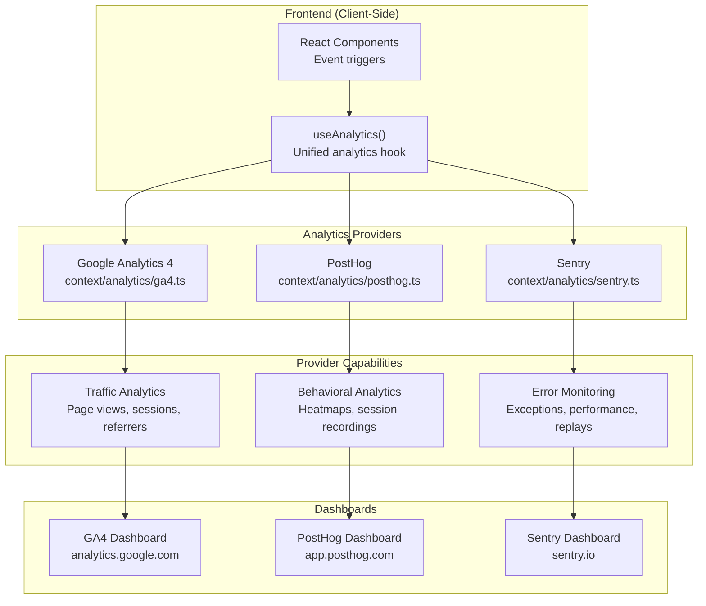
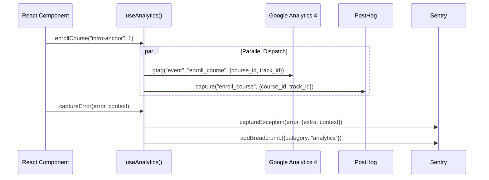
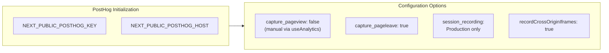
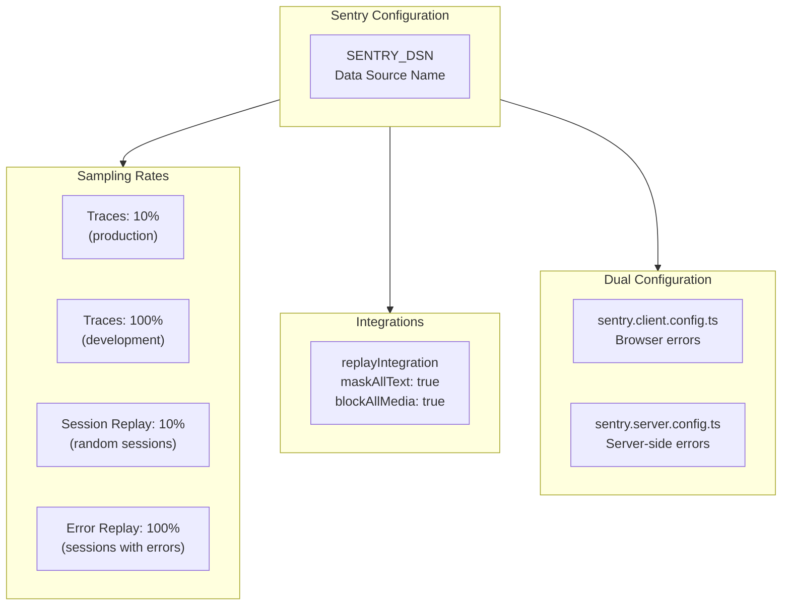
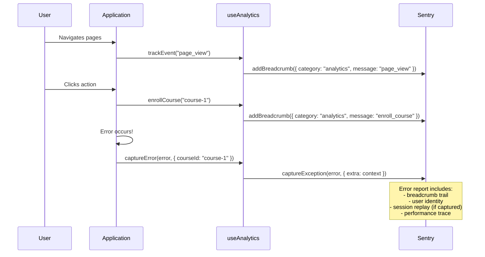
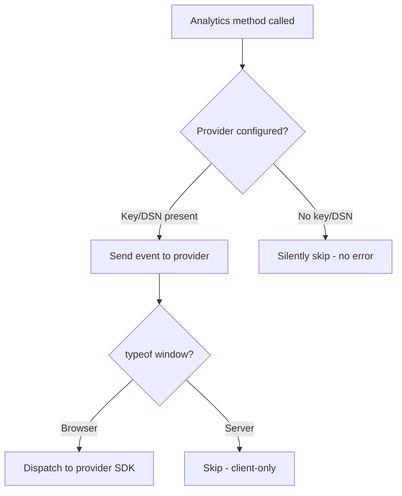

# Analytics and Monitoring

## Table of Contents

- [Analytics Architecture](#analytics-architecture)
- [Unified Analytics Hook](#unified-analytics-hook)
- [Google Analytics 4](#google-analytics-4)
- [PostHog](#posthog)
- [Sentry Error Monitoring](#sentry-error-monitoring)
- [Custom Event Catalog](#custom-event-catalog)
- [Configuration](#configuration)

---

## Analytics Architecture



---

## Unified Analytics Hook

The `useAnalytics` hook in `context/hooks/useAnalytics.ts` provides a single interface that dispatches events to all three providers simultaneously.

### Hook API

| Method | GA4 | PostHog | Sentry | Description |
|---|---|---|---|---|
| `trackPageView(url)` | `config` pageview | `$pageview` capture | -- | Manual page view tracking |
| `trackEvent(action, params)` | `gtag('event')` | `capture()` | `addBreadcrumb()` | Generic event tracking |
| `identify(userId, props)` | -- | `identify()` | `setUser()` | User identification |
| `reset()` | -- | `reset()` | `setUser(null)` | Clear user identity (logout) |
| `captureError(error, ctx)` | -- | -- | `captureException()` | Error reporting |
| `signUp(method)` | `sign_up` | `sign_up` | -- | Registration tracking |
| `login(method)` | `login` | `login` | -- | Login tracking |
| `enrollCourse(id, track)` | `enroll_course` | `enroll_course` | -- | Enrollment tracking |
| `completeLesson(id, idx, xp)` | `complete_lesson` | `complete_lesson` | -- | Lesson completion |
| `completeCourse(id, xp)` | `complete_course` | `complete_course` | -- | Course completion |
| `earnXp(amount, source)` | `earn_xp` | `earn_xp` | -- | XP earning |
| `unlockAchievement(id)` | `unlock_achievement` | `unlock_achievement` | -- | Achievement unlock |
| `viewCredential(trackId)` | `view_credential` | `view_credential` | -- | Credential view |
| `linkWallet(type)` | `link_wallet` | `link_wallet` | -- | Wallet linking |

### Event Flow



---

## Google Analytics 4

### Implementation

| File | `context/analytics/ga4.ts` |
|---|---|
| **SDK** | `gtag.js` (loaded via `next/script`) |
| **Env Variable** | `NEXT_PUBLIC_GA_ID` |
| **Gating** | Client-side only, checks `window.gtag` and measurement ID |

### GA4 Event Types

```typescript
type GAEvent =
    | 'page_view'
    | 'sign_up'
    | 'login'
    | 'enroll_course'
    | 'complete_lesson'
    | 'complete_course'
    | 'earn_xp'
    | 'unlock_achievement'
    | 'view_credential'
    | 'view_profile'
    | 'view_settings'
    | 'export_data'
    | 'link_wallet'
    | 'start_streak'
    | 'break_streak';
```

### Key Metrics Tracked

| Metric Category | Events | Parameters |
|---|---|---|
| Acquisition | `sign_up`, `login` | `method` (wallet, google, github) |
| Engagement | `enroll_course`, `complete_lesson` | `course_id`, `lesson_index`, `xp_earned` |
| Monetization | `complete_course` | `course_id`, `total_xp` |
| Retention | `start_streak`, `break_streak` | -- |
| Features | `link_wallet`, `view_credential` | `wallet_type`, `track_id` |

---

## PostHog

### Implementation

| File | `context/analytics/posthog.ts` |
|---|---|
| **SDK** | `posthog-js` |
| **Env Variables** | `NEXT_PUBLIC_POSTHOG_KEY`, `NEXT_PUBLIC_POSTHOG_HOST` |
| **Default Host** | `https://app.posthog.com` |

### Configuration



### PostHog Features

| Feature | Production | Development | Description |
|---|---|---|---|
| Event Capture | Enabled | Enabled | Custom event tracking |
| Page Views | Manual | Manual | Via `useAnalytics().trackPageView()` |
| Page Leave | Automatic | Automatic | Built-in tracking |
| Session Recording | Enabled | Disabled | Full session replay |
| Cross-Origin iframes | Enabled | -- | Records iframe content |
| Heatmaps | Enabled | Enabled | Click and scroll heatmaps |
| User Identification | Via `identify()` | Via `identify()` | Links events to user ID |
| Person Properties | Via `setPersonProperties()` | Via `setPersonProperties()` | User attribute enrichment |

### PostHog API Methods

| Method | Description |
|---|---|
| `posthogAnalytics.identify(userId, props)` | Associate events with a user profile |
| `posthogAnalytics.capture(event, props)` | Track a custom event |
| `posthogAnalytics.pageView(url)` | Record page view with `$current_url` |
| `posthogAnalytics.setPersonProperties(props)` | Enrich user profile with properties |
| `posthogAnalytics.reset()` | Clear user identity on logout |

---

## Sentry Error Monitoring

### Implementation

| File | `context/analytics/sentry.ts` |
|---|---|
| **SDK** | `@sentry/nextjs` v10 (uses v9 API) |
| **Config Files** | `sentry.client.config.ts`, `sentry.server.config.ts` |
| **Env Variable** | `SENTRY_DSN` or `NEXT_PUBLIC_SENTRY_DSN` |

### Sentry Configuration



### Performance Sampling

| Sample Type | Production Rate | Development Rate | Description |
|---|---|---|---|
| Transaction traces | 10% | 100% | Performance monitoring |
| Session replays (random) | 10% | 100% | Random session recording |
| Session replays (on error) | 100% | 100% | Always capture error sessions |

### Session Replay Privacy

| Setting | Value | Purpose |
|---|---|---|
| `maskAllText` | `true` | Replaces all text with asterisks in replays |
| `blockAllMedia` | `true` | Blocks images and media from replays |

### Sentry API Methods

| Method | Description |
|---|---|
| `sentryAnalytics.captureException(error, ctx)` | Report an error with optional context |
| `sentryAnalytics.captureMessage(msg, level)` | Log a message at specified severity |
| `sentryAnalytics.setUser(user)` | Bind user to error reports |
| `sentryAnalytics.addBreadcrumb(crumb)` | Add navigation/event breadcrumb trail |

### Error Context Flow



---

## Custom Event Catalog

### Complete Event Reference

| Event Name | Category | GA4 | PostHog | Parameters |
|---|---|---|---|---|
| `page_view` | Navigation | Yes | Yes | `url` |
| `sign_up` | Acquisition | Yes | Yes | `method` |
| `login` | Acquisition | Yes | Yes | `method` |
| `enroll_course` | Engagement | Yes | Yes | `course_id`, `track_id` |
| `complete_lesson` | Progress | Yes | Yes | `course_id`, `lesson_index`, `xp_earned` |
| `complete_course` | Progress | Yes | Yes | `course_id`, `total_xp` |
| `earn_xp` | Gamification | Yes | Yes | `amount`, `source` |
| `unlock_achievement` | Gamification | Yes | Yes | `achievement_id` |
| `view_credential` | NFT | Yes | Yes | `track_id` |
| `view_profile` | Social | Yes | -- | -- |
| `view_settings` | Settings | Yes | -- | -- |
| `export_data` | Privacy | Yes | -- | -- |
| `link_wallet` | Auth | Yes | Yes | `wallet_type` |
| `start_streak` | Retention | Yes | -- | -- |
| `break_streak` | Retention | Yes | -- | -- |

---

## Configuration

### Environment Variables

| Variable | Provider | Required | Default |
|---|---|---|---|
| `NEXT_PUBLIC_GA_ID` | Google Analytics 4 | No | None (GA disabled) |
| `NEXT_PUBLIC_POSTHOG_KEY` | PostHog | No | None (PostHog disabled) |
| `NEXT_PUBLIC_POSTHOG_HOST` | PostHog | No | `https://app.posthog.com` |
| `SENTRY_DSN` | Sentry | No | None (Sentry disabled) |
| `NEXT_PUBLIC_SENTRY_DSN` | Sentry | No | None (client-side fallback) |

### Graceful Degradation

All analytics providers are opt-in and fail gracefully when not configured:



All providers check for `typeof window !== 'undefined'` and their respective API key/DSN before executing any operations. Missing configuration never causes errors.
