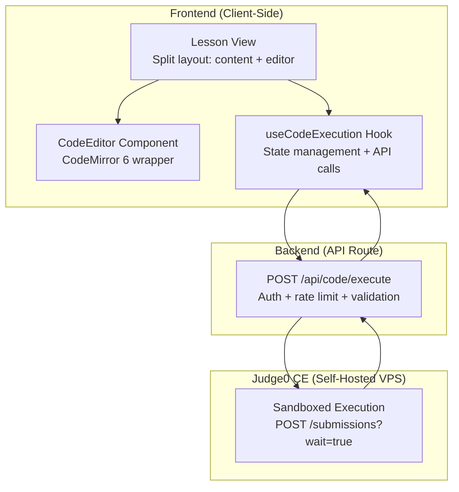
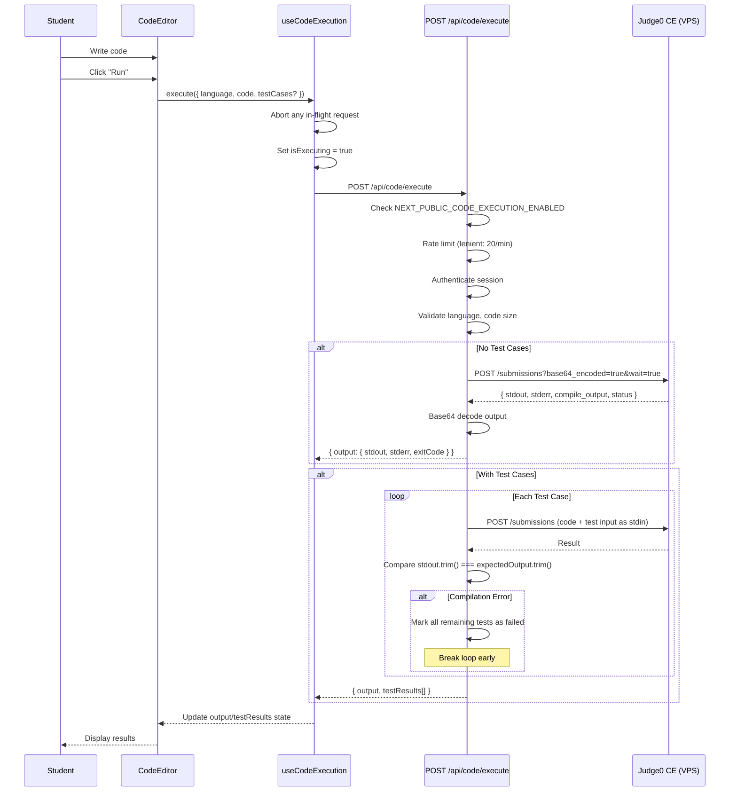
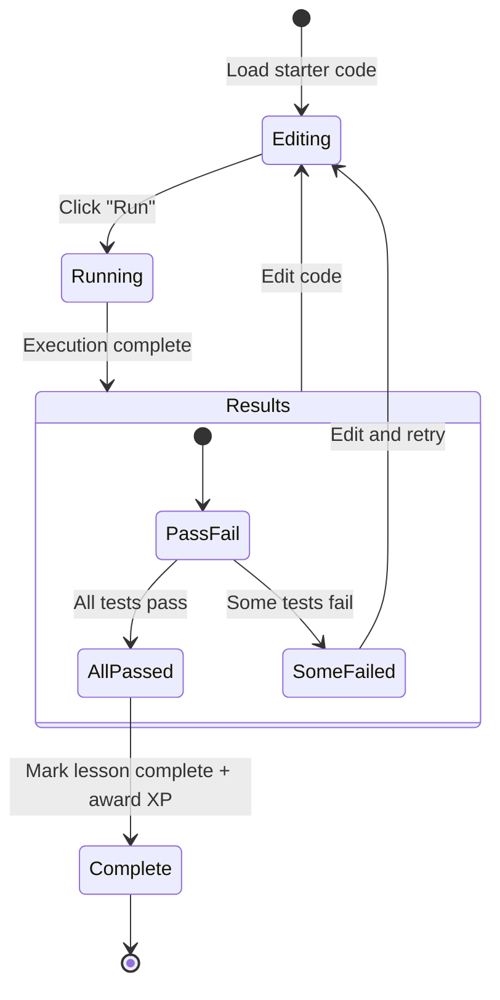
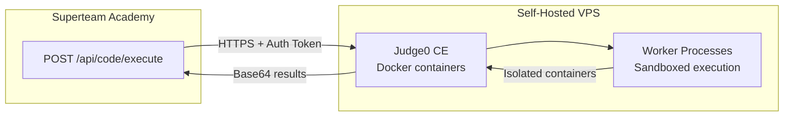

# Code Editor Integration

## Table of Contents

- [Code Editor Architecture](#code-editor-architecture)
- [CodeMirror 6 Editor](#codemirror-6-editor)
- [Code Execution Pipeline](#code-execution-pipeline)
- [Code Challenge Interface](#code-challenge-interface)
- [Configuration](#configuration)
- [API Endpoint](#api-endpoint)

---

## Code Editor Architecture



---

## CodeMirror 6 Editor

### Component: `components/editor/CodeEditor.tsx`

| Feature | Implementation |
|---|---|
| Editor Engine | CodeMirror 6 (`@codemirror/view`, `@codemirror/state`) |
| Theme | One Dark (`@codemirror/theme-one-dark`) |
| Languages | Rust, TypeScript, JavaScript, JSON (dynamic imports) |
| Line Numbers | `lineNumbers()` extension |
| Bracket Matching | `bracketMatching()` + `closeBrackets()` |
| Autocompletion | `autocompletion()` extension |
| Code Folding | `foldGutter()` extension |
| Syntax Highlighting | `syntaxHighlighting(defaultHighlightStyle)` |
| Search | `searchKeymap` + `highlightSelectionMatches()` |
| History | `history()` + undo/redo keybindings |
| Indent | `indentWithTab` + `indentOnInput()` |
| Monospace Font | Fira Code, Cascadia Code, JetBrains Mono |
| Read-Only Mode | `EditorState.readOnly` for completed lessons |
| Dynamic Loading | Language extensions loaded via `import()` to reduce bundle |

### Component Props

| Prop | Type | Description |
|---|---|---|
| `language` | `'rust' \| 'typescript' \| 'json'` | Syntax highlighting language |
| `starterCode` | `string` | Pre-populated code content |
| `isCompleted` | `boolean` | Makes editor read-only when lesson complete |
| `isReadOnly` | `boolean` | Explicit read-only toggle |
| `onChange` | `(code: string) => void` | Callback on text changes |

### Exposed API

The editor exposes `resetCode()` and `getCode()` methods via a DOM reference for parent component access:

```mermaid
graph LR
    PARENT["Lesson Page"] -->|ref.__editorApi| EDITOR["CodeEditor"]
    EDITOR -->|resetCode()| RESET["Restore to starterCode"]
    EDITOR -->|getCode()| GET["Return current content"]
```

---

## Code Execution Pipeline

### End-to-End Flow



### Supported Languages

| Language | Judge0 ID | Version | File Extension |
|---|---|---|---|
| Rust | 108 | 1.85.0 | `.rs` |
| TypeScript | 94 | 5.0.3 | `.ts` |
| JavaScript | 93 | Node.js 18.15.0 | `.js` |
| Python | 100 | 3.12.5 | `.py` |

### Judge0 CE Status Codes

| ID | Status | Description |
|---|---|---|
| 1 | In Queue | Submission pending |
| 2 | Processing | Execution in progress |
| 3 | Accepted | Ran successfully |
| 4 | Wrong Answer | Output mismatch |
| 5 | Time Limit Exceeded | Exceeded CPU time |
| 6 | Compilation Error | Code failed to compile |
| 7-12 | Runtime Errors | Various runtime failures |
| 13 | Internal Error | Judge0 system error |

---

## Code Challenge Interface

### Challenge Flow



### Test Case Structure

| Field | Type | Description |
|---|---|---|
| `name` | string | Test case display name |
| `input` | string | stdin input for the program |
| `expectedOutput` | string | Expected stdout (trimmed comparison) |
| `isHidden` | boolean | If true, expected/actual values show as `[hidden]` |

### Test Result Structure

| Field | Type | Description |
|---|---|---|
| `name` | string | Test case name |
| `passed` | boolean | Whether output matches expected |
| `expected` | string | Expected output (or `[hidden]`) |
| `actual` | string | Actual output (or `[hidden]`) |
| `isHidden` | boolean | Whether test details are hidden |

---

## Configuration

### Environment Variables

| Variable | Required | Default | Description |
|---|---|---|---|
| `NEXT_PUBLIC_CODE_EXECUTION_ENABLED` | Yes | `false` | Feature flag (client + server) |
| `CODE_EXECUTION_API_URL` | Yes | None | Judge0 CE base URL (your VPS) |
| `CODE_EXECUTION_AUTH_TOKEN` | No | `''` | X-Auth-Token for Judge0 |
| `CODE_EXECUTION_TIMEOUT_MS` | No | `10000` | Max execution timeout (ms) |
| `CODE_EXECUTION_MAX_CODE_SIZE` | No | `65536` | Max code size (bytes, ~64KB) |

### Security Controls

| Control | Implementation |
|---|---|
| Authentication | Session required (JWT) |
| Rate Limiting | Lenient tier (20 req/min) |
| Code Size Limit | 64KB max (configurable) |
| Execution Timeout | 10s default + 5s buffer |
| Feature Flag | Disabled by default |
| Sandboxing | Judge0 CE isolates execution |
| Base64 Encoding | All payloads base64-encoded in transit |

### Judge0 CE Deployment

The code execution backend requires a self-hosted Judge0 CE instance. See `docs/judge0-vps-setup.md` for deployment instructions.



---

## API Endpoint

### POST /api/code/execute

| | |
|---|---|
| **Method** | POST |
| **Auth** | JWT (session required) |
| **Rate Limit** | Lenient (20/min) |
| **Feature Flag** | `NEXT_PUBLIC_CODE_EXECUTION_ENABLED=true` |

**Request Body:**

```json
{
    "language": "rust",
    "code": "fn main() { println!(\"Hello\"); }",
    "stdin": "",
    "testCases": [
        {
            "name": "Test 1",
            "input": "5",
            "expectedOutput": "25",
            "isHidden": false
        }
    ]
}
```

**Response (200) - Without test cases:**

```json
{
    "success": true,
    "output": {
        "stdout": "Hello\n",
        "stderr": "",
        "exitCode": 0,
        "compilationError": null
    }
}
```

**Response (200) - With test cases:**

```json
{
    "success": true,
    "output": {
        "stdout": "25\n",
        "stderr": "",
        "exitCode": 0,
        "compilationError": null
    },
    "testResults": [
        {
            "name": "Test 1",
            "passed": true,
            "expected": "25",
            "actual": "25",
            "isHidden": false
        }
    ]
}
```
