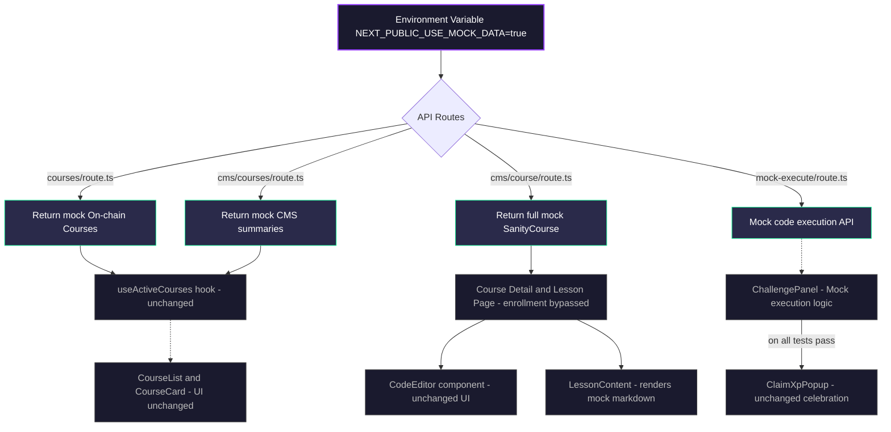

# Mock Data Integration Architecture

This document describes how mock data (courses, challenges, and code execution) is integrated into the Superteam Academy platform without modifying the core production data flows.

## Overview

The mock data system is designed to allow developers and preview environments to test the platform's UI and interactive features (like the code editor and XP popups) without requiring a connection to the Solana blockchain, Sanity CMS, or a live Judge0 code execution backend.

It achieves this by intercepting requests at the Next.js API route layer and serving static mock data when the `NEXT_PUBLIC_USE_MOCK_DATA` environment variable is set to `true`.

## Architecture

The system uses an "early-return" pattern in the API routes. If mock mode is enabled, the API route returns the mock data immediately; otherwise, it proceeds with the actual data-fetching logic.

## How It Works

1.  **Environment Flag**: The entire system is guarded by `process.env.NEXT_PUBLIC_USE_MOCK_DATA === 'true'`. If this is false or unset, the application behaves normally.
2.  **On-Chain Data Mocking**: The `/api/courses` and `/api/courses/[id]` routes return hardcoded `Course` objects that match the expected on-chain PDA structure. This populates the catalog and course detail pages.
3.  **CMS Data Mocking**: The `/api/cms/courses` and `/api/cms/course` routes bypass the `@sanity/client` and return hardcoded `SanityCourse` objects. This provides the rich text content, lesson structures, and challenge parameters.
4.  **Enrollment Bypass**: On the frontend course detail page, if `MOCK_MODE` is true, the `isEnrolled` state is forced to `true`. This circumvents the need for the user to sign an on-chain enrollment transaction to access the lessons.
5.  **Mock Code Execution**: A new endpoint `/api/mock-execute` simulates the Judge0 API. It receives the user's code and the challenge test cases. It performs simple string/regex pattern matching to determine if the code looks correct, artificially delays the response to simulate container spin-up time, and returns a pass/fail result.
6.  **UI Seamlessness**: The `ChallengePanel` component (which wraps the `CodeEditor`) checks the `MOCK_MODE` flag. If true, it POSTs to `/api/mock-execute` instead of the real Piston/Judge0 execution hook. If the tests pass, it triggers the real `ClaimXpPopup` confetti component, creating a seamless user experience.

## File Structure

The mock data itself is isolated in the `app/mock-data/` directory:

*   **`app/mock-data/courses.ts`**: Contains the full `SanityCourse` objects (e.g., "Intro to Solana", "DeFi Fundamentals"). This includes modules, lessons, markdown content, and detailed challenge data (starter code, expected outputs, hints).
*   **`app/mock-data/on-chain-courses.ts`**: Contains the `Course` objects that represent the Solana program state (enrollment counts, completion stats, XP rewards).
*   **`app/mock-data/index.ts`**: A barrel export file that also exports the `MOCK_ENABLED` boolean.

### Key Modified Files

*   **API Routes**:
    *   `app/api/courses/route.ts` & `[id]/route.ts`: added early returns for `MOCK_ON_CHAIN_COURSES`.
    *   `app/api/cms/courses/route.ts` & `cms/course/route.ts`: added early returns for `MOCK_SANITY_COURSES`.
*   **Mock Execution**:
    *   `app/api/mock-execute/route.ts`: **NEW** endpoint for simulating compilation/execution via pattern matching.
*   **Frontend Components**:
    *   `app/components/editor/ChallengePanel.tsx`: Added branching logic to hit `/api/mock-execute` and show `ClaimXpPopup`.
    *   `app/app/[locale]/(routes)/courses/[slug]/page.tsx`: Bypasses the `isEnrolled` check so lessons are clickable.
    *   `app/app/[locale]/(routes)/courses/[slug]/lessons/[index]/page.tsx`: Skips the on-chain `completeLesson` transaction and loads lesson content directly from the mock object instead of trying to fetch it from Arweave.
    *   `app/context/hooks/useChallenges.ts`: Ensures mock challenges link to the local `courseId` instead of relying on a missing CMS slug.
