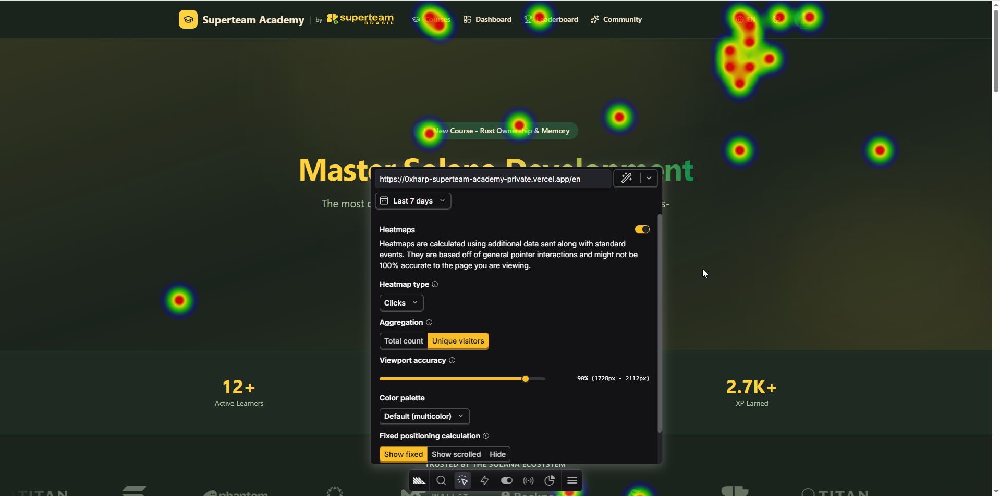

# Analytics & Monitoring

Superteam Academy uses a triple-layer analytics stack: **Google Analytics 4** (conversions & user journeys), **PostHog** (product analytics, heatmaps, session recordings), and **Sentry** (error monitoring & performance).

All events fire through a unified `trackEvent()` function that dispatches to both GA4 and PostHog simultaneously.

---

## Environment Variables

| Variable | Required | Description |
|----------|----------|-------------|
| `NEXT_PUBLIC_GA_ID` | Yes | GA4 Measurement ID (e.g. `G-XXXXXXXXXX`) |
| `NEXT_PUBLIC_POSTHOG_KEY` | Yes | PostHog project API key |
| `NEXT_PUBLIC_POSTHOG_HOST` | No | PostHog instance URL (default: `https://us.i.posthog.com`) |
| `SENTRY_DSN` | Yes | Sentry DSN for error tracking |
| `SENTRY_ORG` | No | Sentry org slug (for source map uploads) |
| `SENTRY_PROJECT` | No | Sentry project slug (for source map uploads) |

---

## Architecture

```
User Action
    │
    ▼
trackEvent(name, properties)          ── src/lib/analytics/events.ts
    ├── PostHog.capture()             ── posthog-js
    ├── GA4 gtag("event", ...)        ── Google Analytics
    └── console.log() (dev only)

Error thrown
    │
    ▼
Sentry.captureException(error)        ── @sentry/nextjs
    ├── global-error.tsx              ── Root error boundary
    ├── [locale]/error.tsx            ── Locale error boundary
    └── catch blocks                  ── lesson-view, course-view, use-enrollment
```

### Provider Hierarchy

```
RootLayout                            ── GA4 script tags
  └─ [locale]/layout.tsx
      └─ SessionProvider
          └─ SolanaWalletProvider
              └─ ThemeProvider         ── THEME_CHANGED event
                  └─ AnalyticsProvider ── PostHog init, PAGE_VIEW, SIGN_IN
```

---

## All 22 Analytics Events

### Navigation & Session

| # | Event | Trigger | Properties | File |
|---|-------|---------|------------|------|
| 1 | `page_view` | Every route change | `path`, `search` | `components/providers/analytics-provider.tsx` |
| 2 | `sign_in` | Session transitions to authenticated | `provider` | `components/providers/analytics-provider.tsx` |
| 3 | `language_changed` | User switches locale | `from`, `to` | `components/layout/locale-switcher.tsx` |
| 4 | `theme_changed` | User changes theme (not initial load) | `theme` | `components/providers/theme-provider.tsx` |
| 5 | `wallet_connected` | Wallet linked successfully via signIn | `address` | `hooks/use-wallet-link.ts` |

### Course Lifecycle

| # | Event | Trigger | Properties | File |
|---|-------|---------|------------|------|
| 6 | `course_view` | Course page mounted | `slug` | `courses/[slug]/course-view.tsx` |
| 7 | `enrollment` | On-chain enrollment tx confirmed | `courseId`, `wallet`, `tx` | `hooks/use-enrollment.ts` |
| 8 | `unenrollment` | User clicks close enrollment | `courseId`, `slug` | `courses/[slug]/course-view.tsx` |
| 9 | `course_complete` | All lessons done, course finalized | `courseSlug`, `courseId` | `courses/[slug]/lessons/[id]/lesson-view.tsx` |

### Lesson & Challenge

| # | Event | Trigger | Properties | File |
|---|-------|---------|------------|------|
| 10 | `lesson_start` | Lesson page mounted (enrolled, not preview) | `courseSlug`, `lessonId`, `type` | `courses/[slug]/lessons/[id]/lesson-view.tsx` |
| 11 | `lesson_complete` | Lesson marked complete (content or challenge) | `courseSlug`, `lessonId`, `type`, `xp` | `courses/[slug]/lessons/[id]/lesson-view.tsx` |
| 12 | `challenge_attempt` | User clicks Run Code | `courseSlug`, `lessonId` | `courses/[slug]/lessons/[id]/lesson-view.tsx` |
| 13 | `challenge_pass` | All tests pass | `courseSlug`, `lessonId`, `xp` | `courses/[slug]/lessons/[id]/lesson-view.tsx` |
| 14 | `challenge_fail` | Some tests fail | `courseSlug`, `lessonId`, `passed`, `total` | `courses/[slug]/lessons/[id]/lesson-view.tsx` |

### Progression & Gamification

| # | Event | Trigger | Properties | File |
|---|-------|---------|------------|------|
| 15 | `xp_earned` | XP received from lesson completion | `courseSlug`, `lessonId`, `amount` | `courses/[slug]/lessons/[id]/lesson-view.tsx` |
| 16 | `level_up` | XP causes level increase | `from`, `to`, `totalXp` | `courses/[slug]/lessons/[id]/lesson-view.tsx` |
| 17 | `achievement_unlocked` | Achievement claimed successfully | `achievementId` | `components/dashboard/achievement-grid.tsx` |
| 18 | `streak_milestone` | Streak reaches 3, 7, 14, or 30 days | `days`, `currentStreak` | `hooks/use-player-stats.ts` |
| 19 | `streak_broken` | Streak resets to 0 | `previousStreak` | `hooks/use-player-stats.ts` |

### Unused / Reserved

| # | Event | Status | Notes |
|---|-------|--------|-------|
| 20 | `sign_up` | Reserved | Requires backend `isNewUser` flag on session. Currently not distinguishable from `sign_in`. |

---

## PostHog Configuration

**File:** `src/lib/analytics/posthog.ts`

```ts
posthog.init(key, {
  api_host: "https://us.i.posthog.com",
  person_profiles: "identified_only",
  capture_pageview: false,        // Handled manually via trackEvent
  capture_pageleave: true,
  autocapture: true,              // Clicks, inputs, form submits
  enable_heatmaps: true,          // Click & scroll heatmaps
  enable_recording_console_log: false,
});
```

### PostHog Features Enabled

| Feature | Setting | Notes |
|---------|---------|-------|
| Custom events | Via `trackEvent()` | All 22 events |
| Autocapture | `autocapture: true` | Automatic click/input tracking |
| Heatmaps | `enable_heatmaps: true` | Click & scroll maps per page |
| Page leave | `capture_pageleave: true` | Tracks when users leave pages |
| Session recording | Project settings | Enable in PostHog dashboard → Project Settings → Session Recording |
| Page views | Manual | Fired in `AnalyticsProvider` on route change |

---

## Sentry Configuration

### Config Files

| File | Scope | Sample Rate |
|------|-------|-------------|
| `sentry.client.config.ts` | Browser errors | 10% traces, 100% error replays |
| `sentry.server.config.ts` | Server errors | 10% traces |
| `next.config.ts` | Source maps | Conditional on `SENTRY_DSN` |

### Error Boundaries

| File | Scope |
|------|-------|
| `src/app/global-error.tsx` | Root-level unhandled errors |
| `src/app/[locale]/error.tsx` | Locale-level errors (with i18n) |

### Instrumented Catch Blocks

| File | Operation |
|------|-----------|
| `lesson-view.tsx` | `markComplete()` — lesson completion API call |
| `course-view.tsx` | `handleCollectCredential()` — credential collection |
| `use-enrollment.ts` | `enroll()` — on-chain enrollment transaction |
| `use-enrollment.ts` | `closeEnrollment()` — on-chain close enrollment transaction |

All catch blocks use lazy dynamic import to avoid bundling Sentry when DSN is not set:
```ts
import("@sentry/nextjs").then((S) => S.captureException(err)).catch(() => {});
```

---

## Google Analytics 4 Setup

GA4 is loaded via script tags in `src/app/layout.tsx` when `NEXT_PUBLIC_GA_ID` is set:

```tsx
<Script src={`https://www.googletagmanager.com/gtag/js?id=${GA_ID}`} />
<Script id="ga4-init">
  {`window.dataLayer=window.dataLayer||[];
    function gtag(){dataLayer.push(arguments);}
    gtag('js',new Date());
    gtag('config','${GA_ID}');`}
</Script>
```

Events are sent via `gtag("event", name, properties)` inside `trackEvent()`.

---

## Dashboards & Screenshots

### Google Analytics 4

**Realtime Overview** — analytics.google.com → Reports → Realtime


**Events Report** — analytics.google.com → Reports → Engagement → Events


**User Journey Funnel** — analytics.google.com → Explore → Funnel Exploration


### PostHog

**Live Events** — PostHog → Activity → Live Events


**Heatmap** — PostHog → Add authorized URL → Launch Toolbar → Heatmap



---

## Recommended Funnel

The core learning funnel to track across all platforms:

```
page_view → course_view → enrollment → lesson_start → lesson_complete → course_complete
                                                          ↓
                                              challenge_attempt → challenge_pass
                                                               → challenge_fail
```

### Key Metrics to Monitor

| Metric | Events Used | Platform |
|--------|------------|----------|
| Course conversion rate | `course_view` → `enrollment` | GA4 / PostHog |
| Lesson completion rate | `lesson_start` → `lesson_complete` | GA4 / PostHog |
| Challenge pass rate | `challenge_attempt` → `challenge_pass` | PostHog |
| Average attempts per challenge | Count of `challenge_attempt` / unique lessonIds | PostHog |
| Streak retention | `streak_milestone` vs `streak_broken` | PostHog |
| Error rate | Issue count / session count | Sentry |
| XP distribution | `xp_earned` amounts | GA4 / PostHog |

---

## trackEvent() Implementation

**File:** `src/lib/analytics/events.ts`

```ts
export function trackEvent(event: EventName, properties?: Record<string, unknown>) {
  // PostHog
  if (typeof window !== "undefined" && "posthog" in window) {
    const ph = (window as any)["posthog"];
    ph?.capture?.(event, properties);
  }
  // GA4
  if (typeof window !== "undefined" && "gtag" in window) {
    const gtag = (window as any)["gtag"];
    gtag("event", event, properties);
  }
  // Dev logging
  if (process.env.NODE_ENV === "development") {
    console.log(`[Analytics] ${event}`, properties);
  }
}
```

---

## Adding a New Event

1. Add the event name to `ANALYTICS_EVENTS` in `src/lib/analytics/events.ts`
2. Call `trackEvent(ANALYTICS_EVENTS.YOUR_EVENT, { ...properties })` at the trigger point
3. Update this document with the event details
4. Verify in dev console: `[Analytics] your_event { ... }`
5. Verify in PostHog Live Events and GA4 Realtime after deploying

---
