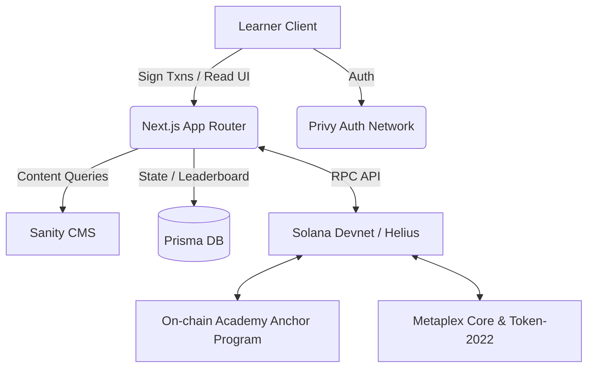

# Architecture & Technical Design

On-chain Academy is designed as a hybrid Web2/Web3 Learning Management System (LMS) built specifically for Solana development courses. This document outlines the core technical architecture, data flow, and abstractions used to deliver a seamless developer experience.

## Core Tech Stack

- **Frontend**: Next.js 14 (App Router), React, Tailwind CSS
- **State Management**: Zustand
- **Authentication**: Privy (Email, Google, Github, embedded Solana Wallets)
- **Database (Off-chain State)**: PostgreSQL via Prisma ORM
- **CMS**: Sanity.io (Embedded Studio)
- **On-chain Program (Smart Contract)**: Anchor Framework (Rust)
- **Tokens & Credentials**: SPL Token-2022 (XP), Metaplex Core (NFT Credentials)

---

## 🏗 System Architecture

The architecture balances the undeniable speed of Web2 databases (Prisma) with the undeniable verifiability of Web3 state (Anchor).



## Hybrid Data Model: The Prisma Abstraction

To ensure high performance and cost-effectiveness, the platform uses Prisma as an authoritative **read-cache** or "stub" for on-chain state, particularly for features that are expensive or slow to calculate purely from RPC nodes.

### 1. The Leaderboard Strategy
**Problem:** The hackathon prompt requires a Leaderboard with "Daily, Weekly, and All-Time" filters based on XP earned. Solana Token-2022 accounts *only* store current balances. They do not store snapshots of historical transfers. To build a time-filtered leaderboard entirely on-chain, one would need a dedicated Geyser plugin or Helius webhook indexer.

**Solution (The Abstraction):** We track all XP events locally in the PostgreSQL database (`XpEvent` table) alongside the Token-2022 mints.
- When a user claims XP, the backend mints the Token-2022 asset on-chain AND logs an `XpEvent` locally.
- The Leaderboard queries the Prisma `XpEvent` timestamps (e.g., `WHERE createdAt > dailyStart`) to calculate realtime filtered rankings.
- This satisfies the architectural requirements of the prompt without needing a heavy indexer.

### 2. Enrollment State
Enrollment state is tracked actively via Anchor PDAs:
```rust
#[account(
    seeds = [b"enrollment", course_id.as_bytes(), learner.key().as_ref()],
    bump
)]
pub struct Enrollment {
    pub course: Pubkey,
    pub enrolled_at: i64,
    pub completed_at: Option<i64>,
}
```
The frontend explicitly queries the Solana RPC for this PDA to verify true enrollment status but relies on Prisma to track individual lesson completions until the final "Complete Course" transaction is sent.

---

## 🔗 Transaction Lifecycles

### Enrolling in a Course
1. User clicks "Enroll" on the frontend.
2. The frontend assembles an `enroll` transaction via Anchor.
3. The user signs the transaction locally via their **Privy embedded wallet**, paying the required rent for the Enrollment PDA.
4. The transaction creates the `Enrollment` PDA for the user.
5. The Prisma database synchronizes the start date after transaction confirmation.

### Reclaiming Rent (Unenrolling)
1. User navigates to the course and clicks "Close Enrollment".
2. The frontend assembles a `closeEnrollment` transaction via Anchor.
3. The user signs the transaction locally via their **Privy embedded wallet**.
4. The Anchor program zeroes the `Enrollment` PDA data and sends the lamports (rent) back to the user.
5. The frontend calls `POST /api/unenroll` to clean up the Prisma state cache.

> **Cooldown Note:** The smart contract enforces a strict 24-hour cooldown on closing active (incomplete) enrollments to prevent users from spamming enrollment/unenrollment too frequently without committing to the course.

### Earning XP (Token-2022)
1. User completes a lesson.
2. The backend invokes `POST /api/courses/[id]/complete-lesson`.
3. The backend calculates the XP value of the lesson from Sanity.
4. The backend sends a Token-2022 `mintTo` instruction to the user's Associated Token Account.
5. A synchronous event is logged in Prisma for the Leaderboard.

### Course Completion & NFT Credential
1. User completes the final lesson.
2. The backend verifies all Prisma lesson flags are met.
3. The backend invokes the Anchor `completeCourse` instruction.
4. The smart contract updates the `Enrollment` PDA to store `completed_at`.
5. The backend mints a **Metaplex Core Asset** directly to the user's wallet as verifiable proof of completion.

---

## 🛡 Security Boundaries

- **Sanity CMS**: Only readable by the frontend. Writable only via Studio by authenticated admins.
- **Backend Wallet**: The platform relies on a funded authority Keypair to subsidize gas and rent for seamless onboarding. Its private key is never exposed to the client.
- **Privy Embedded Wallets**: Users retain custody of their Solana wallets. Features like Reclaiming Rent require direct user signatures.
