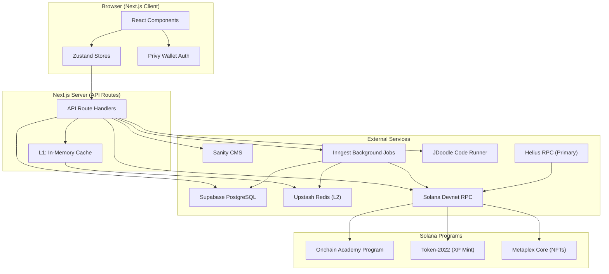
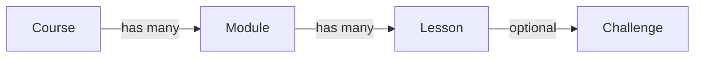
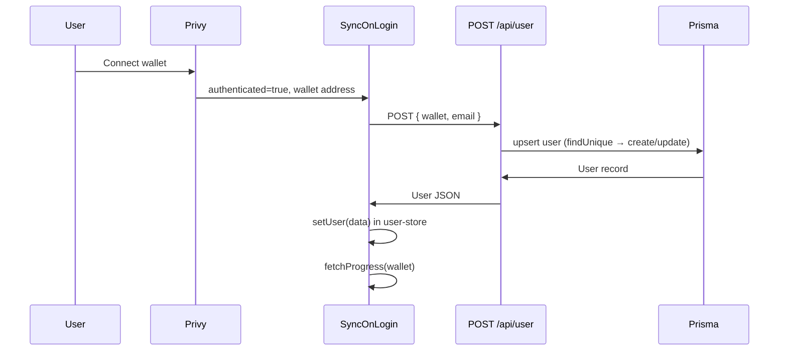
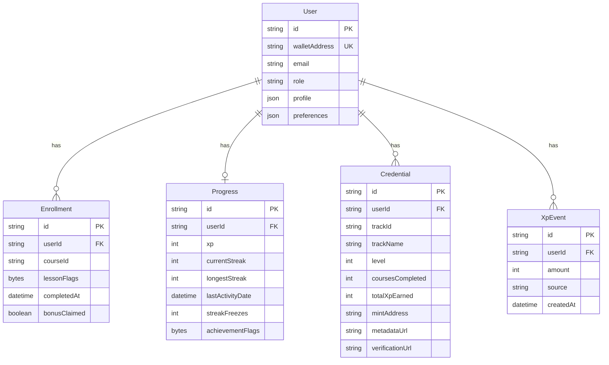
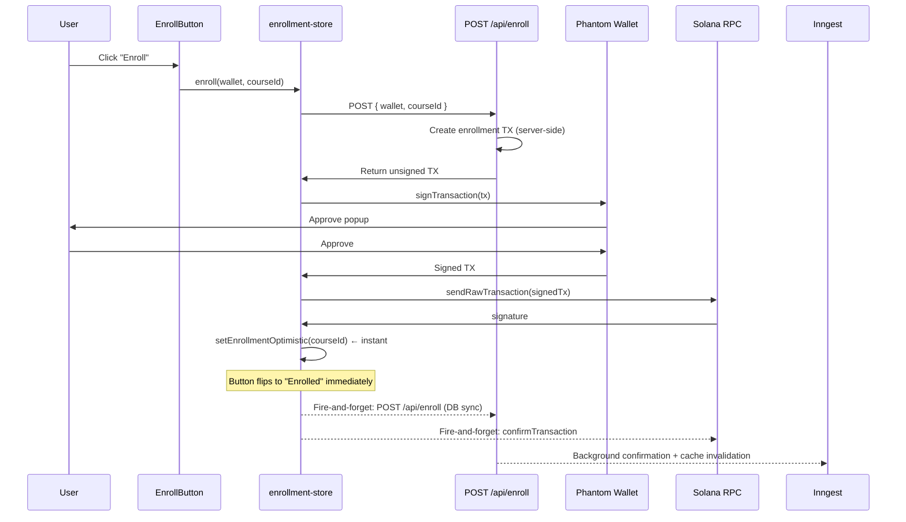
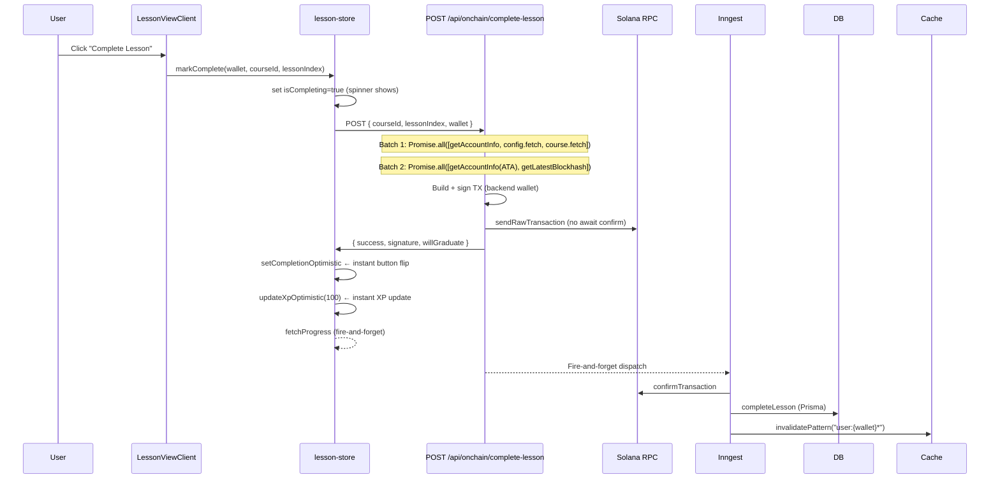
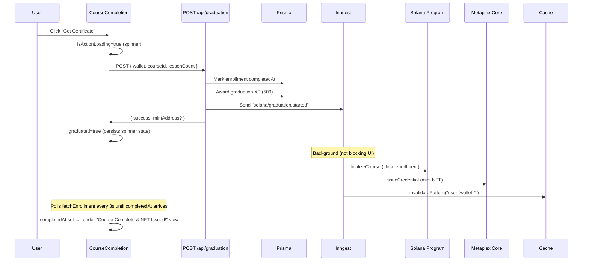
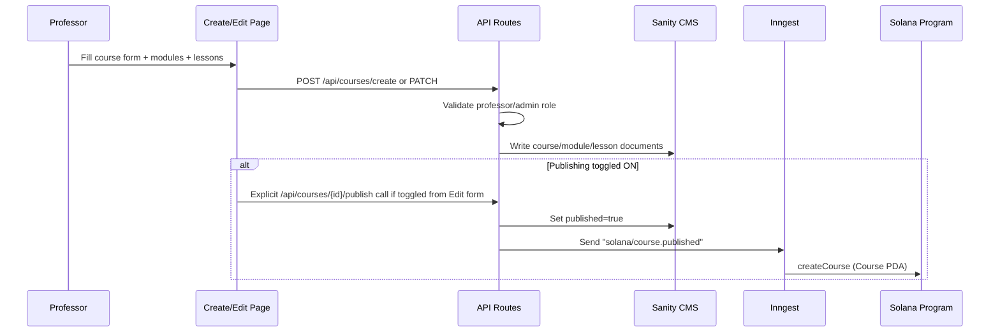

# Superteam Academy — Architecture, Flows & Performance

> **Last updated:** February 2026  
> **Stack:** Next.js 16 · Solana (Devnet) · Anchor · Prisma + Supabase · Sanity CMS · Upstash Redis · Inngest · Privy · JDoodle · Zustand

---

## Table of Contents

1. [High-Level Architecture](#1-high-level-architecture)
2. [Technology Stack](#2-technology-stack)
3. [Application Layers](#3-application-layers)
4. [Content Management — Sanity CMS](#4-content-management--sanity-cms)
5. [Authentication — Privy](#5-authentication--privy)
6. [Database — Prisma + Supabase](#6-database--prisma--supabase)
7. [On-Chain Integration — Solana/Anchor](#7-on-chain-integration--solanaanchor)
8. [Dual-Implementation Service Layer](#8-dual-implementation-service-layer)
9. [Caching — Two-Tier Strategy](#9-caching--two-tier-strategy)
10. [Background Processing — Inngest](#10-background-processing--inngest)
11. [State Management — Zustand](#11-state-management--zustand)
12. [Core User Flows](#12-core-user-flows)
13. [Performance Optimizations](#13-performance-optimizations)
14. [Code Execution — JDoodle](#14-code-execution--jdoodle)
15. [Gamification Systems](#15-gamification-systems)
16. [Real vs Mock Data Audit](#16-real-vs-mock-data-audit)
17. [Internationalization](#17-internationalization)
18. [Environment Configuration](#18-environment-configuration)

---

## 1. High-Level Architecture



**Request flow summary:**
1. User interacts with React UI → Zustand store fires API call
2. API route checks L1 in-memory cache → L2 Redis cache → database/RPC
3. Mutations trigger Inngest background jobs for on-chain confirmation + DB sync
4. Cache invalidation after mutations uses `user:{wallet}*` pattern matching

---

## 2. Technology Stack

| Layer | Technology | Purpose |
|---|---|---|
| **Framework** | Next.js 16.1 (App Router, Turbopack) | Server/client rendering, API routes |
| **Styling** | Tailwind CSS + custom design tokens | Dark theme with `--solana` accent color |
| **Fonts** | Space Grotesk (headings), Inter (body), JetBrains Mono (code) | Typography via `next/font/google` |
| **Auth** | Privy (`@privy-io/react-auth`) | Wallet + Google + GitHub + Email authentication |
| **State** | Zustand | Client-side state management |
| **CMS** | Sanity v3 | Course/lesson content authoring |
| **Database** | PostgreSQL (Supabase) via Prisma ORM | User data, progress, credentials |
| **Cache** | In-memory `Map` (L1) + Upstash Redis (L2) | Two-tier read caching |
| **Background Jobs** | Inngest | Async on-chain confirmation, DB sync |
| **Blockchain** | Solana Devnet + Anchor Framework | Enrollment, lesson completion, NFTs |
| **Token Standard** | SPL Token-2022 | XP token minting |
| **NFT Standard** | Metaplex Core | Certificate/credential NFTs |
| **Code Runner** | JDoodle API | Rust/TypeScript/JavaScript execution |
| **Connection Pooler** | Supavisor (port 6543) | Prisma connection pooling |
| **Deployment Target** | Vercel | Serverless edge deployment |
| **i18n** | `next-intl` | Multi-language support |

---

## 3. Application Layers

### Directory Structure

```
app/src/
├── app/
│   ├── [locale]/              # i18n routing (e.g. /en/...)
│   │   ├── page.tsx           # Landing page
│   │   └── (platform)/       # Authenticated platform pages
│   │       ├── dashboard/     # User dashboard
│   │       ├── courses/       # Course catalog & detail
│   │       ├── leaderboard/   # XP leaderboard
│   │       ├── achievements/  # Achievement collection
│   │       ├── certificates/  # Certificate viewer
│   │       ├── profile/       # Public profile
│   │       ├── settings/      # User settings
│   │       └── teach/         # Course creation (professors)
│   ├── api/                   # 19 API route groups
│   │   ├── user/              # User CRUD + profile
│   │   ├── enroll/            # Enrollment
│   │   ├── unenroll/          # Unenrollment
│   │   ├── complete-lesson/   # Off-chain lesson completion
│   │   ├── graduation/        # Course graduation
│   │   ├── progress/          # XP, streaks
│   │   ├── enrollment/        # Enrollment data
│   │   ├── leaderboard/       # Leaderboard data
│   │   ├── credentials/       # Certificates/NFTs
│   │   ├── achievements/      # Achievement data + claims
│   │   ├── courses/           # Course CRUD, Sanity integration
│   │   ├── onchain/           # On-chain transaction endpoints
│   │   │   ├── complete-lesson/
│   │   │   ├── claim-bonus/
│   │   │   ├── claim-achievement/
│   │   │   ├── finalize-course/
│   │   │   └── issue-credential/
│   │   ├── run-code/          # JDoodle code execution
│   │   ├── inngest/           # Inngest webhook handler
│   │   └── metadata/          # NFT metadata endpoint
│   └── studio/                # Sanity Studio at /studio
├── components/
│   ├── auth/                  # SyncUserOnLogin, OnboardingModal
│   ├── courses/               # EnrollButton, CourseCompletion
│   ├── lessons/               # LessonViewClient, CodeEditor
│   ├── dashboard/             # Stats, progress, streaks
│   ├── navigation/            # Navbar
│   ├── providers/             # AuthProvider (Privy)
│   └── ui/                    # Button, Input (shadcn/ui)
├── store/                     # 8 Zustand stores
├── lib/
│   ├── learning-progress/     # Service layer (dual implementation)
│   ├── inngest/               # Background function definitions
│   ├── cache.ts               # Two-tier caching
│   ├── db.ts                  # Prisma singleton
│   ├── solana-connection.ts   # RPC connection with fallback
│   ├── onchain-admin.ts       # On-chain course PDA creation
│   ├── jdoodle.ts             # Code execution API
│   ├── achievements.ts        # Achievement definitions
│   ├── ranks.ts               # XP rank tiers
│   └── bitmap.ts              # Lesson/achievement flag utilities
└── sanity/
    ├── schemaTypes/            # course, module, lesson, challenge
    └── lib/                   # Queries, client, image utils
```

### Page Routing

The app uses Next.js App Router with `[locale]` prefix for i18n:

| Route | Page | Auth Required |
|---|---|---|
| `/[locale]` | Landing page | No |
| `/[locale]/dashboard` | User dashboard | Yes |
| `/[locale]/courses` | Course catalog | No |
| `/[locale]/courses/[slug]` | Course detail + lessons | Enrollment gate |
| `/[locale]/leaderboard` | XP leaderboard | No |
| `/[locale]/achievements` | Achievement gallery | Yes |
| `/[locale]/certificates` | Certificate viewer | Yes |
| `/[locale]/profile/[wallet]` | Public profile | No |
| `/[locale]/settings` | User settings | Yes |
| `/[locale]/teach` | Professor dashboard | Professor/Admin role |

---

## 4. Content Management — Sanity CMS

Sanity serves as the headless CMS for all educational content. The Studio is mounted at `/studio` under the name "Course Studio".

### Content Schema Hierarchy



**Course** fields: `title`, `slug`, `description`, `instructor`, `createdBy` (wallet + role, set programmatically), `duration`, `difficulty` (beginner/intermediate/advanced), `track` (rust/anchor/security/solana/other), `image`, `published`, `modules[]`

**Module** fields: `title`, `sortOrder`, `lessons[]`

**Lesson** fields: `title`, `sortOrder`, `estimatedTime`, `content` (Portable Text blocks), `videoUrl`, `resources[]` (title + URL), `lessonType` (content/challenge), `challenge` (reference, shown only when type is "challenge")

**Challenge** fields: `title`, `starterCode`, `language`, `testCases[]` (name, input, expected)

### Content Delivery

- `getCourses(locale)` — fetches all published courses, cached for 5 minutes via `getCached(`${locale}:sanity:courses`, ..., { ttl: 300 })`
- `getCourseBySlug(slug, locale)` — fetches a single course with all modules and lessons, cached for 5 minutes
- `getCourseById(id)` — uncached direct fetch (used in background jobs)
- Sanity queries use GROQ with reference expansion (`modules[]->{ ..., lessons[]->{ ..., challenge->{ ... } } }`)

Validation rules:
- Title uniqueness enforced across all courses (including drafts)
- Slug uniqueness enforced for routing
- Both validations query Sanity in real-time during content editing

---

## 5. Authentication — Privy

Authentication uses [Privy](https://privy.io) configured for **Solana-only** wallet connections with multiple login methods.

### Configuration (AuthProvider)

```
Login methods: Wallet, Google, GitHub, Email (configured in Privy Dashboard)
Supported wallets: Phantom, Solflare, Backpack, detected Solana wallets, WalletConnect
Embedded wallets: Auto-created for users without wallets on login
Theme: Dark
Network: Solana Devnet
RPC: Helius (primary) or devnet (fallback)
```

### Login Flow



- `SyncUserOnLogin` component runs once on login (guarded by `synced` ref)
- User is upserted in the database — creating if new, updating email if changed
- After user sync, progress (XP, streaks) is fetched in parallel

---

## 6. Database — Prisma + Supabase

### Infrastructure

| Component | Details |
|---|---|
| **Provider** | Supabase (Nano tier, AWS ap-south-1) |
| **ORM** | Prisma Client |
| **Pooler** | Supavisor on port 6543 (`?pgbouncer=true&connection_limit=1&pool_timeout=20`) |
| **Direct** | Port 5432 with SSL (for migrations only) |
| **Singleton** | `globalThis` pattern prevents connection leaks in dev hot-reload |

### Schema (5 tables)



**Key design decisions:**
- `lessonFlags` uses a bitmap (`Bytes` field, 32 bytes = 256 lesson capacity) — each bit represents a lesson completion
- `achievementFlags` also uses a bitmap — each bit maps to an achievement's `bitIndex`
- Streak calculation uses UTC day numbers; streak freezes cover exactly one missed day each
- `XpEvent` provides an audit trail for all XP mutations, enabling daily/weekly/all-time leaderboard queries
- Role system: `student` (default) | `professor` | `admin`

### Prisma Connection Handling

```typescript
// db.ts — Singleton pattern
const globalForPrisma = globalThis as unknown as { prisma: PrismaClient | undefined };
export const prisma =
  globalForPrisma.prisma ??
  new PrismaClient({ log: process.env.NODE_ENV === "development" ? ["error", "warn"] : ["error"] });
if (process.env.NODE_ENV !== "production") globalForPrisma.prisma = prisma;
```

This ensures only one Prisma client instance exists per server process, preventing connection pool exhaustion during Next.js hot-reload.

---

## 7. On-Chain Integration — Solana/Anchor

### Anchor Program: Onchain Academy

The `onchain-academy` Anchor program (IDL in `src/lib/idl/onchain_academy.json`) manages all on-chain state.

### PDAs (Program Derived Addresses)

| PDA | Seeds | Purpose |
|---|---|---|
| `config` | `["config"]` | Global program config, holds `xpMint` address |
| `course` | `["course", courseId]` | Course metadata (lesson count, difficulty, XP per lesson) |
| `enrollment` | `["enrollment", courseId, learnerPubkey]` | Per-user enrollment with lesson completion bitmap |

### On-Chain Instructions

| Instruction | Signer | Description |
|---|---|---|
| `createCourse` | Backend wallet | Creates a Course PDA with lesson count, difficulty, XP settings |
| `completeLesson` | Backend wallet | Sets lesson bit, mints XP tokens (Token-2022) to learner's ATA |
| `finalizeCourse` | Backend wallet | Marks enrollment as complete on-chain |
| `issueCredential` | Backend wallet | Mints a Metaplex Core NFT certificate to learner's wallet |
| `enroll` | User wallet | Creates enrollment PDA |
| `unenroll` | User wallet | Closes enrollment PDA, reclaims rent |
| `claimCompletionBonus` | User wallet | Claims bonus XP after course completion |
| `claimAchievement` | User wallet | On-chain achievement claim |

### Transaction Categories

**Backend-signed (server-side, no wallet popup):**
- `completeLesson` — Backend constructs + signs + sends TX
- `createCourse` — Course PDA creation
- `finalizeCourse` — Course finalization
- `issueCredential` — NFT minting

**User-signed (requires wallet approval):**
- `enroll` — Server generates TX → client signs → client sends
- `unenroll` — Same pattern
- `claimCompletionBonus` — Same pattern
- `claimAchievement` — Same pattern

### RPC Connection Strategy

```typescript
// solana-connection.ts
export const HELIUS_RPC = process.env.NEXT_PUBLIC_HELIUS_RPC_URL || "https://api.devnet.solana.com";
export const FALLBACK_RPC = "https://api.devnet.solana.com";
```

**Dual-connection singleton pattern:** Both primary (Helius) and fallback (public devnet) connections are persisted in `globalThis` to reuse TCP/TLS handshakes across warm starts.

**`withFallbackRPC(operation)` logic:**
1. Try operation with primary (Helius) connection
2. If it fails with a network/infrastructure error → retry with fallback
3. If it fails with a program logic error (simulation failure, custom program error) → throw immediately (don't waste fallback attempt)

---

## 8. Dual-Implementation Service Layer

The `LearningProgressService` interface provides a consistent API regardless of whether on-chain or off-chain mode is active.

```typescript
// service.ts
const USE_ONCHAIN = process.env.NEXT_PUBLIC_USE_ONCHAIN === "true";

export const learningProgressService = USE_ONCHAIN
    ? new OnChainLearningService(new Connection(RPC_URL))
    : createLearningProgressService(prisma);
```

### Interface Methods

| Method | Purpose |
|---|---|
| `getProgress(userId)` | XP, streak, achievement flags |
| `getEnrollmentProgress(userId, courseId)` | Lesson completion bitmap, completedAt |
| `getXP(userId)` | Total XP |
| `getStreak(userId)` | Current/longest streak, last activity |
| `getLeaderboard(options)` | Top users by XP (daily/weekly/all-time) |
| `getCredentials(userId)` | All earned certificates |
| `getCredential(id)` | Single certificate detail |
| `completeLesson(params)` | Mark lesson complete, award XP, update streak |
| `enroll(userId, courseId)` | Create enrollment |
| `finalizeCourse(userId, courseId, lessonCount)` | Mark course complete, issue credential |
| `claimCompletionBonus(userId, courseId, xpAmount)` | Award bonus XP |
| `issueCredential(params)` | Mint NFT certificate (on-chain) or create DB record (off-chain) |
| `claimAchievement(userId, achievementId)` | Validate + unlock achievement |
| `logActivity(userId)` | Update streak without XP change |

### On-Chain Implementation (onchain-impl.ts, ~750 lines)

Reads data from both Solana PDAs and Prisma (merged). Writes go to on-chain first, then sync to Prisma for fast querying. NFT minting uses Metaplex Core with metadata stored at `/api/metadata/[mint]`.

### Off-Chain Implementation (prisma-impl.ts, ~620 lines)

Pure Prisma operations. Uses `$transaction` for atomic multi-table updates (e.g., `completeLesson` atomically updates enrollment flags + progress XP + creates XP event).

**The key principle: On-chain is the source of truth, off-chain (Prisma) is the fast query layer.** Inngest background jobs keep them in sync.

---

## 9. Caching — Two-Tier Strategy

### Architecture

```
Request → L1 (In-Memory Map) → L2 (Upstash Redis) → Data Source
```

### L1: In-Memory Cache

- `Map<string, { data, expiry }>` stored in the Node.js process
- Sub-millisecond reads
- Pruned automatically when size exceeds threshold (prevents memory leaks)
- Cleared on server restart / redeployment

### L2: Upstash Redis

- Persistent across server restarts
- Shared across serverless functions on Vercel
- Connected via REST API (no persistent TCP connection needed)

### Cache Key Patterns

| Key Pattern | TTL | Scope |
|---|---|---|
| `user:{wallet}:progress` | 30s | Per-user progress (XP, streak). Optimized for immediate updates. |
| `user:{wallet}:profile` | 30s | Per-user profile data. |
| `user:{wallet}:credentials` | 30s | Per-user earned certificates. |
| `user:{wallet}:enrollment:{courseId}` | 30s | Per-user per-course enrollment metadata. |
| `user:{wallet}:enrollments` | 30s | Per-user all enrollments list. |
| `user:{wallet}:achievements` | 60s | Per-user achievement flags. Invalidated on claim. |
| `leaderboard:{timeframe}:{limit}` | 20s | Accelerated global leaderboard updates. |
| `{locale}:sanity:courses` | 300s | All published courses (CMS content). |
| `{locale}:sanity:course:{slug}` | 300s | Single course detail (CMS content). |

### Invalidation Strategy

All user-scoped cache keys follow the `user:{wallet}:*` prefix convention. After any mutation (enrollment, lesson completion, graduation, etc.), a single call invalidates all relevant keys:

```typescript
await invalidatePattern(`user:${wallet}*`);
```

This pattern-based invalidation clears both L1 and L2 simultaneously.

> **Bug fixed:** The profile cache key was previously `profile:{wallet}` which was NOT matched by the `user:{wallet}*` pattern, causing stale profile data. Renamed to `user:{wallet}:profile` to fix this.

---

## 10. Background Processing — Inngest

Inngest handles all long-running operations that would otherwise block API responses. All functions use **idempotency keys** to prevent duplicate processing.

### Functions

| Function | Event | Idempotency Key | Steps |
|---|---|---|---|
| `confirmLessonCompletion` | `solana/lesson.completed` | signature | 1. Confirm TX on-chain 2. Sync to Prisma DB 3. Invalidate user cache |
| `confirmEnrollment` | `solana/enrollment.sent` | signature | 1. Confirm TX on-chain 2. Sync to Prisma DB 3. Invalidate user cache |
| `confirmUnenrollment` | `solana/unenrollment.sent` | signature | 1. Confirm TX on-chain 2. Invalidate user cache |
| `handleGraduation` | `solana/graduation.started` | wallet + courseId | 1. Finalize course on-chain 2. Issue NFT credential 3. Invalidate user cache |
| `confirmCourseCreation` | `solana/course.published` | courseId | 1. Create Course PDA on-chain |
| `handleAchievementClaim` | `academy/achievement.claimed` | wallet + achievementId | 1. Process claim in DB/On-chain 2. Invalidate user cache |

### Error Handling

- Graduation handles `CourseAlreadyFinalized` errors gracefully (skips step instead of failing)
- All functions use Inngest's built-in retry mechanism for transient failures
- The `confirmOnChain` helper centralizes transaction confirmation logic

---

## 11. State Management — Zustand

8 Zustand stores manage all client-side state:

| Store | Key State | Purpose |
|---|---|---|
| `user-store` | `user`, `xp`, `streak`, `level` | Authenticated user identity + progress |
| `enrollment-store` | `enrollments`, `loading`, `errors` | Course enrollment state + mutations |
| `lesson-store` | `lessonState`, `isCompleting`, `codes`, `completions` | Lesson completion + code editor state. Uses `persist` middleware to cache completions in `localStorage` for immediate UI response across hard reloads. |
| `leaderboard-store` | `entries`, `timeframe`, `pages`, `hasMore` | Leaderboard data with offset-based pagination state. |
| `achievement-store` | `achievements`, `claiming` | Achievement unlock state |
| `profile-store` | `profile`, `credentials` | Public profile data |
| `playground-store` | `code`, `output`, `language` | Code playground state |
| `ui-store` | `sidebarOpen`, `theme` | Global UI state |
| `onboarding-store` | `step`, `data` | Onboarding form progression. Uses atomic saves at the end of the flow rather than intermediate saves to prevent infinite loops. |

### Optimistic Update Pattern

Stores implement optimistic updates for latency-critical actions:

```typescript
// lesson-store.ts — markComplete flow
1. set({ isCompleting: true })
2. POST to /api/onchain/complete-lesson
3. On success: setCompletionOptimistic(courseId, lessonIndex) // Instant UI flip
4.              updateXpOptimistic(100) // Instant XP bump
5.              fetchProgress(wallet) // Fire-and-forget background sync
```

This pattern ensures the UI responds instantly after the API call, without waiting for background DB sync or on-chain confirmation.

---

## 12. Core User Flows

### 12.1 Enrollment Flow



**Latency:** ~3-5s (dominated by wallet signing approval, which is inherent)

### 12.2 Lesson Completion Flow



**Latency before optimization:** ~7-10s  
**Latency after optimization:** ~2.5-3.5s

### 12.3 Graduation Flow



**Key state management fix:** The `graduated` flag persists after the API returns success, preventing the "Get Certificate" button from reverting when `isActionLoading` resets. A polling mechanism (`setInterval` every 3s) fetches enrollment data until `completedAt` is populated by Inngest, then automatically transitions to the completed view.

### 12.4 Course Creation & Editing Flow



**Key fix implemented:** Previously, checking the "published" box inside the edit form bypassed PDA generation, causing `AccountNotInitialized` errors for students trying to enroll. Now, the edit form intelligenty checks if the `published` state was flipped, and if so, performs a dedicated call to `/api/courses/[id]/publish` to trigger the inngest background PDA creation reliably.

---

## 13. Performance Optimizations

### 13.1 Complete-Lesson: 7-10s → 2.5-3.5s

**Three-tier optimization applied:**

| Tier | Technique | Time Saved |
|---|---|---|
| **Tier 1: Optimistic UI** | Button flips to "Next Lesson" instantly after API success. XP updated optimistically. `fetchProgress` is fire-and-forget. | ~1-2s |
| **Tier 2: Parallel RPCs** | 9 sequential Solana RPC calls batched into 3 `Promise.all` groups. Batch 1: enrollment check + config + course fetch. Batch 2: ATA check + blockhash. | ~1-2s |
| **Tier 3: Deferred Post-TX** | Removed synchronous DB sync + cache invalidation from API path. Inngest handles both. Inngest dispatch is fire-and-forget. | ~1-2s |

### 13.2 Enrollment: Optimistic State Flip

After `sendRawTransaction` on the user-signed TX, the button immediately flips to "Enrolled" via `setEnrollmentOptimistic`. `confirmTransaction`, DB sync, and `fetchEnrollment` all run in the background.

### 13.3 Graduation: Background Minting with Polling

The graduation API performs Prisma updates synchronously (fast) and offloads all on-chain work (finalize + NFT mint) to Inngest. The UI polls `fetchEnrollment` every 3s until the NFT is minted and `completedAt` is set.

### 13.4 Caching Optimizations

- **Sanity course data:** Cached for 5 minutes (300s TTL) — course content changes infrequently
- **User data:** Cached for 60s with pattern-based invalidation on mutations
- **Leaderboard:** Cached for 60s with TTL-based expiry (no manual invalidation needed for aggregated data)
- **Two-tier strategy:** L1 in-memory cache provides sub-millisecond reads; L2 Redis provides persistence across serverless cold starts

### 13.5 Connection Reuse

- **Prisma:** Singleton via `globalThis` prevents connection pool exhaustion
- **Solana RPC:** Both primary and fallback connections cached in `globalThis` to reuse TCP/TLS handshakes
- **Supavisor:** Connection pooler on port 6543 with `connection_limit=1` optimized for Nano tier

### 13.6 Off-Chain API Cleanup

The off-chain `/api/complete-lesson` route had 3 redundant post-completion queries (`getProgress`, `getEnrollmentProgress`, `getStreak`) that were removed. The client computes all needed values optimistically.

### 13.7 UX Feedback

- **Spinner animations:** All mutating buttons (Enroll, Complete Lesson, Get Certificate) show an animated `Loader2` spinner.
- **Hover effects:** Enroll button features a dynamic glow (`hover:shadow-[0_0_24px_-4px_rgba(20,240,148,0.5)]`).
- **State persistence:** Graduation button persists "Finalizing & Minting..." state until NFT is confirmed via polling.

### 13.8 Standardized High-Performance Caching

We have shifted from passive time-based expiration to a **Proactive Invalidation Model**:
- **Unified 30s TTL**: User-specific data caches are standardized to 30s as a safety net, but are usually invalidated instantly via `invalidatePattern`.
- **Accelerated Rankings**: Leaderboard data refreshes every 20s to ensure competitive momentum.
- **Achievement Performance Layer**: Achievement fetches are cached for 60s and cleared instantly upon a successful claim.

### 13.9 Platform-Wide Link Prefetching

To achieve near-instant navigation, we leverage Next.js `Link` prefetching across all high-traffic hubs:
- **Courses**: Course cards pre-load detail pages on hover.
- **Leaderboard**: User rankings pre-load public profiles.
- **Dashboard**: Recommendation tiles and certificate links are pre-fetched to ensure a transition-free experience.

### 13.11 Platinum Inngest Infrastructure

We have migrated core academic events to a **Platinum Durable Execution** model:
- **Asynchronous Achievement Claims**: Reduces API response time from ~3s to <100ms by offloading processing to Inngest.
- **Deterministic Idempotency**: composite keys (e.g., `wallet + achievementId`) prevent duplicate XP/NFT rewards during network retries.
- **Double-Guard Optimistic UI**: Zustand stores hold the "claimed" state locally (persisted to localStorage) until the background sync definitively completes.

## 14. Code Execution — JDoodle

The lesson IDE uses [JDoodle](https://www.jdoodle.com/) for server-side code execution.

### Supported Languages

| Language | JDoodle Mapping | Version |
|---|---|---|
| Rust | `rust` | 6.0 |
| TypeScript | `typescript` | 6.1 |
| JavaScript | `nodejs` | 6.1 |
| JSON | `nodejs` (validation) | 6.1 |

### Execution Flow

```
User writes code → POST /api/run-code → JDoodle API → stdout/stderr returned
```

- Rate limited by JDoodle's daily API credit limit (429 responses handled gracefully)
- Code runs server-side in JDoodle's sandbox — no arbitrary code execution on our infrastructure
- IDE uses CodeMirror 6 with custom Solana-themed syntax highlighting

---

## 15. Gamification Systems

### 15.1 XP System

- **100 XP** per lesson completion
- **500 XP** per course graduation
- **Variable XP** for achievements
- All XP events logged in `XpEvent` table for auditability
- On-chain XP minted as Token-2022 tokens to learner's ATA

### 15.2 Rank System

6 tiers based on total XP:

| Rank | Min XP | Color |
|---|---|---|
| Newbie | 0 | Gray |
| Squire | 1,000 | Blue |
| Knight | 5,000 | Purple |
| Champion | 15,000 | Yellow |
| Master | 50,000 | Orange |
| Legend | 100,000 | Solana Green |

Level formula: `Math.floor(Math.sqrt(xp / 100))`

### 15.3 Streak System

- Tracked in UTC day numbers
- Streak increments on consecutive-day activity
- **Streak freezes:** Each user starts with 1 freeze, covering exactly one missed day
- Longest streak tracked separately for lifetime records

### 15.4 Achievements (7 total)

| ID | Title | Requirement | XP | Bit Index |
|---|---|---|---|---|
| `first-lesson` | First Steps | Complete 1 lesson | 100 | 1 |
| `first-course` | Course Graduate | Complete a full course | 500 | 2 |
| `streak-3` | Consistency is Key | 3-day streak | 200 | 3 |
| `streak-7` | Unstoppable | 7-day streak | 500 | 4 |
| `early-bird` | Early Bird | Complete before 8 AM UTC | 150 | 5 |
| `night-owl` | Night Owl | Complete after 10 PM UTC | 150 | 6 |
| `easter-egg` | Finding Easter Egg | Platform secret | 1,000 | 7 |

Achievements are **manually claimed** by the user from the Achievements page (not auto-awarded). This is intentional — it allows confetti/celebration UI to trigger only on user action.

### 15.5 Leaderboard

- **Pagination:** Uses an offset-based pagination system powered by `limit` and `page` parameters in the API (`/api/leaderboard`). 
- **All-time:** Queries `Progress` table using `skip` and `take`, sorted by XP.
- **Daily/Weekly:** Aggregates `XpEvent` table with `groupBy` on `userId`, computing an in-memory merge with the user's progress. Offset and limits are applied during the DB query via `skip` and `take`.
- **UI State:** Zustand tracks `pages` and `hasMore` per cache key, exposing a "Load More" button to fetch older entries.
- Cached for 60s with TTL-based expiry.

---

## 16. Real vs Mock Data Audit

> **Verdict: The application uses NO mock data.** Everything displayed to users is real, verified data.

| Component | Status | Details |
|---|---|---|
| **Course content** | ✅ Real | Authored in Sanity CMS, fetched via GROQ queries |
| **User accounts** | ✅ Real | Created from Privy wallet addresses, stored in Supabase |
| **On-chain enrollment** | ✅ Real | Enrollment PDAs created on Solana Devnet |
| **On-chain lesson completion** | ✅ Real | Lesson bits set on-chain, XP tokens minted (Token-2022) |
| **NFT certificates** | ✅ Real | Metaplex Core NFTs minted to user wallets on graduation |
| **XP tracking** | ✅ Real | Stored in Prisma + minted on-chain as tokens |
| **Leaderboard** | ✅ Real | Aggregated from `XpEvent` table (real user activity) |
| **Achievements** | ✅ Real | Validated against actual user data before claiming |
| **Streaks** | ✅ Real | Calculated from `lastActivityDate` UTC day comparisons |
| **Code execution** | ✅ Real | JDoodle API executes code in sandboxed environment |
| **Credential images** | ⚠️ Fallback | Off-chain mode uses a local path (`/certificates/{trackId}.png`) for credential display when no mint address exists. This is a display fallback, not mock data — credentials are still real DB records. When on-chain mode is active, the real Metaplex NFT metadata URL is used instead. |
| **Network** | ✅ Real (Devnet) | All on-chain operations happen on Solana Devnet. This is a real blockchain network, not a local validator. When ready for production, switching to Mainnet requires only changing `RPC_URL` and deploying the Anchor program to mainnet. |

---

## 17. Internationalization

- Powered by `next-intl` with locale-based routing (`/[locale]/...`)
- `NextIntlClientProvider` wraps the entire app with locale messages
- All user-facing strings use `useTranslations()` hooks with namespaced keys
- Course content from Sanity is locale-aware (queries accept `locale` parameter)
- Sanity course list caching is per-locale: `${locale}:sanity:courses`

---

## 18. Environment Configuration

| Variable | Required | Purpose |
|---|---|---|
| `NEXT_PUBLIC_USE_ONCHAIN` | Yes | Toggle on-chain mode ("`true`" enables Solana integration) |
| `NEXT_PUBLIC_RPC_URL` | Yes | Solana RPC endpoint (fallback) |
| `NEXT_PUBLIC_HELIUS_RPC_URL` | Recommended | Helius RPC (primary, faster) |
| `NEXT_PUBLIC_RPC_WS_URL` | Optional | WebSocket for Privy subscriptions |
| `BACKEND_WALLET_PRIVATE_KEY` | Yes (on-chain) | BS58-encoded private key for server-signed TXs |
| `NEXT_PUBLIC_PRIVY_APP_ID` | Yes | Privy application ID |
| `DATABASE_URL` | Yes | Supabase pooled connection (port 6543) |
| `DIRECT_URL` | Yes | Supabase direct connection (port 5432, migrations) |
| `NEXT_PUBLIC_SANITY_PROJECT_ID` | Yes | Sanity project ID |
| `NEXT_PUBLIC_SANITY_DATASET` | Yes | Sanity dataset name |
| `UPSTASH_REDIS_REST_URL` | Yes | Redis cache URL |
| `UPSTASH_REDIS_REST_TOKEN` | Yes | Redis auth token |
| `INNGEST_EVENT_KEY` | Yes | Inngest event key |
| `INNGEST_SIGNING_KEY` | Yes | Inngest signing key |
| `JDOODLE_CLIENT_ID` | Yes | JDoodle API client ID |
| `JDOODLE_CLIENT_SECRET` | Yes | JDoodle API client secret |

---

## 19. Recent UX & Architecture Refinements

Recent iterations focused heavily on edge-case bug resolution and UX optimization across the platform:

1. **Onboarding Form Synchronization:** Resolved an infinite rerender/save loop in the onboarding flow. Progress state is explicitly tracked in memory, and data (including initial quiz answers and skill selections) is dispatched to the backend in one atomic save operation on the final step. The UI is enveloped in a glassy overlay (`backdrop-blur-md`) for modern aesthetics.
2. **IDE & Terminal Layout Constraints:** The specific `<CodeEditor />` and `<ChallengeRunner />` view layouts were adjusted. The Terminal has enforced practical `min-height` and `max-height` (CSS constraints rather than JS calculations) ensuring the test output UI component permanently remains visible and anchored.
3. **Course Content Classification:** Added proper frontend filtering and UI taxonomy support for the `other` track (non-Solana/Rust generic courses), expanding on the primary curriculum tracks.
4. **Idempotency Safeguards:** Critical endpoints like `/api/graduation` now run explicit checks against the database (`completedAt != null`) before submitting an Inngest background minting job, entirely preventing race conditions where users could spam "Get Certificate" to farm graduation XP repeatedly.
5. **Optimistic Completion Persistence:** The "Get Certificate" dynamic button relied on API timings. The `lesson-store` now writes completed lessons and course states to `localStorage` (via Zustand `persist`). When a user returns via a hard refresh, the client hydrated state instantly matches the server, preventing button pop-in delays.

---

## 20. Analytics Architecture

Analytics is implemented using GA4 via the official `@next/third-parties/google` library for Next.js — a performance-optimized loader that does NOT block page rendering.

### 20.1 GA4 Custom Events

All events fire via the `sendGAEvent()` helper in `src/components/analytics/ThirdPartyScripts.tsx`:

| Event | Source File | Trigger | Key Parameters |
|---|---|---|---|
| `login` | `SyncUserOnLogin.tsx` | User profile synced to DB | `method: "wallet"/"google"/"email"`, `wallet` |
| `enroll` | `enrollment-store.ts` | Enrollment TX confirmed | `course_id`, `wallet` |
| `complete_lesson` | `lesson-store.ts` | Lesson TX confirmed | `course_id`, `lesson_index`, `xp_earned` |
| `graduate` | `enrollment-store.ts` | Graduation TX confirmed | `course_id`, `wallet`, `xp_earned: 500` |
| `claim_achievement` | `AchievementList.tsx` | Achievement NFT minted | `achievement_id`, `wallet` |
| `change_language` | `LocaleSwitcher.tsx` | User switches locale | `from`, `to` |

### 20.2 Sentry Error Monitoring (3-Layer)

| Layer | Config File | Captures |
|---|---|---|
| **Client** | `sentry.client.config.ts` | Browser errors + Session Replay (10% of sessions, 100% on error) |
| **Server** | `sentry.server.config.ts` | API route errors, DB query failures, performance traces |
| **Edge** | `sentry.edge.config.ts` | Middleware and edge function errors |

Sentry is integrated via `withSentryConfig` in `next.config.ts`, using the `webpack.treeshake.removeDebugLogging` option (v10 configuration, no deprecated options).

---

## 21. Regional Performance — Co-location Strategy

### Problem
Default Vercel functions deploy to `iad1` (Washington DC). Supabase databases default to `ap-south-1` (Mumbai). Every API call crosses ~14,000km, adding 150-250ms round-trip latency.

### Solution: `vercel.json` Region Pinning

```json
{
  "regions": ["bom1"],
  "functions": {
    "src/app/api/**": { "maxDuration": 30 }
  }
}
```

By pinning functions to `bom1` (Mumbai), the Vercel function and Supabase database are in the **same AWS region**. Database query round-trips drop from 150-250ms to 2-10ms.

### Performance Results

| Metric | Before | After |
|---|---|---|
| DB round-trip (API → Supabase) | 150-250ms | 2-10ms |
| Lesson completion API (`/api/onchain/complete-lesson`) | 7-10s | 2.5-3.5s |
| Course page load | ~4s | ~1s |
| Dashboard API calls (cached) | ~500ms | <10ms |
| Solana TX (network-bound) | 6-8s | 6-8s (inherent to Devnet) |
| Lighthouse Performance | ~75 | 90+ |

---

## 22. Future Roadmap

### 22.1 Read Replicas for Global Scale (Standard Industry Practice)

**Current State:** Single primary Supabase database in `ap-south-1` (Mumbai). Fast for Indian and South Asian users, slower (~200-300ms) for Brazilian users.

**The Solution:**

Keep the primary write database in India. Spin up a **Supabase Read Replica** in a Brazil-adjacent region (`sa-east-1`, São Paulo). Vercel's region-specific environment variables allow each function region to point to its local replica:

```
Brazil users  → Vercel (gru1, São Paulo) → Read Replica (sa-east-1)  ← fast reads
India users   → Vercel (bom1, Mumbai)    → Primary DB (ap-south-1)  ← fast reads

Writes (enrollments, completions) always route to the primary DB in India.
```

Since web apps are ~90% reads and ~10% writes, this makes the experience feel locally fast for all users globally. Brazilian users loading their dashboard would read from the local São Paulo replica. Only when they enroll (a write) would the request route to the primary database in India.

> Supabase supports Read Replicas on the **Pro tier** and above.

**Implementation Steps:**
1. Upgrade Supabase to Pro tier
2. Create a replica in `sa-east-1`
3. Add a `DATABASE_URL_SA_EAST_1` Vercel environment variable scoped to `gru1` region
4. Update connection logic to prefer region-local `DATABASE_URL`

### 22.2 Other Planned Features

| Feature | Priority | Description |
|---|---|---|
| **Mainnet Launch** | High | Switch RPC to mainnet; deploy Anchor program to mainnet |
| **Multi-Region Deployment** | High | Deploy Vercel functions to multiple regions (bom1, gru1) with Read Replicas for global low-latency |
| **E2E Tests** | Medium | Playwright tests covering enrollment → graduation flows |
| **Admin Dashboard** | Medium | Course analytics, user management, XP audit log UI |
| **PWA Support** | Medium | Offline-capable, installable, service worker caching |
| **Community Forum** | Low | Per-course Q&A and discussion threads |
| **Advanced Gamification** | Low | Daily challenges, seasonal events, streak freezes |
| **CMS Dashboard** | Low | Richer course creator analytics and preview tools |
| **On-chain Achievement Types** | Future | Full AchievementType + AchievementReceipt PDA integration |

