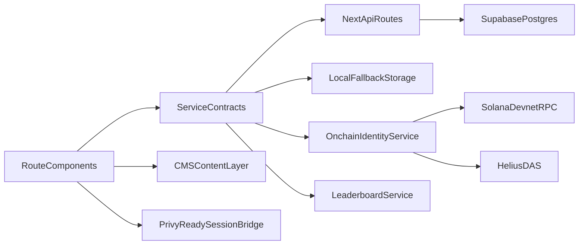

# Architecture

## Application Layers

1. `src/app/[locale]` route layer for pages and layout composition.
2. `src/components` presentation and interaction components.
3. `src/services` integration contracts and implementations (remote-first + fallback).
4. `src/domain` typed models and seeded mock data.
5. `src/cms` schema definitions for course/module/lesson content.
6. `src/app/api` route handlers for persistence and leaderboard windows.
7. `src/lib/backend` API client and Supabase server adapters.

## Data Flow

## Service Interfaces

- `LearningProgressService`: progress state, lesson completion, streak data, XP read abstraction.
- `OnchainIdentityService`: wallet-linked XP balance, credentials, verification, enrollment signing flow.
- `LeaderboardService`: timeframe leaderboard provider.
- `AchievementService`: claim/list achievement abstraction.
- `learner-session`: shared resolver for wallet, social, and fallback learner identity.
- `scoring`: shared XP and rank math used by dashboard/leaderboard/curriculum.

## Integration Points

- Enrollment is learner-signed from frontend.
- Lesson completion and credential issuance remain backend-signed by design and are stubbed behind interfaces.
- Progress and enrollment are persisted through Supabase APIs when configured.
- Leaderboard windows are computed server-side via `/api/leaderboard` and consumed by UI services.
- Credentials and leaderboard can merge indexer/on-chain reads with persisted app activity.
